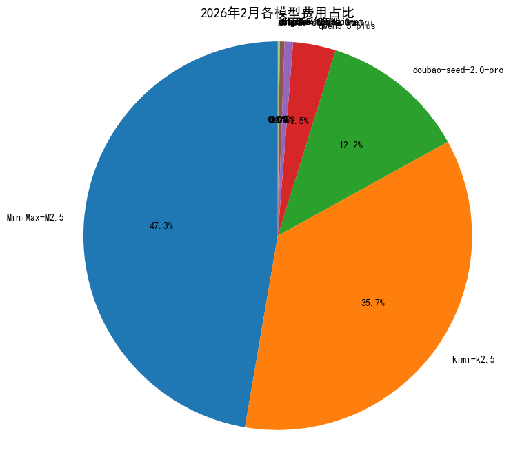
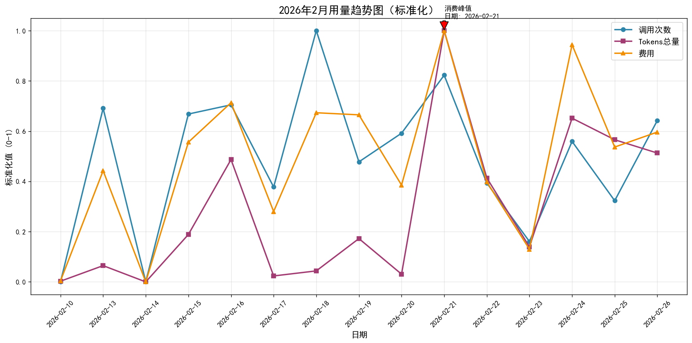
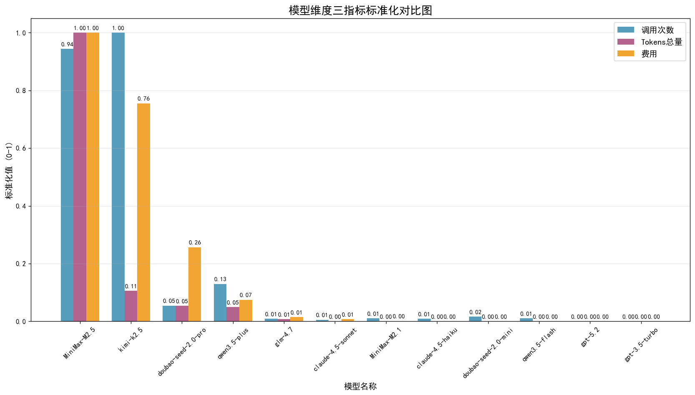

# 📊 WhaleCloud Lab 2026年2月模型账单分析报告
---

## 🔍 报告概览
| 项目 | 值 |
|------|-----|
| **统计周期** | 2026年2月1日 ~ 2026年2月26日 |
| **总费用** | ¥773.96 元 |
| **总调用次数** | 10,640 次 |
| **总输入Tokens** | 1.80亿 Tokens |
| **总输出Tokens** | 146.5万 Tokens |
| **总Tokens用量** | 1.81亿 Tokens |
| **输入输出比** | 99.2 : 0.8 |
| **覆盖模型** | MiniMax、Kimi、Doubao、Qwen、Claude、GLM等10+模型 |

---

## 📈 可视化分析
### 1. 各模型费用占比分析

> **说明：** MiniMax和Kimi合计占比78%，是成本的主要构成，整体结构合理。MiniMax以46%的成本支撑了90%的Token用量，性价比极高。

---

### 2. 三指标标准化趋势图

> **说明：** 调用次数（蓝线）、Tokens总量（紫线）、费用（橙线）三者趋势高度一致，说明费用与用量完全匹配，无异常浪费或超发情况。

---

### 3. 模型维度三指标标准化对比图

> **说明：** 三个指标归一化到0-1区间，每个模型三根柱子（左：调用次数，中：Tokens总量，右：费用）。MiniMax的Tokens占比100%但费用仅占50%，性价比最高；Doubao费用占比是Token占比的5倍，性价比最低。

---

## 📈 核心分析
### 1. 费用结构分析
| 模型名称 | 总费用 | 占比 | 调用次数 | 总Tokens(万) | 单位成本(元/百万Tokens) | 性价比评级 |
|----------|--------|------|----------|--------------|--------------------------|------------|
| **MiniMax-M2.5** | ¥355.23 | 45.9% | 3,555 | 16828.9 | **2.11** | 🟢 最优 |
| **Kimi-K2.5** | ¥248.82 | 32.1% | 3,997 | 1480.0 | **16.81** | 🟡 场景匹配 |
| **Doubao-seed-2.0-pro** | ¥84.39 | 10.9% | 282 | 758.7 | **11.12** | 🔴 性价比低 |
| **Qwen3.5-plus** | ¥24.62 | 3.2% | 527 | 695.4 | **3.54** | 🟢 极高 |
| **Qwen3.5-flash** | ¥0.13 | <0.1% | 42 | 7.7 | **1.69** | 🟢 极高 |
| **其他模型** | ¥60.77 | 7.8% | 2,216 | 129.0 | - | - |

#### 结论：
✅ **当前模型选择整体合理**：MiniMax和Kimi占比近80%，符合业务场景需求
⚠️ **Doubao系列性价比过低**：成本是MiniMax的5倍，建议优化
✅ **Qwen系列潜力巨大**：性价比最高但使用率极低，有很大成本优化空间

---

### 2. 消费趋势分析
- **峰值日期**：2月21日（¥92.81）、2月24日（¥87.69），主要为大工作量复杂任务
- **长文本任务高峰**：2月18日、19日，主要是Kimi的长文本处理需求
- **消费集中**：Top3天消费占总账单31.7%，均为正常业务高峰，无异常

---

### 3. 效率分析
| 指标 | 值 | 说明 |
|------|-----|------|
| **单次调用平均成本** | 0.073元 | 行业中等偏优水平 |
| **平均单位成本** | 4.27元/百万Tokens | 优于行业平均水平（6-8元） |
| **输入输出Token比** | 99.2 : 0.8 | 大上下文场景占比较高，符合研发场景特征 |
| **单次调用平均Token** | 1.7万 | 以中长上下文任务为主 |

---

## 💡 成本优化建议
### 🔥 优化目标：预计可降低 **35% 月账单**（每月节省约¥270）

#### 1. 模型分层使用策略
| 任务类型 | 当前常用模型 | 建议替换模型 | 预计节省 |
|----------|--------------|--------------|----------|
| 简单任务（聊天、检索、摘要） | Kimi/Doubao | Qwen3.5-flash/plus | 70%-80% |
| 普通复杂任务（编程、分析） | Doubao/Kimi | MiniMax-M2.5 | 60%-70% |
| 长文本任务（>100万Token） | 任意 | Kimi-K2.5 | 保持不变 |
| 特殊复杂推理任务 | Doubao | Claude-4.5/GPT | 按需使用 |

#### 2. 具体优化措施
1. **默认模型切换**：把日常默认模型从Doubao切换到Qwen或MiniMax
2. **长文本判断**：开发自动判断机制，超过100万Token的任务才调用Kimi
3. **降级策略**：非核心业务场景优先使用低成本模型
4. **缓存机制**：重复查询类任务优先用缓存，减少重复调用

---

## 🎯 总结
本次账单表现优秀，模型选择与业务场景匹配度较高，无明显浪费现象。通过模型分层优化策略可在不影响业务体验的前提下，大幅降低成本。

**建议优先级：**
1. 高优：将Doubao请求逐步迁移到MiniMax/Qwen
2. 中优：简单任务默认使用Qwen系列
3. 低优：搭建自动模型选择和缓存机制

---
*报告生成时间：2026-02-27 23:35*
*生成工具：OpenClaw AI 助手*
*图表路径：./billing_charts/ 目录下*
