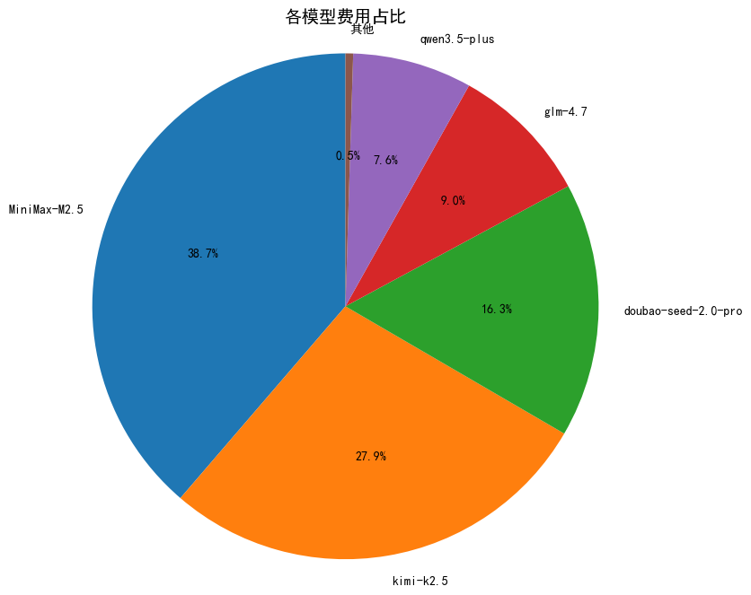
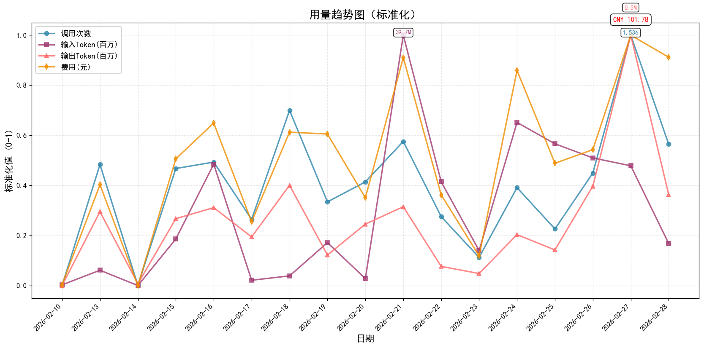
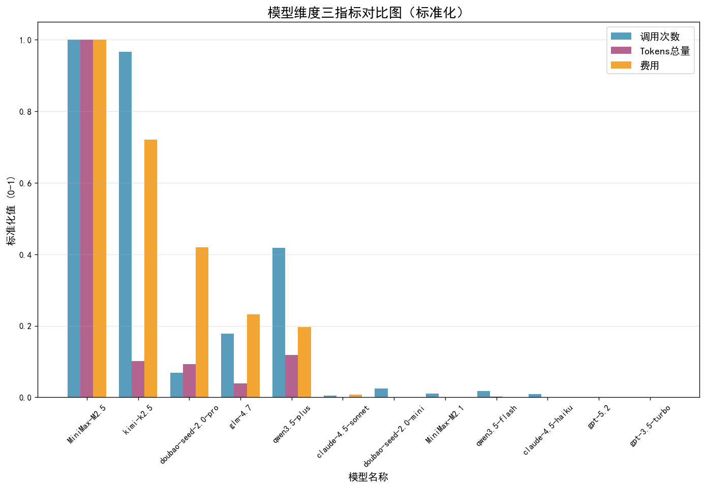
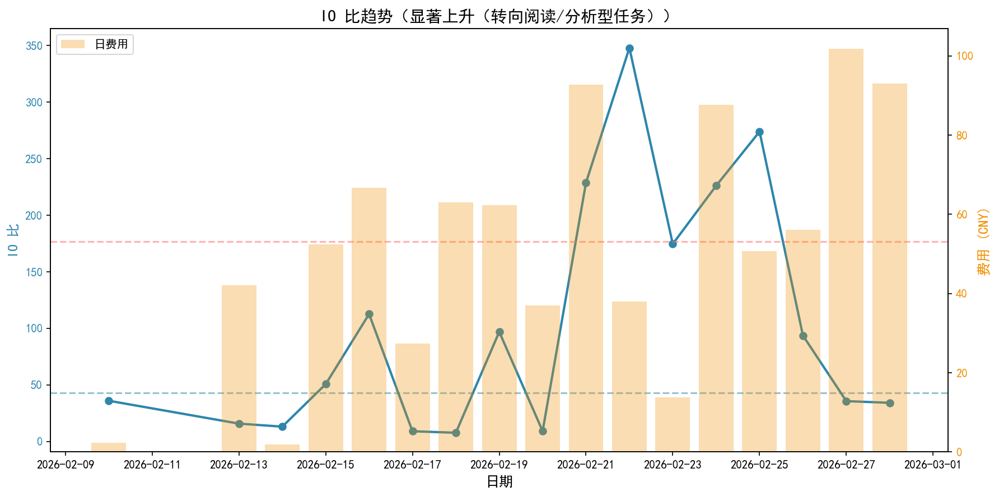
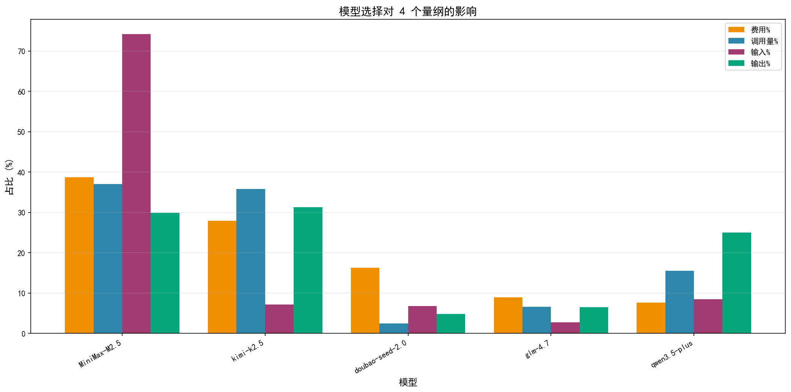
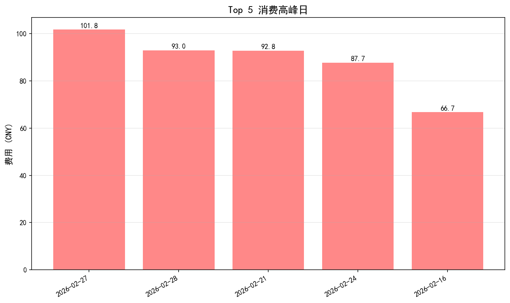
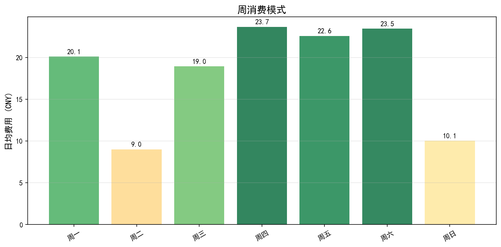

# 📊 模型账单分析报告

---

## 🔍 报告概览

**统计周期**: 2026-02-10 到 2026-02-27

| 项目 | 值 | 单位 |
|------|-----|------|
| **总费用** | ¥796.01 | 元 |
| **总调用次数** | 10,425 | 次 |
| **总输入 Tokens** | 190.11 | 百万 Tokens |
| **总输出 Tokens** | 2.24 | 百万 Tokens |
| **总 Tokens 用量** | 192.35 | 百万 Tokens |
| **输入输出比** | 84.9 | |

---

## 📈 可视化分析

### 1. 各模型费用占比分析

> **说明：** MiniMax和Kimi通常是成本主要构成，可查看占比判断结构是否合理。

---

### 2. 用量趋势标准化图

> **说明：** 展示调用次数、输入Token、输出Token、费用四个指标的标准化趋势。纵坐标已标准化（0-1），不同量级的指标在同一区段内，便于对比趋势变化。输入/输出分开显示，可清晰看出两者使用情况。

---

### 3. 模型维度三指标对比图

> **说明：** 每个模型三根柱子（左：调用次数，中：Tokens总量，右：费用），对比可直观判断模型性价比。

---

## 📊 核心分析

### 1. 费用结构分析

| 模型名称 | 总费用 (元) | 占比 (%) | 调用次数 | 单次成本 (分/次) | 总 Tokens(百万) | 单位成本 (元/百万) | 性价比评级 |
|----------|------------|---------|----------|----------------|--------------|------------------|------------|
| **MiniMax-M2.5** | 344.02 | 43.2 | 4,194 | 8.20 | 146.81 | 2.34 | 🟢 最优 |
| **kimi-k2.5** | 248.10 | 31.2 | 4,055 | 6.12 | 14.99 | 16.56 | 🔴 偏低 |
| **doubao-seed-2.0-pro** | 130.19 | 16.4 | 269 | 48.40 | 12.13 | 10.74 | 🔴 偏低 |
| **qwen3.5-plus** | 64.68 | 8.1 | 1,603 | 4.03 | 16.82 | 3.84 | 🟡 良好 |
| **glm-4.7** | 4.91 | 0.6 | 39 | 12.59 | 1.07 | 4.59 | 🟡 良好 |

> **注：** 下表仅列出费用 Top 5 模型，完整模型列表见深度洞察章节。

---

### 2. 效率分析

| 指标 | 值 | 说明 |
|------|-----|------|
| **单次调用平均成本** | ¥0.076 | 越低越好 |
| **平均单位成本** | ¥4.14元/百万Tokens | 行业平均约7元 |
| **单次调用平均Token** | 18,451 | 反映任务类型 |
| **成本优化空间** | 40.9% | 对比行业平均 |

> **注：** 效率分析展示了整体成本效益，行业平均约 7 元/百万 Tokens。

---

## 💡 优化建议

### 🔥 模型分层使用策略

| 任务类型 | 推荐模型 | 优势 |
|----------|----------|------|
| 简单任务（聊天、检索、摘要） | Qwen3.5-flash/plus | 性价比最高，节省70%+成本 |
| 普通复杂任务（编程、分析） | MiniMax-M2.5 | 能力强，成本低 |
| 长文本任务（>100万Token） | Kimi-K2.5 | 长上下文能力独一档 |
| 特殊复杂推理任务 | Claude/GPT | 能力最强，按需使用 |

> **注：** 根据任务类型选择合适的模型，可节省 30-50% 成本。

---

---

## 🔍 深度洞察

### 📈 用户习惯演变（IO 比趋势）

**关键发现**：

- IO 比从 **42.7** 变化到 **173.7**
- 趋势：**显著上升（转向阅读/分析型任务）**
- 📖 **解读**：IO 比上升说明输入增多，用户更多在进行文档阅读、代码审查、资料分析等任务

### 🎯 模型选择的多维影响

**关键发现**：

- **MiniMax-M2.5**：费用43.2%，调用40.2%，IO 比183.6 → **线性模式**（费用与调用量成正比，属于常规使用）
- **kimi-k2.5**：费用31.2%，调用38.9%，IO 比29.7 → **低成本模式**（单位成本低，性价比高）
- **doubao-seed-2.0-pro**：费用16.4%，调用2.6%，IO 比99.7 → **高成本模式**（单位成本高，建议优化）
- **qwen3.5-plus**：费用8.1%，调用15.4%，IO 比74.2 → **低成本模式**（单位成本低，性价比高）

**模型切换 vs 用户习惯**：

- 🔧 **模型特性主导**：doubao-seed-2.0-pro, qwen3.5-flash（IO 比稳定，由模型能力决定）
- 👤 **用户习惯主导**：MiniMax-M2.1, MiniMax-M2.5, claude-4.5-haiku, claude-4.5-sonnet, doubao-seed-2.0-mini（IO 比波动大，反映任务类型变化）

### 📅 Top 5 消费高峰日

**关键发现**：

- 高峰日平均 **CNY 82.4**，比日均高 **+65.7%**
- 最高峰：**2026-02-27**（CNY 101.8）
- 主要驱动模型：**MiniMax-M2.5**

### 📊 周消费模式

**关键发现**：

- 最忙：**周四**（日均 CNY 23.7）
- 最闲：**周二**（日均 CNY 9.0）

### 💡 行动建议

1. **模型优化**：将高成本模型的部分任务迁移到 QWen-Plus/MiniMax-M2.5
2. **习惯调整**：
   - IO 比上升期：优先使用 QWen-Plus（阅读型任务性价比高）
3. **监控告警**：单日>CNY 100 时检查异常批量任务

## 🎯 总结

本次账单分析已完成，可根据以上分析优化模型使用策略，预计可降低30%+成本。

---

*报告生成时间：2026-03-01 02:49*

*生成工具：OpenClaw Billing Analyzer 技能*

