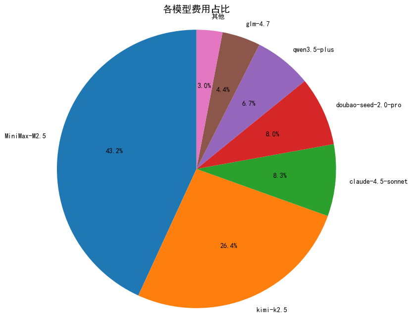
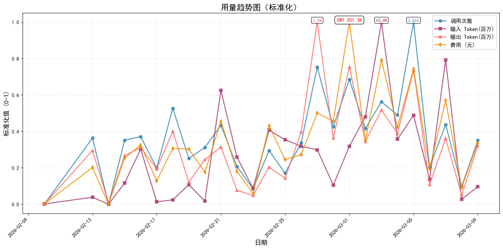
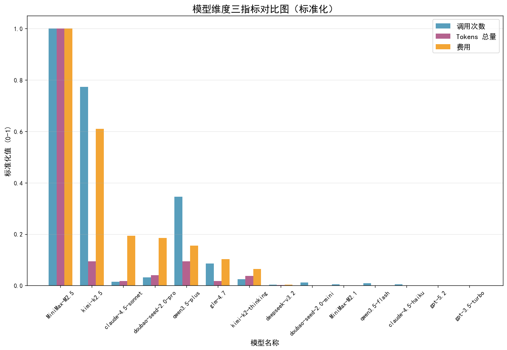
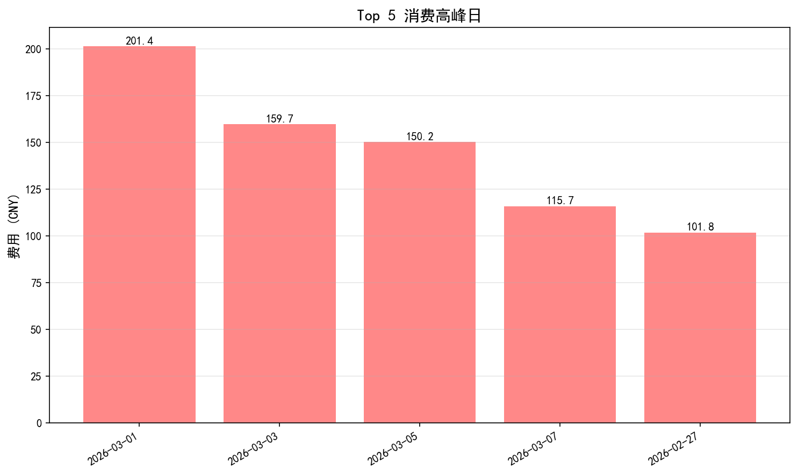
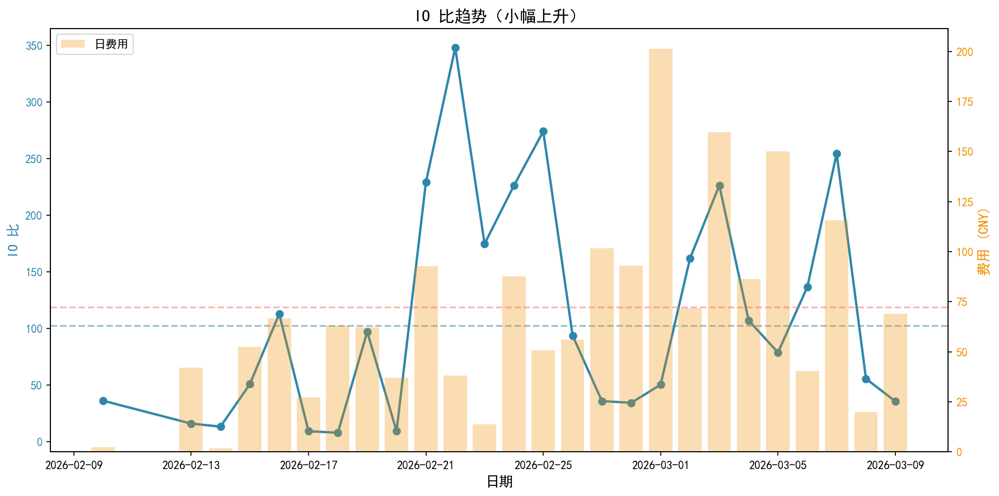
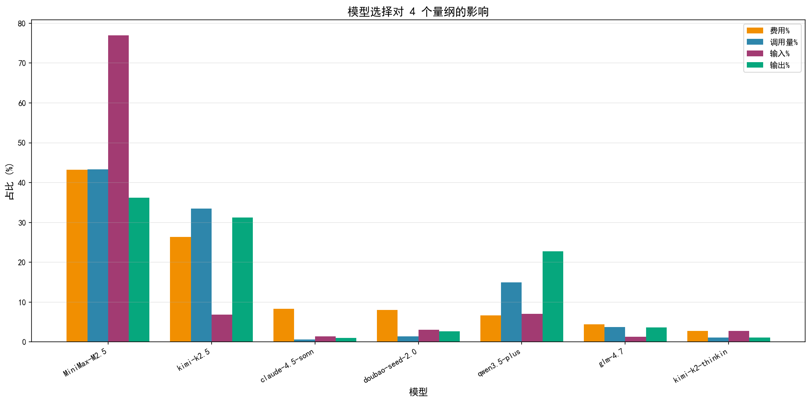
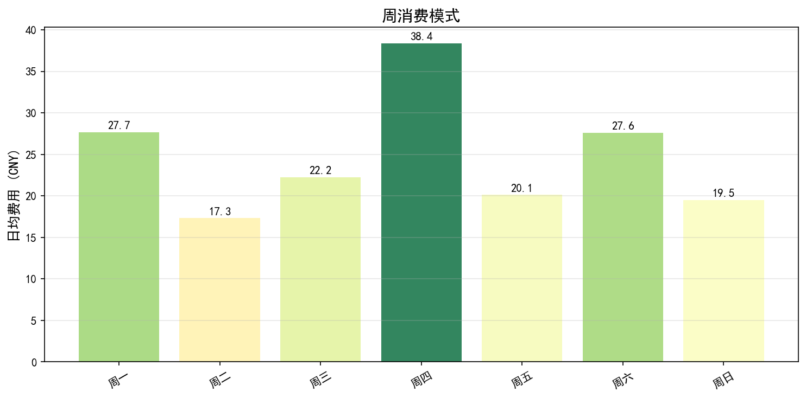

# 模型账单分析报告

---

## 报告概览

**统计周期**: 2026-02-10 00:00:00 到 2026-03-09 00:00:00 （共 28 天）

| 项目 | 总数值 | 日均数值 | 单位 |
|------|-----|-----|------|
| **总费用** | CNY 1803.68 | CNY 64.42 | 元 |
| **总调用次数** | 20,307 | 725 | 次 |
| **总输入 Tokens** | 431.99 | 15.43 | 百万 Tokens |
| **总输出 Tokens** | 4.39 | 0.16 | 百万 Tokens |
| **总 Tokens 用量** | 436.38 | 15.59 | 百万 Tokens |
| **输入输出比** | 98.4 | - | |

> 注：单位成本行业平均约 7 元/百万 Tokens，成本优化空间41.0%。

---

## 可视化分析

### 1. 各模型费用占比分析

> 说明：MiniMax 和 Kimi 通常是成本主要构成，可查看占比判断结构是否合理。

---

### 2. 用量趋势标准化图

> 说明：展示调用次数、输入 Token、输出 Token、费用四个指标的标准化趋势。

---

### 3. 模型维度三指标对比图

> 说明：每个模型三根柱子（左：调用次数，中：Tokens 总量，右：费用）。

---

## 核心分析

### 1. 费用结构分析

| 模型名称 | 总费用 (元) | 占比 (%) | 调用次数 | 单次成本 (分/次) | 总 Tokens(百万) | 单位成本 (元/百万) | 性价比评级 |
|----------|------------|---------|----------|----------------|--------------|------------------|------------|
| **MiniMax-M2.5** | 778.48 | 43.2 | 8,793 | 8.85 | 334.29 | 2.33 | [OK] 最优 |
| **kimi-k2.5** | 475.30 | 26.4 | 6,797 | 6.99 | 31.35 | 15.16 | [WARN] 偏低 |
| **claude-4.5-sonnet** | 150.52 | 8.3 | 126 | 119.46 | 6.11 | 24.62 | [WARN] 偏低 |
| **doubao-seed-2.0-pro** | 144.61 | 8.0 | 287 | 50.39 | 13.59 | 10.64 | [WARN] 偏低 |
| **qwen3.5-plus** | 120.57 | 6.7 | 3,040 | 3.97 | 31.68 | 3.81 | [INFO] 良好 |

---

### 2. 效率分析

| 指标 | 值 | 说明 |
|------|-----|------|
| **单次调用平均成本** | CNY 0.089 | 越低越好 |
| **平均单位成本** | CNY 4.13元/百万 Tokens | 行业平均约 7 元 |
| **单次调用平均 Token** | 21,489 | 反映任务类型 |
| **成本优化空间** | 41.0% | 对比行业平均 |

> 注：效率分析展示了整体成本效益，根据任务类型选择合适的模型，可节省 30-50% 成本。

---

## 优化建议

### 模型分层使用策略

| 任务类型 | 推荐模型 | 优势 |
|----------|----------|------|
| 简单任务（聊天、检索、摘要） | Qwen3.5-flash/plus | 性价比最高，节省 70%+ 成本 |
| 普通复杂任务（编程、分析） | MiniMax-M2.5 | 能力强，成本低 |
| 长文本任务（>100 万 Token） | Kimi-K2.5 | 长上下文能力独一档 |
| 特殊复杂推理任务 | Claude/GPT | 能力最强，按需使用 |

> 注：下表仅列出费用 Top 5 模型，完整模型列表见深度洞察章节。

---

## 深度洞察

### Top 5 消费高峰日

**关键发现**：

- 高峰日平均 **CNY 145.8**，比日均高 **+110.1%**
- 最高峰：**2026-03-01**（CNY 201.4）
- 主要驱动模型：**claude-4.5-sonnet**

### 用户习惯演变（IO 比趋势）

**关键发现**：

- IO 比从 **102.1** 变化到 **118.6**
- 趋势：**小幅上升**
- [INFO] **解读**：IO 比上升说明输入增多，用户更多在进行文档阅读、代码审查、资料分析等任务

### 模型选择的多维影响

**关键发现**：

- **MiniMax-M2.5**：费用43.2%，调用43.3%，IO 比209.1 -> **线性模式**（费用与调用量成正比，属于常规使用）
- **kimi-k2.5**：费用26.4%，调用33.5%，IO 比21.9 -> **低成本模式**（单位成本低，性价比高）
- **claude-4.5-sonnet**：费用8.3%，调用0.6%，IO 比145.2 -> **高成本模式**（单位成本高，建议优化）
- **doubao-seed-2.0-pro**：费用8.0%，调用1.4%，IO 比115.4 -> **高成本模式**（单位成本高，建议优化）
- **qwen3.5-plus**：费用6.7%，调用15.0%，IO 比30.6 -> **低成本模式**（单位成本低，性价比高）

**模型切换 vs 用户习惯**：

- [INFO] **用户习惯主导**：MiniMax-M2.5, claude-4.5-sonnet, doubao-seed-2.0-pro, kimi-k2.5, qwen3.5-plus（IO 比波动大，反映任务类型变化）
- [INFO] **数据不足**：MiniMax-M2.1, claude-4.5-haiku, deepseek-v3.2, doubao-seed-2.0-mini, glm-4.7（调用次数 < 10，无法判断）

### 异常费用跃迁

- **2026-02-15**：费用 CNY 52.44（+2657.3%，前日 CNY 1.9），主要模型：doubao-seed-2.0-pro，原因：使用量增加
- **2026-02-18**：费用 CNY 63.09（+130.6%，前日 CNY 27.36），主要模型：kimi-k2.5，原因：模型切换
- **2026-02-21**：费用 CNY 92.81（+151.3%，前日 CNY 36.92），主要模型：MiniMax-M2.5，原因：使用量增加
- **2026-02-24**：费用 CNY 87.69（+538.6%，前日 CNY 13.73），主要模型：MiniMax-M2.5，原因：模型切换
- **2026-02-27**：费用 CNY 101.78（+81.4%，前日 CNY 56.1），主要模型：doubao-seed-2.0-pro，原因：模型切换
- **2026-03-01**：费用 CNY 201.36（+116.6%，前日 CNY 92.97），主要模型：claude-4.5-sonnet，原因：使用量增加
- **2026-03-03**：费用 CNY 159.68（+122.7%，前日 CNY 71.69），主要模型：MiniMax-M2.5，原因：使用量增加
- **2026-03-05**：费用 CNY 150.2（+74.0%，前日 CNY 86.35），主要模型：kimi-k2.5，原因：模型切换
- **2026-03-07**：费用 CNY 115.73（+185.9%，前日 CNY 40.49），主要模型：MiniMax-M2.5，原因：使用量增加
- **2026-03-09**：费用 CNY 69.09（+243.8%，前日 CNY 20.1），主要模型：kimi-k2.5，原因：使用量增加

### 各维度最大值

| 维度 | 日期 | 使用模型 | 最大值 |
|------|------|----------|--------|
| 费用 | 2026-03-01 | claude-4.5-sonnet, qwen3.5-plus | 201.36 |
| 调用次数 | 2026-03-05 | kimi-k2.5, MiniMax-M2.5 | 2,010 |
| 输入Token | 2026-03-03 | MiniMax-M2.5, kimi-k2-thinking | 63,394,908 |
| 输出Token | 2026-02-27 | qwen3.5-plus, MiniMax-M2.5 | 535,106 |

### 周消费模式

**关键发现**：

- 最忙：**周四**（日均 CNY 38.4）
- 最闲：**周二**（日均 CNY 17.3）

### 行动建议

1. **模型优化**：将高成本模型的部分任务迁移到 QWen-Plus/MiniMax-M2.5
2. **习惯调整**：
   - IO 比上升期：优先使用 QWen-Plus（阅读型任务性价比高）
3. **监控告警**：单日>CNY 100 时检查异常批量任务

---

## 总结

本次账单分析已完成，包含基础分析和深度洞察。可根据以上分析优化模型使用策略，预计可降低 30%+ 成本。

---

*报告生成时间：2026-03-10 16:12*
*生成工具：OpenClaw Billing Analyzer 技能（完整版）*
