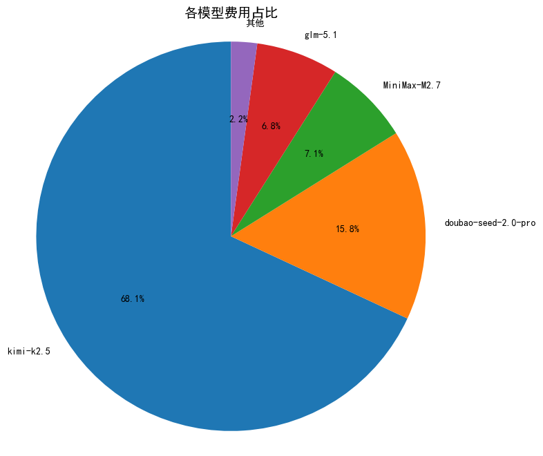
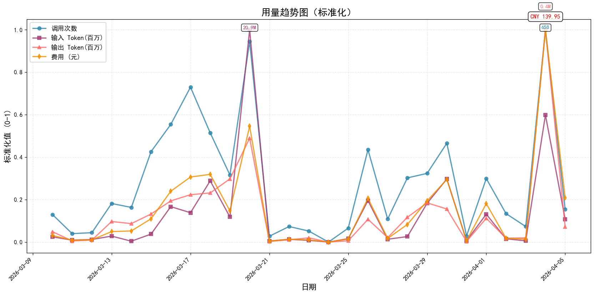
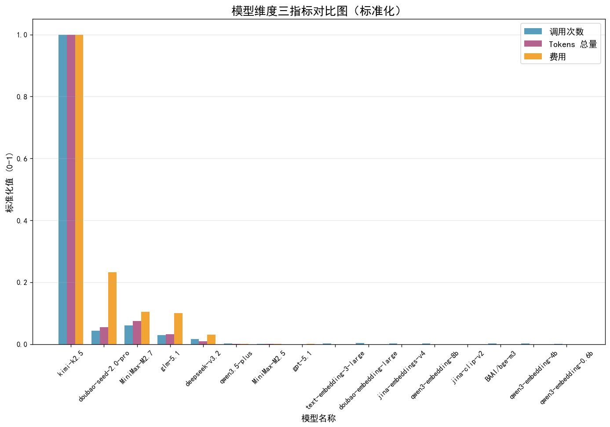
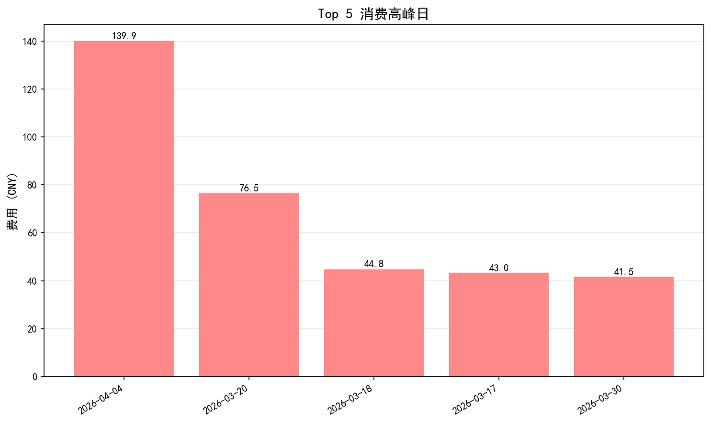
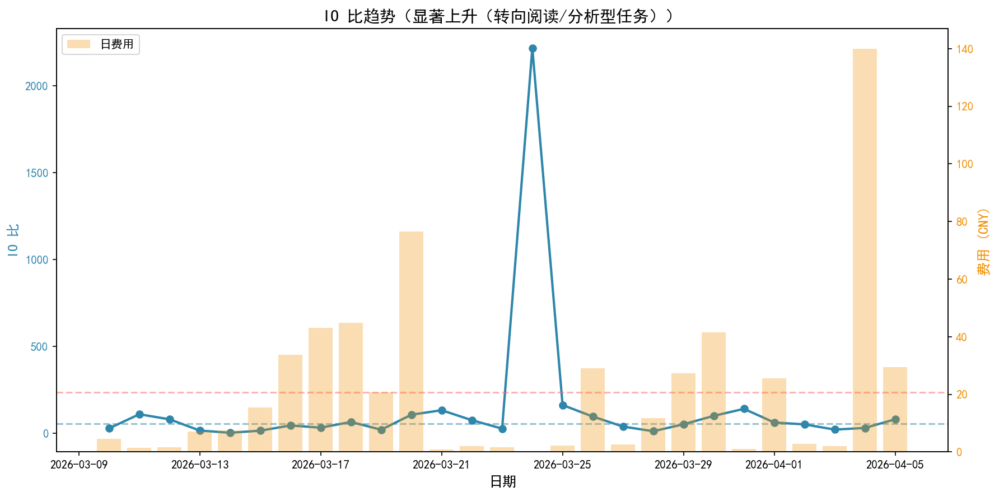
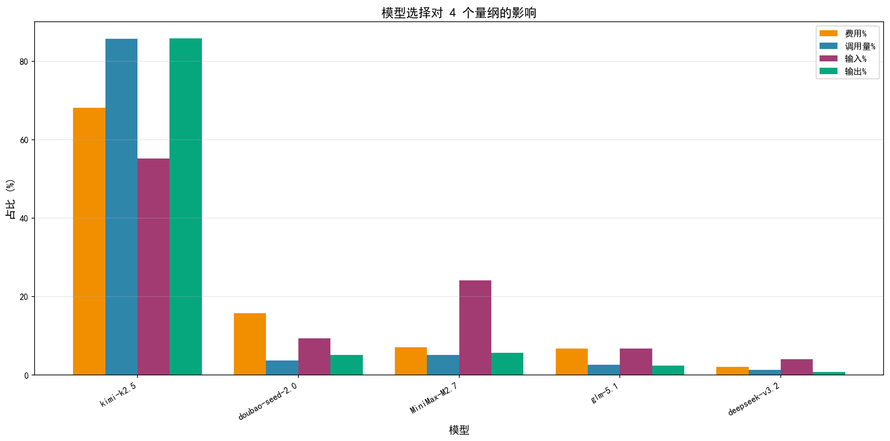
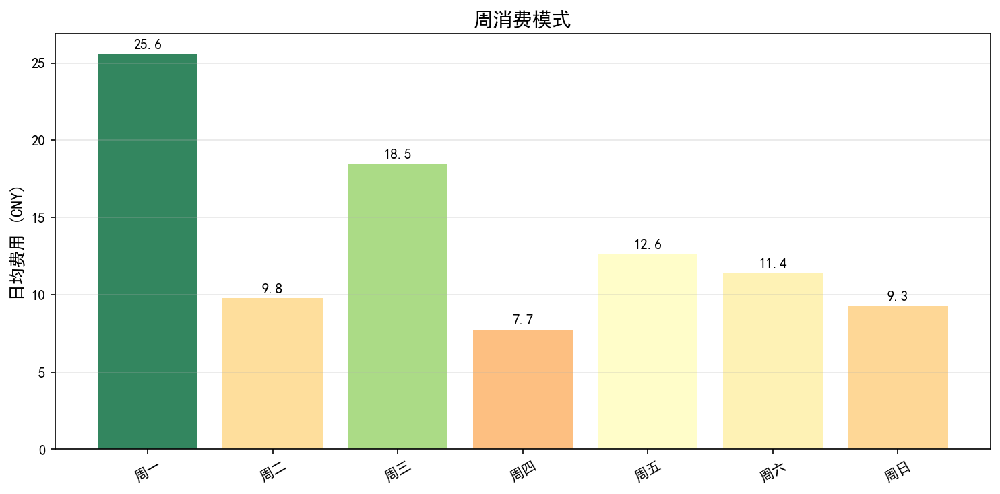

# 模型账单分析报告

---

## 报告概览

**统计周期**: 2026-03-10 00:00:00 到 2026-04-05 00:00:00 （共 27 天）

| 项目 | 总数值 | 日均数值 | 单位 |
|------|-----|-----|------|
| **总费用** | CNY 576.99 | CNY 21.37 | 元 |
| **总调用次数** | 5,051 | 187 | 次 |
| **总输入 Tokens** | 73.42 | 2.72 | 百万 Tokens |
| **总输出 Tokens** | 1.45 | 0.05 | 百万 Tokens |
| **总 Tokens 用量** | 391.02 | 14.48 | 百万 Tokens |
| **输入输出比** | 50.5 | - | |

> 注：单位成本行业平均约 7 元/百万 Tokens，成本优化空间78.9%。

---

## 可视化分析

### 1. 各模型费用占比分析

> 说明：MiniMax 和 Kimi 通常是成本主要构成，可查看占比判断结构是否合理。

---

### 2. 用量趋势标准化图

> 说明：展示调用次数、输入 Token、输出 Token、费用四个指标的标准化趋势。

---

### 3. 模型维度三指标对比图

> 说明：每个模型三根柱子（左：调用次数，中：Tokens 总量，右：费用）。

---

## 核心分析

### 1. 费用结构分析

| 模型名称 | 总费用 (元) | 占比 (%) | 调用次数 | 单次成本 (分/次) | 总 Tokens(百万) | 单位成本 (元/百万) | 性价比评级 |
|----------|------------|---------|----------|----------------|--------------|------------------|------------|
| **kimi-k2.5** | 392.73 | 68.1 | 4,327 | 9.08 | 333.65 | 1.18 | [OK] 最优 |
| **doubao-seed-2.0-pro** | 91.28 | 15.8 | 186 | 49.08 | 18.22 | 5.01 | [INFO] 良好 |
| **MiniMax-M2.7** | 41.04 | 7.1 | 260 | 15.78 | 25.05 | 1.64 | [OK] 最优 |
| **glm-5.1** | 39.45 | 6.8 | 129 | 30.59 | 10.75 | 3.67 | [INFO] 良好 |
| **deepseek-v3.2** | 12.04 | 2.1 | 69 | 17.45 | 3.00 | 4.01 | [INFO] 良好 |

---

### 2. 效率分析

| 指标 | 值 | 说明 |
|------|-----|------|
| **单次调用平均成本** | CNY 0.114 | 越低越好 |
| **平均单位成本** | CNY 1.48元/百万 Tokens | 行业平均约 7 元 |
| **单次调用平均 Token** | 77,414 | 反映任务类型 |
| **成本优化空间** | 78.9% | 对比行业平均 |

> 注：效率分析展示了整体成本效益，根据任务类型选择合适的模型，可节省 30-50% 成本。

---

## 优化建议

### 模型分层使用策略

| 任务类型 | 推荐模型 | 优势 |
|----------|----------|------|
| 简单任务（聊天、检索、摘要） | Qwen3.5-flash/plus | 性价比最高，节省 70%+ 成本 |
| 普通复杂任务（编程、分析） | MiniMax-M2.5 | 能力强，成本低 |
| 长文本任务（>100 万 Token） | Kimi-K2.5 | 长上下文能力独一档 |
| 特殊复杂推理任务 | Claude/GPT | 能力最强，按需使用 |

> 注：下表仅列出费用 Top 5 模型，完整模型列表见深度洞察章节。

---

## 深度洞察

### Top 5 消费高峰日

**关键发现**：

- 高峰日平均 **CNY 69.2**，比日均高 **+223.6%**
- 最高峰：**2026-04-04**（CNY 139.9）
- 主要驱动模型：**doubao-seed-2.0-pro**

### 用户习惯演变（IO 比趋势）

**关键发现**：

- IO 比从 **57.1** 变化到 **236.7**
- 趋势：**显著上升（转向阅读/分析型任务）**
- [INFO] **解读**：IO 比上升说明输入增多，用户更多在进行文档阅读、代码审查、资料分析等任务

### 模型选择的多维影响

**关键发现**：

- **kimi-k2.5**：费用68.1%，调用85.7%，IO 比32.5 -> **低成本模式**（单位成本低，性价比高）
- **doubao-seed-2.0-pro**：费用15.8%，调用3.7%，IO 比93.6 -> **高成本模式**（单位成本高，建议优化）
- **MiniMax-M2.7**：费用7.1%，调用5.1%，IO 比215.3 -> **线性模式**（费用与调用量成正比，属于常规使用）
- **glm-5.1**：费用6.8%，调用2.6%，IO 比145.7 -> **线性模式**（费用与调用量成正比，属于常规使用）

**模型切换 vs 用户习惯**：

- [INFO] **模型特性主导**：MiniMax-M2.7（IO 比稳定，由模型能力决定）
- [INFO] **用户习惯主导**：doubao-seed-2.0-pro, glm-5.1, kimi-k2.5（IO 比波动大，反映任务类型变化）
- [INFO] **数据不足**：BAAI/bge-m3, MiniMax-M2.5, deepseek-v3.2, doubao-embedding-large, gpt-5.1（调用次数 < 10，无法判断）

### 异常费用跃迁

- **2026-03-13**：费用 CNY 7.13（+318.8%，前日 CNY 1.7），主要模型：kimi-k2.5，原因：模型切换
- **2026-03-15**：费用 CNY 15.55（+106.2%，前日 CNY 7.54），主要模型：kimi-k2.5，原因：使用量增加
- **2026-03-16**：费用 CNY 33.7（+116.8%，前日 CNY 15.55），主要模型：kimi-k2.5，原因：使用量增加
- **2026-03-20**：费用 CNY 76.51（+268.4%，前日 CNY 20.77），主要模型：MiniMax-M2.7，原因：使用量增加
- **2026-03-22**：费用 CNY 2.08（+135.9%，前日 CNY 0.88），主要模型：kimi-k2.5，原因：使用量增加
- **2026-03-25**：费用 CNY 2.27（+899.2%，前日 CNY 0.23），主要模型：kimi-k2.5，原因：使用量增加
- **2026-03-26**：费用 CNY 29.03（+1181.2%，前日 CNY 2.27），主要模型：kimi-k2.5，原因：使用量增加
- **2026-03-28**：费用 CNY 11.81（+348.9%，前日 CNY 2.63），主要模型：kimi-k2.5，原因：模型切换
- **2026-03-29**：费用 CNY 27.36（+131.6%，前日 CNY 11.81），主要模型：kimi-k2.5，原因：使用量增加
- **2026-04-01**：费用 CNY 25.53（+2193.6%，前日 CNY 1.11），主要模型：kimi-k2.5，原因：模型切换
- **2026-04-04**：费用 CNY 139.95（+6479.1%，前日 CNY 2.13），主要模型：doubao-seed-2.0-pro，原因：使用量增加

### 各维度最大值

| 维度 | 日期 | 使用模型 | 最大值 |
|------|------|----------|--------|
| 费用 | 2026-04-04 | doubao-seed-2.0-pro, glm-5.1 | 139.95 |
| 调用次数 | 2026-04-04 | kimi-k2.5, glm-5.1 | 658 |
| 输入Token | 2026-03-20 | MiniMax-M2.7, kimi-k2.5 | 20,922,321 |
| 输出Token | 2026-04-04 | kimi-k2.5, doubao-seed-2.0-pro | 396,355 |

### 周消费模式

**关键发现**：

- 最忙：**周一**（日均 CNY 25.6）
- 最闲：**周四**（日均 CNY 7.7）

### 行动建议

1. **模型优化**：将高成本模型的部分任务迁移到 QWen-Plus/MiniMax-M2.5
2. **习惯调整**：
   - IO 比上升期：优先使用 QWen-Plus（阅读型任务性价比高）
3. **监控告警**：单日>CNY 100 时检查异常批量任务

---

## 总结

本次账单分析已完成，包含基础分析和深度洞察。可根据以上分析优化模型使用策略，预计可降低 30%+ 成本。

---

*报告生成时间：2026-04-06 17:55*
*生成工具：OpenClaw Billing Analyzer 技能（完整版）*
