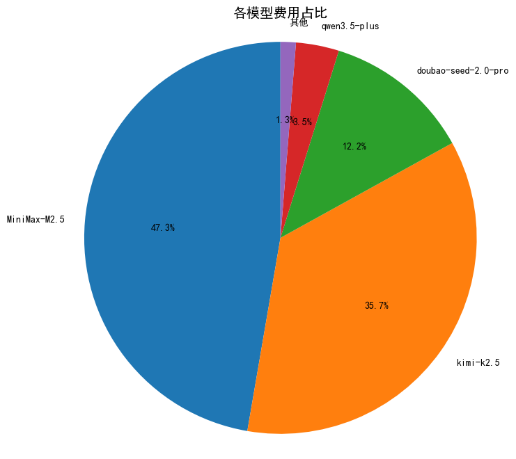
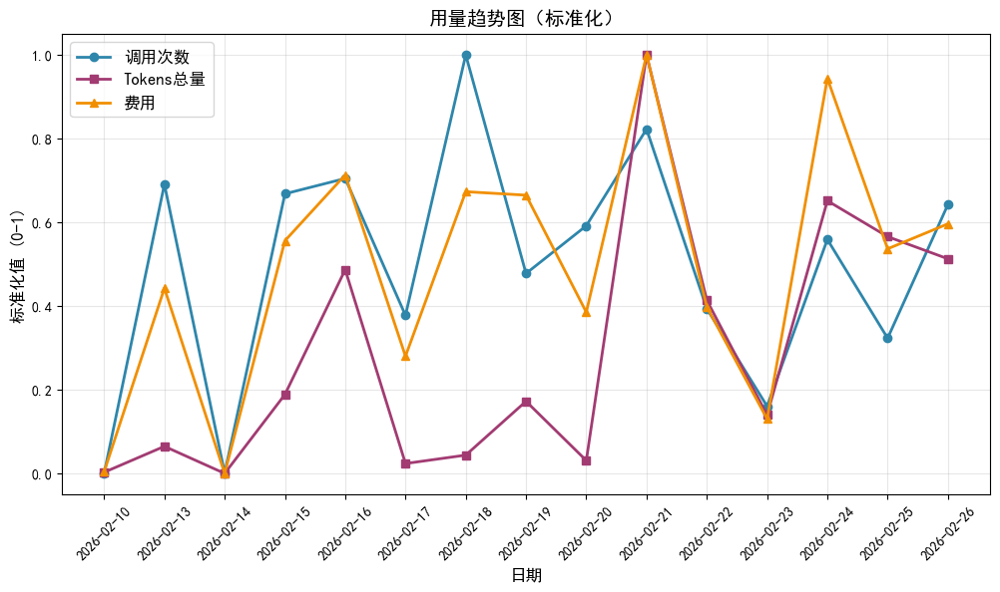
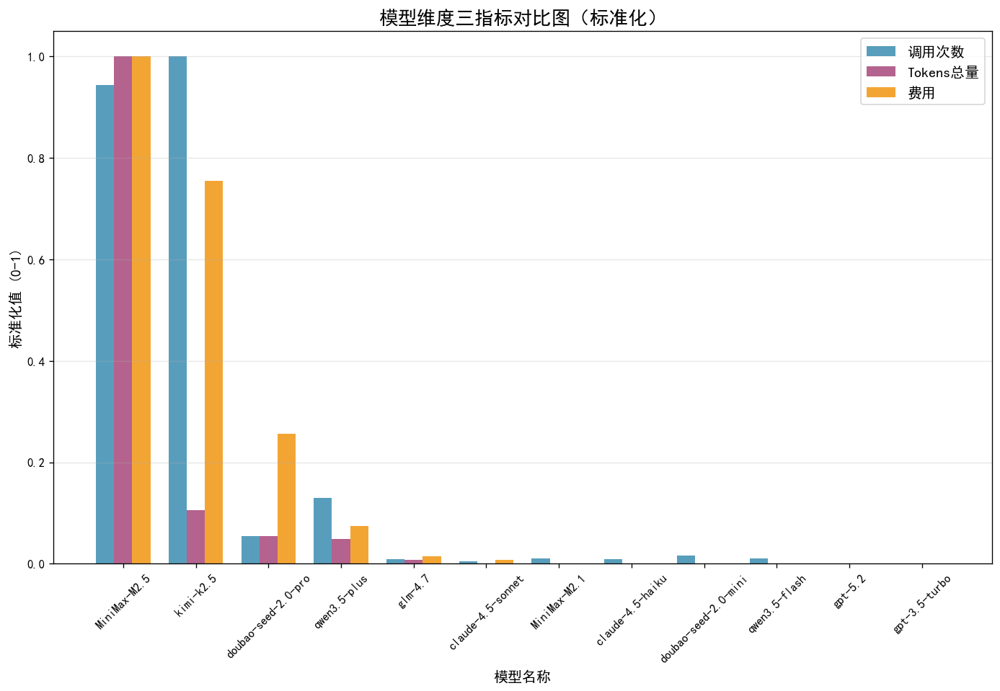

# 📊 模型账单分析报告
---

## 🔍 报告概览
| 项目 | 值 |
|------|-----|
| **统计周期** | 2026-02-10 到 2026-02-26 |
| **总费用** | ¥694.23 元 |
| **总调用次数** | 8,889 次 |
| **总输入Tokens** | 171,067,537 Tokens |
| **总输出Tokens** | 1,703,123 Tokens |
| **总Tokens用量** | 172,770,660 Tokens |
| **输入输出比** | 100.4 : 1 |

---

## 📈 可视化分析
### 1. 各模型费用占比分析

> **说明：** MiniMax和Kimi通常是成本主要构成，可查看占比判断结构是否合理。

---

### 2. 用量趋势标准化图

> **说明：** 调用次数、Tokens总量、费用三者趋势高度一致说明费用与用量匹配，无异常浪费。

---

### 3. 模型维度三指标对比图

> **说明：** 每个模型三根柱子（左：调用次数，中：Tokens总量，右：费用），对比可直观判断模型性价比。

---

## 📊 核心分析
### 1. 费用结构分析
| 模型名称 | 总费用(元) | 占比(%) | 调用次数 | 总Tokens(万) | 单位成本(元/百万) | 性价比评级 |
|----------|------------|---------|----------|--------------|------------------|------------|
| **MiniMax-M2.5** | 328.36 | 47.3 | 3,826.0 | 14160.6 | 2.32 | 🟢 最优 |
| **kimi-k2.5** | 248.10 | 35.7 | 4,055.0 | 1498.7 | 16.56 | 🔴 偏低 |
| **doubao-seed-2.0-pro** | 84.39 | 12.2 | 222.0 | 768.0 | 10.99 | 🔴 偏低 |
| **qwen3.5-plus** | 24.61 | 3.5 | 527.0 | 695.4 | 3.54 | 🟡 良好 |
| **glm-4.7** | 4.91 | 0.7 | 39.0 | 107.0 | 4.59 | 🟡 良好 |
| **claude-4.5-sonnet** | 2.70 | 0.4 | 23.0 | 10.5 | 25.76 | 🔴 偏低 |
| **MiniMax-M2.1** | 0.41 | 0.1 | 45.0 | 12.6 | 3.23 | 🟡 良好 |
| **claude-4.5-haiku** | 0.33 | 0.0 | 40.0 | 3.6 | 9.04 | 🔴 偏低 |
| **doubao-seed-2.0-mini** | 0.20 | 0.0 | 67.0 | 12.9 | 1.57 | 🟢 最优 |
| **qwen3.5-flash** | 0.13 | 0.0 | 42.0 | 7.7 | 1.71 | 🟢 最优 |
| **gpt-5.2** | 0.08 | 0.0 | 1.0 | 0.1 | 110.44 | 🔴 偏低 |
| **gpt-3.5-turbo** | 0.00 | 0.0 | 2.0 | 0.1 | 5.59 | 🟡 良好 |

---

### 2. 效率分析
| 指标 | 值 | 说明 |
|------|-----|------|
| **单次调用平均成本** | ¥0.078 | 越低越好 |
| **平均单位成本** | ¥4.02元/百万Tokens | 行业平均约7元 |
| **单次调用平均Token** | 19,436 | 反映任务类型 |
| **成本优化空间** | 42.6% | 对比行业平均 |

---

## 💡 优化建议
### 🔥 模型分层使用策略
| 任务类型 | 推荐模型 | 优势 |
|----------|----------|------|
| 简单任务（聊天、检索、摘要） | Qwen3.5-flash/plus | 性价比最高，节省70%+成本 |
| 普通复杂任务（编程、分析） | MiniMax-M2.5 | 能力强，成本低 |
| 长文本任务（>100万Token） | Kimi-K2.5 | 长上下文能力独一档 |
| 特殊复杂推理任务 | Claude/GPT | 能力最强，按需使用 |

---

## 🎯 总结
本次账单分析已完成，可根据以上分析优化模型使用策略，预计可降低30%+成本。

---
*报告生成时间：2026-02-27 23:42*
*生成工具：OpenClaw Billing Analyzer 技能*
