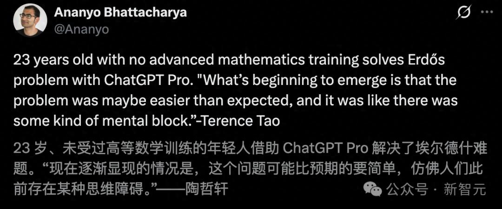
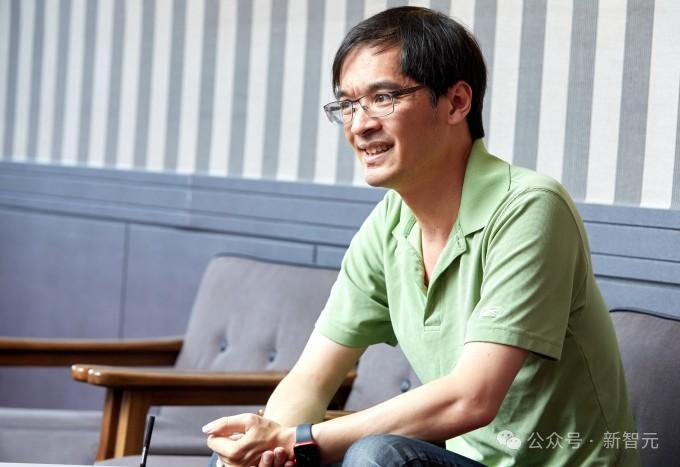
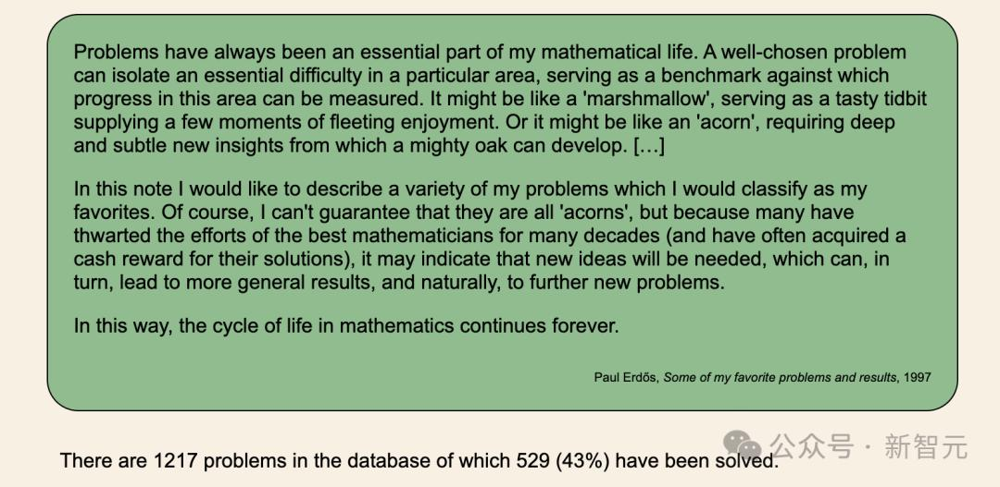
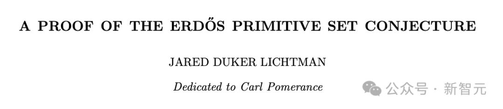
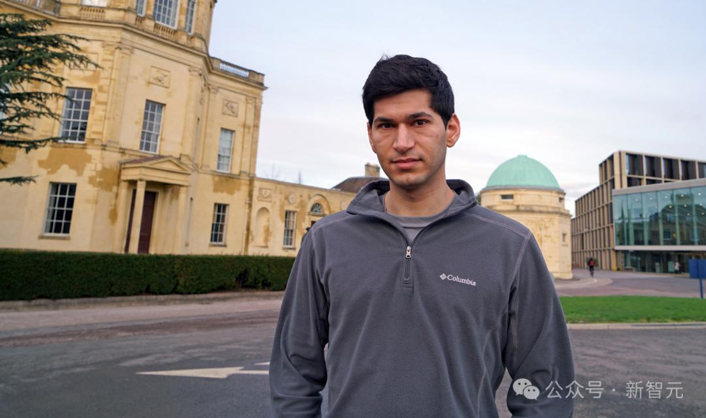
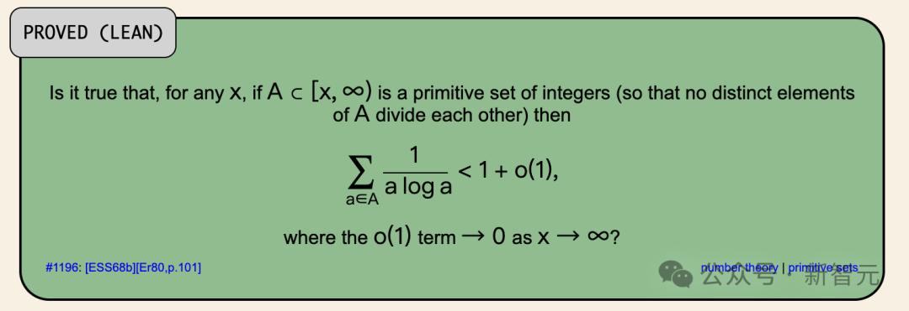
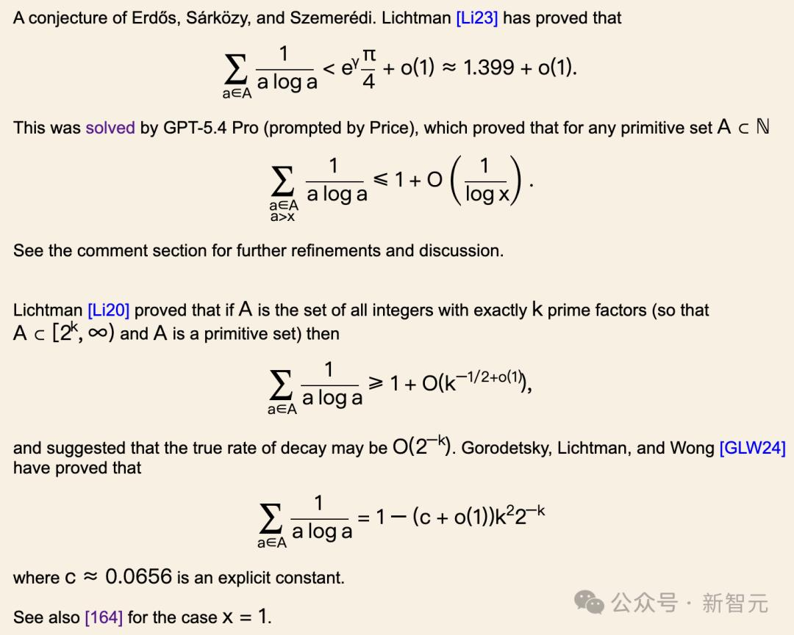
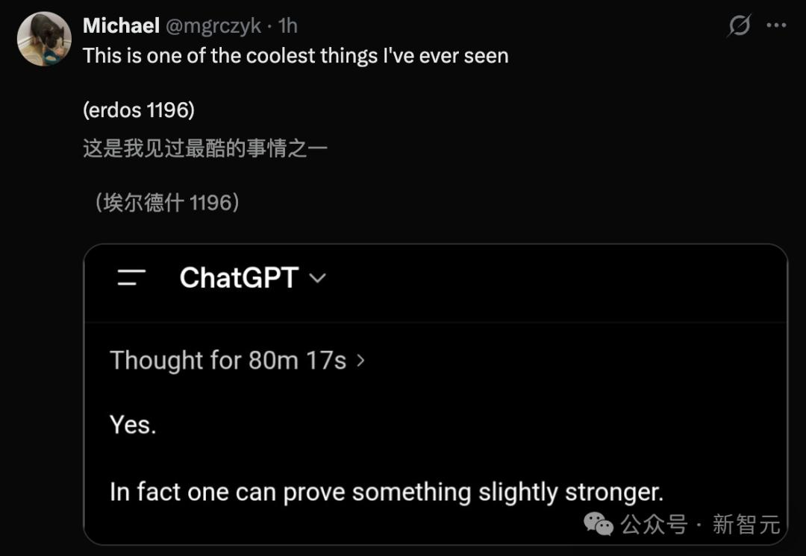
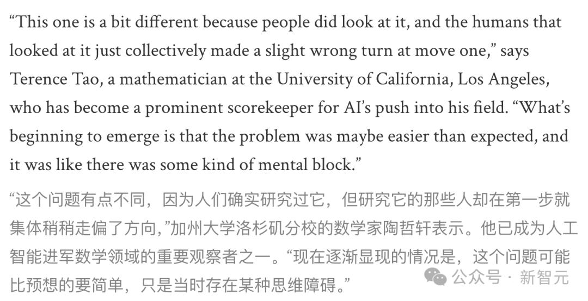
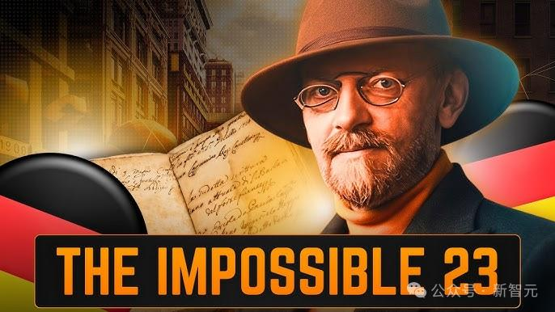

# 23岁门外汉携ChatGPT，攻克60年数学猜想！陶哲轩：我们全走偏了

2026-04-26 22:01·[新智元](/c/user/token/MS4wLjABAAAAeaRVJ7voLkS7eOVdjLVg53UuJgCFVFsmROItAuAsUls/?source=tuwen_detail)

编辑：桃子

**【新智元导读】7年的专业研究，输给了一次「vibe mathing」。一个毫无高数背景的23岁年轻人，靠一段提示词，让ChatGPT在80分钟内破解了困扰人类60年的猜想。陶哲轩承认：我们第一步就走偏了。**

困扰数学界60年的「世纪猜想」，竟被一个门外汉给攻克了！

他年仅23岁，从未接受过任何高等数学训练，仅凭一个提示词，让ChatGPT破解了这一难题。

陶哲轩看完证明后，只说了一句话——

过去60年人类都看过这道题，所有人在第一步就集体走偏了。

**23岁门外汉，让全网破防**

故事的主人公叫Liam Price。

他并非「数学科班」出身，履历中找不到任何高等数学学位的加持。

然而，在2025年底，他与剑桥大学数学系的大二生Kevin Barreto联手开启了一场近乎「疯狂」的实验：

从数学界著名的Erdős Problems网站中随机抽取未解难题，直接丢给ChatGPT。

不做前置研究，不读相关论文，不从某个分析框架入手。

就是凭直觉，用最朴素的语言描述问题，让大模型自己找路。

圈子里给这种方法起了个名字：「**vibe mathing**」。

在#1196之前，Price和Barreto已经用类似方法在几个较小的问题上取得了进展，陆续引起了一些关注。

OpenAI听说后，给他们俩送了ChatGPT Pro订阅，鼓励继续挖掘。

这个举动，后来被证明，是2026年数学史上回报率最高的一笔投资。

但没人想到，真正的大鱼会来得这么快。

这次他们盯上的Erdős Problem #1196，关于「primitive sets」：一个集合里任意两个元素互不整除。

**60年猜想证毕，ChatGPT仅80分钟**

在这个问题上走得最远的人类数学家，是牛津大学的Jared Lichtman。

他在原始集问题上苦干了整整7年，发表了多篇重要论文，把已知上界一步步推到了约1.399。

距离最终证明，似乎只差最后一脚。但这「最后一脚」，7年都没能踢进去。

没想到，Price将提示发出去，GPT-5.4 Pro推理80分钟，给出渐近1+O(1/log x)，一刀到底。

先把问题本身说清楚。

所谓「原始集」，就是一组正整数，其中任何一个数都不能被另一个整除。

比如{2, 3, 7, 12}，12能被2和3整除，所以不是原始集，而{2, 3, 7, 11}就是。

1968年，埃尔德什和合作者Sárközy、Szemerédi提出了一个猜想：关于原始集的一个特定求和式，存在渐近意义上的明确上界。

简洁的表述，58年的僵局。

更关键的不是速度差距，是路线差距。所有此前研究这个问题的数学家，包括Lichtman在内，都默认从解析数论的工具箱入手。

这条路看似自然，走了几十年，但它把思维锁死在了一个狭窄的通道里。

GPT-5.4 Pro走了一条完全不同的路：用马尔可夫链方法结合冯·曼戈尔特权重。

这两样东西在数论的其他分支里都是成熟工具，但从来没有人想到把它们用在原始集问题上。

耐人寻味的是，Price在接受Scientific American采访时坦言：GPT的原始输出「其实质量很差」。

证明冗长、混乱，逻辑跳跃随处可见。是Barreto和后来介入的专家，从一堆杂乱的推导中辨认出了那个关键的全新洞见。

Lichtman的评价很克制，但分量极重：「这需要专家去筛选，才能真正理解它在试图表达什么」。

然后他说了一句让整个圈子安静下来的话：「这是第一个达到埃尔德什之书水平的AI数学成果。」

熟悉数学的人会立刻反应过来这句话的重量。「埃尔德什之书」是埃尔德什生前的一个说法：上帝手里有一本书，里面收录了每个数学定理最优雅的证明。

Lichtman的意思是，AI不仅解了题，而且解法本身是美的。

**陶哲轩：人类集体走偏了**

菲尔兹奖得主陶哲轩的点评，让所有人引发深思。

他是这么说的——

以前研究这个问题的人，大家一开始往往会采用一套标准的路数。

而LLM则走了一条完全不同的路线，它使用了一个在相关数学分支中众所周知、却从未有人想过要应用到这类问题上的公式。

这个「集体走偏的第一步」，是1935年以来形成的标准路径：

把数论问题翻译成概率论，走「Mertens定理」那条线，所有人都默认这条路是对的。

一代代研究生进来都先学这套翻译方法，再在它之上加细节。

GPT-5.4 Pro完全没学过这套「传统」。它反手就用了von Mangoldt函数——解析数论里编码算术基本定理的一个对象——走了完全不同的路。

Lichtman后来解释：这个公式在相关数学领域里其实大家都熟，但从来没人想到把它用到Erdős这个问题上。

陶哲轩给这次结果定的性更狠：「我们发现了一种思考大整数及其结构的全新方式」。

研究Lichtman问题7年的人，输给了一个不知道这个问题「应该怎么研究」的素人。

「无知」在AI时代成了一种结构性优势，没有历史包袱，自然不会跟着集体走偏。

**数学的钥匙，正在换手**

1900年，David Hilbert在巴黎国际数学家大会上提出23个问题，定义了整个20世纪数学的方向。

那个时代，能触碰数学前沿的人全球不超过几百人。

2026年4月的一个周一下午，一个23岁年轻人，一段提示词，80分钟。

数学的大门没有降低门槛，但门上多了一把新钥匙。

拿着这把钥匙的人，不需要先花十年学会前人走过的所有弯路。
