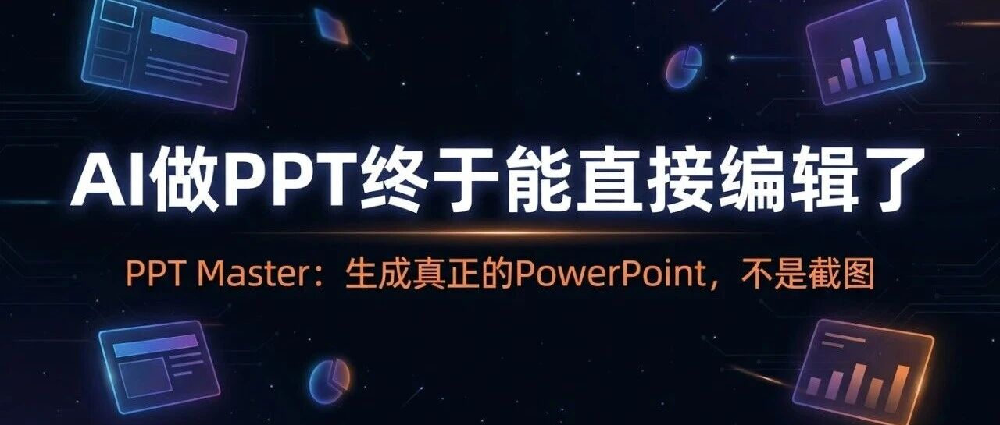
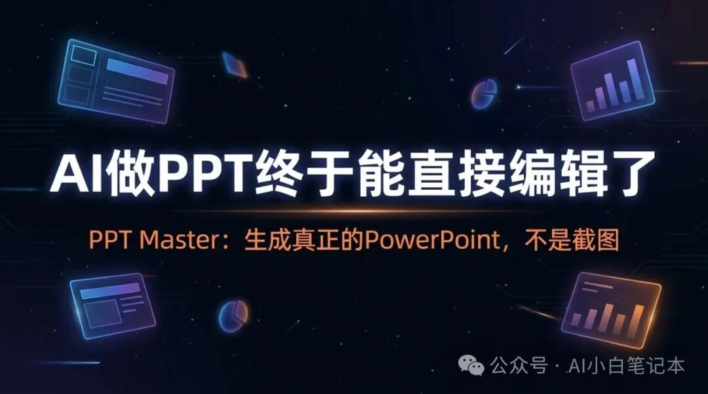
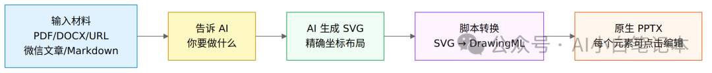

AI做PPT终于能直接编辑了——PPT Master 开源工具介绍

# AI做PPT终于能直接编辑了——PPT Master 开源工具介绍

原创

AI小白笔记本
AI小白笔记本

[AI小白笔记本](javascript:void(0);) 

*2026年4月20日 13:42*
*北京*

在小说阅读器读本章

去阅读

在小说阅读器中沉浸阅读

---

你用 AI 生成过 PPT 吗？

生出来打开一看——好看是好看，但每一页是一张图片。你想改个数字，改个标题，做不到。整页都是贴进去的截图，点了也没反应。

这是绝大多数 AI PPT 工具的现状：**生成的不是 PowerPoint，是 PowerPoint 形状的截图**。

PPT Master 是一个开源项目，专门解决这个问题。生成真正的 PPTX 文件——每个文字框、每个图形、每条线都是原生 PowerPoint 对象，打开就能编辑。

---

## 其他工具为什么做不到

先说清楚问题在哪。

AI 生成 PPT 有几种主流方案，每种都有硬伤：

**方案一：把幻灯片渲染成图片嵌进去。** 看起来漂亮，但那只是图片，文字没法选，颜色没法改，放大就模糊。

**方案二：HTML/CSS 渲染再导出。** Gamma、Tome 这类工具用的方案。网页里看起来很好，但 HTML 是流式文档布局，PowerPoint 是绝对坐标画布——导出的时候两套逻辑一碰就崩，布局乱掉，元素压扁。

**方案三：用 python-pptx 直接生成。** ChatGPT 代码生成 PPT 用的路子。元素是可以编辑的，但 AI 没学过怎么设计复杂排版，生出来的都是朴素文字框加项目符号列表，没有设计感。

PPT Master 走了另一条路：

**AI 生成 SVG → 脚本把 SVG 转成 DrawingML。**

为什么这个方案能行？因为 SVG 和 PowerPoint 的 DrawingML 本质上是同一类东西——两者都是基于绝对坐标的二维矢量格式，矩形、路径、渐变、阴影，几乎一一对应，转换的时候是"方言互译"，不是"跨语言翻译"。

结果就是：导出的 PPTX 里，每个形状、文字框、渐变都是真正的 PowerPoint 原生对象。打开文件，点任何一个元素，直接编辑——就像你自己手动画的一样。

---

## 成本低到离谱

PPT Master 本身是免费开源的，MIT 协议。你只需要支付 AI 模型的调用费用：

用 Claude Sonnet 生成一套 PPT，大约消耗 2 次请求，费用约 **0.08 美元**（不到 6 毛钱）。

如果你有 VS Code Copilot（10 美元/月），每个月做几十套 PPT，总花费也就几块钱。

相比 Gamma（8-20 美元/月）、Beautiful.ai（12-45 美元/月），PPT Master 是按使用付费，不用不花钱，用多少算多少。

---

## 可以输入什么

几乎什么都可以扔给它：

* PDF、DOCX、PPTX
* 网页 URL
* 微信文章链接
* Markdown、纯文本
* 直接把内容粘进对话框

给它一份季度报告 PDF，告诉它"做成 10 页 McKinsey 风格 PPT"，它就去分析内容、设计版式、生成文件。

---

## 生出来是什么风格

项目内置三套风格：

**General（通用风）**：适合内部培训、技术分享、一般演示。

**Consultant（咨询风）**：商业报告、数据分析、结构化内容展示。

**Consultant Top（顶级咨询风）**：对标 McKinsey/BCG/Bain 的 MBB 级别——投资备忘录、战略规划、政府简报这类需要数据密度和专业感的场景。

项目的 Examples 目录里有 15 个实例，229 页幻灯片，可以在官方预览站 hugohe3.github.io/ppt-master 直接看效果。

---

## 支持哪些 AI 工具

工具

推荐度

说明

Claude Code

⭐⭐⭐

效果最好，原生 Opus，上下文最大

Cursor / VS Code Copilot

⭐⭐

很好的替代选择

Codebuddy IDE

⭐⭐

用国产模型（Kimi、MiniMax）首选

Claude、GPT、Gemini、Kimi 都支持，效果有差异但都能用。

---

## 它不适合哪些人

作者在文档里说得很诚实：

**需要自己装环境。** 要安装 Python、克隆代码仓库、配置 AI 编辑器，不是"打开浏览器直接用"那种体验。

**生成比较慢。** 10 页 PPT 大约需要 10-20 分钟，因为每页都是独立生成再拼在一起，保持跨页一致性。

**没有在线协作。** 本地文件，没有分享链接，没有多人实时编辑。

**没有可视化界面。** 所有操作都通过 AI 对话来完成，没有拖拽画布。

**图表数据不动态绑定。** 图表是视觉图形，不是链接 Excel 的动态数据，改数据要重新生成。

如果你想要"秒出一套能看的 PPT"，Gamma 或 Canva 更合适。

如果你在意生成的是不是真正可编辑的 PowerPoint，在意数据不上传到别人服务器，在意不被某个订阅平台锁死——PPT Master 就是为这个需求做的。

---

## 作者是谁

Hugo He，CPA（注册会计师）、CPV（资产评估师）、咨询工程师（投资方向），在投行和咨询行业每天都要做大量 PPT。他做这个工具的原始动机很简单：现有 AI PPT 工具的输出没法编辑，对一个每天要在 PowerPoint 里审稿改稿的人来说完全不够用。

---

## 怎么开始用

**安装（macOS/Linux）：**

git clone https://github.com/hugohe3/ppt-master.git

cd ppt-master

pip install -r requirements.txt

**用法：** 在 Claude Code / Cursor 这类 AI 编辑器里，直接跟 AI 说：

"把 projects/报告.pdf 做成 10 页顶级咨询风 PPT"

AI 会先确认设计规格，再生成，最后在 exports/ 目录里输出两个文件：一个可编辑的 .pptx，一个 SVG 预览版 \_svg.pptx。

Windows 用户参考项目文档里的专门安装指南。

---

GitHub：**github.com/hugohe3/ppt-master**，在线预览：**hugohe3.github.io/ppt-master**

---

看到这里了，说明你是真爱👀

如果这篇对你有用，点个**赞**和**在看**支持一下——这是我继续更新最大的动力。

还没关注的话，搜索公众号「**AI小白笔记本**」，每周都有 AI 实用干货，不整虚的。

预览时标签不可点

关闭

更多

名称已清空

**微信扫一扫赞赏作者**

喜欢作者[其它金额](javascript:;)

赞赏后展示我的头像

作品

暂无作品

喜欢作者

其它金额

¥

最低赞赏 ¥0

确定

返回

**其它金额**

更多

赞赏金额

¥

最低赞赏 ¥0

1

2

3

4

5

6

7

8

9

0

.

关闭

更多

#

搜索「」网络结果

关闭

**调整当前正文文字大小**

更多

100%

​

留言

暂无留言

1条留言

已无更多数据

[发消息](javascript:;)

写留言:

微信扫一扫  
关注该公众号

继续滑动看下一个

轻触阅读原文

AI小白笔记本

向上滑动看下一个

当前内容可能存在未经审核的第三方商业营销信息，请确认是否继续访问。

[继续访问](javascript:)[取消](javascript:)

[微信公众平台广告规范指引](javacript:;)

[知道了](javascript:;)

微信扫一扫  
使用小程序

[取消](javascript:void(0);)
[允许](javascript:void(0);)

[取消](javascript:void(0);)
[允许](javascript:void(0);)

[取消](javascript:void(0);)
[允许](javascript:void(0);)

×
分析

微信扫一扫可打开此内容，  
使用完整服务

AI小白笔记本

已关注

赞

分享

推荐

写留言

：
，
，
，
，
，
，
，
，
，
，
，
，
。
 
视频
小程序
赞
，轻点两下取消赞
在看
，轻点两下取消在看
分享
留言
收藏
听过

可在「公众号 > 右上角  > 划线」找到划线过的内容

我知道了

,

,

选择留言身份

**留言**

暂无留言

1条留言

已无更多数据

[发消息](javascript:;)

写留言:

关闭

更多

关闭

## 确认提交投诉

你可以补充投诉原因（选填）

确定