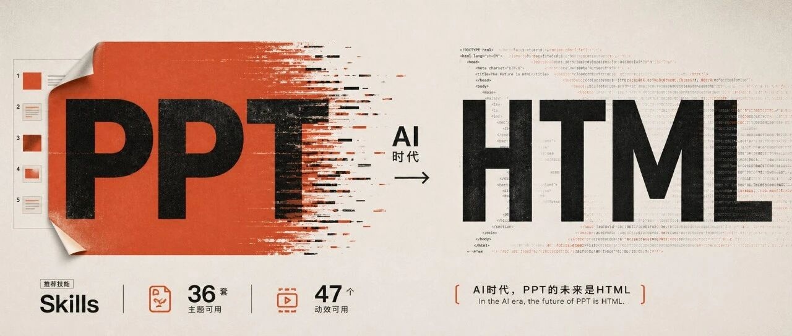
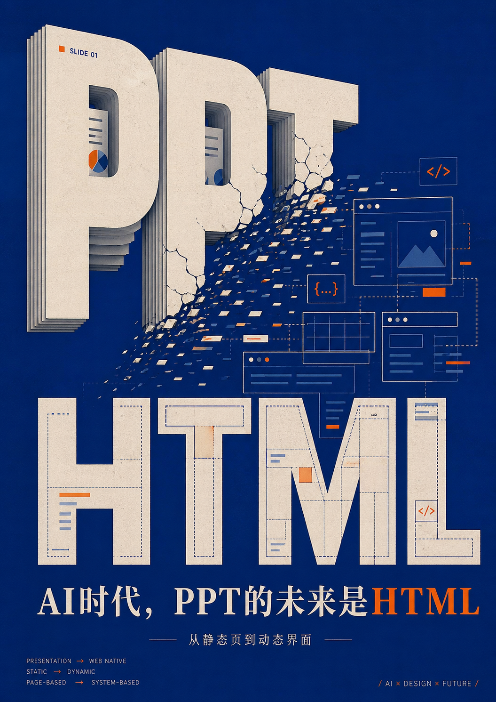
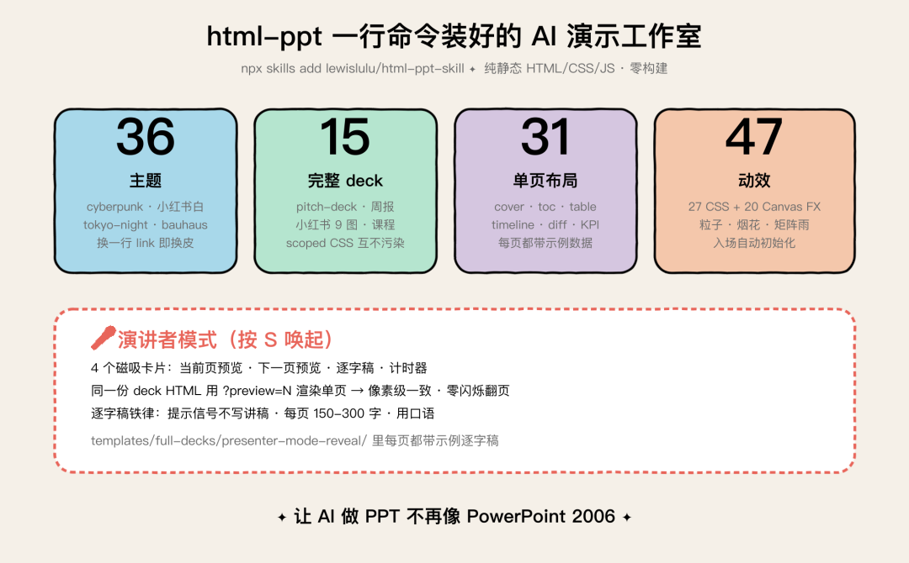
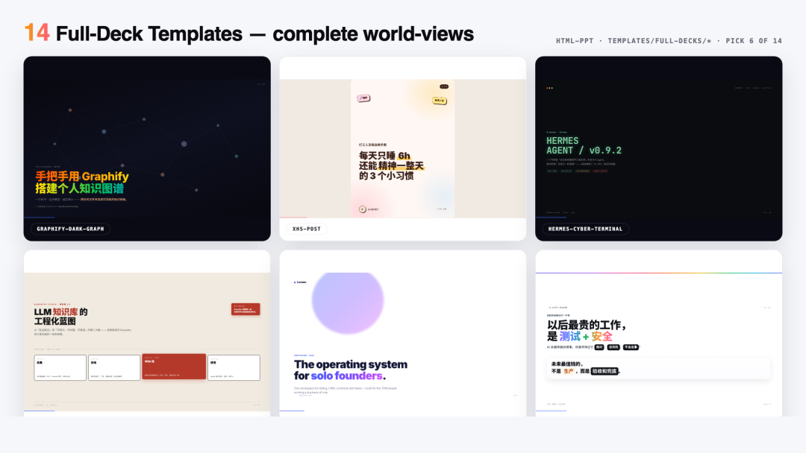
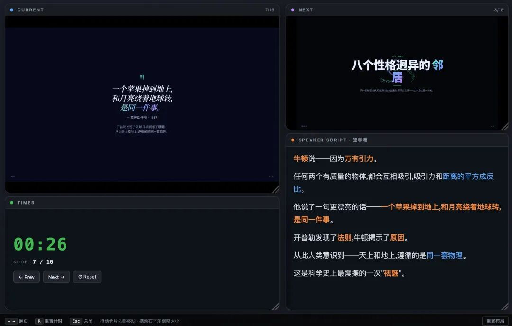
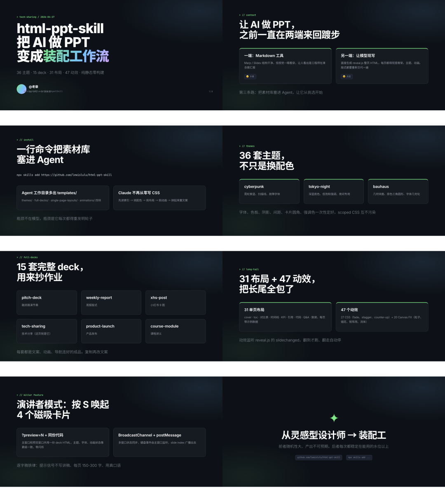

AI时代，PPT的未来是HTML，一个神奇的 Skills 推荐




# AI时代，PPT的未来是HTML，一个神奇的 Skills 推荐

原创

老章很忙
老章很忙

[Ai学习的老章](javascript:void(0);) 

*2026年4月28日 07:09*
*英国*


在小说阅读器读本章

去阅读


在小说阅读器中沉浸阅读



让 AI 做 PPT ，我之前一直在两端之间来回踱步，一端是 Marp、Slidev 这类 Markdown 工具，结构干净但视觉一眼看穿；

另一端是直接让模型生成 reveal.js 整页 HTML，每页都得现搭骨架，主题、动画、版式都要重新交代一遍，模型一旦上下文一长就开始忘前面定的样式

最近翻到 lewislulu 开源的 `html-ppt-skill`，把这两端的纠结直接绕过去了，它给 Claude Code / Cursor 这类带 skill 系统的 Agent 装上一整套预置素材库，36 套主题、15 套完整 deck、31 个单页布局、47 个动效全部躺在仓库里随取随用，做出来的 PPT 是纯静态 HTML/CSS/JS，浏览器双击就开

仓库地址：github.com/lewislulu/html-ppt-skill

下面是仓库首页的封面动图，封面页本身就是用这个 skill 生成的，左下角实时预览能看到它跑动效的状态：


html-ppt 封面 · 实时预览

我用文字总结了一张能力速查图，方便你先看个全貌：



### 一行命令把素材库塞进 Agent

安装就一句

```
npx skills add https://github.com/lewislulu/html-ppt-skill
```

跑完之后，Agent 的工作目录里会多出 `templates/` 目录，里面分了 `themes/`、`full-decks/`、`single-page-layouts/`、`animations/` 四块，从此再让 Claude 做 PPT，它不用从零写 CSS，而是先读 templates 索引，挑配色、挑布局、挑动画，把现成的卡片拼起来，最后只往里塞业务文案

这种"先选后填"的工作流让我意识到一件事：之前模型生成 PPT 慢、丑、不一致，瓶颈不在模型，瓶颈在它每次都得重发明轮子

### 36 套主题不只是换配色

下图是仓库放出的 8 套主题预览，cyberpunk 的霓虹紫、tokyo-night 的深蓝、bauhaus 的几何块，一眼能看出彼此差异：


36 主题 · 其中 8 个

我点进 `templates/themes/` 看了一圈，cyberpunk、tokyo-night、bauhaus、小红书白、商务深蓝……每套都是一个独立 CSS 文件，把字体、色板、阴影、间距、卡片圆角、强调色、引文样式一次性定好，换主题就是换一行 link，整套 deck 立刻换皮

更关键的是每套主题都做了 scoped CSS 隔离，同一份 HTML 文件里塞两套主题不会互相污染，这点小细节决定了你能不能在一份周报里同时放产品发布页和内部数据页两种风格

### 15 套完整 deck 是用来抄作业的

下图是 15 套 deck 的封面拼图，pitch-deck、周报、小红书 9 图、技术分享，每套都自带配色和节奏：



15 套完整 deck 模板

`full-decks/` 下有 pitch-deck、周报、小红书 9 图、产品发布、技术分享、课程讲义等等，每一套都是写完文案、配好动画、连好导航的可直接演示的成品，Agent 拿到任务，先去这里找最贴近的 deck，复制一份再改文案，比让它从空白页搭起快得不止一个量级

我自己测的体感：让 Claude 生成一份 12 页技术分享 PPT，没有 skill 时它会反复犹豫每页该用啥布局，平均 8 分钟一份还经常版式翻车；装上 skill 之后，它直接说"我用 minimal-tech 主题 + technical-talk deck 模板"，3 分钟出一份能直接讲

### 31 个单页布局补齐长尾

仓库里有一张动图把 31 种布局轮播一遍，每张都是真实模板渲染出来的，能直观看出哪些是你常用的版式：


31 种布局通过真实模板文件自动循环播放

15 套 deck 解决主线，剩下的 31 个单页布局解决长尾，cover 页、目录页、对比表、时间线、KPI 看板、引用页、代码页、Q&A 页、致谢页……每页都带一份示例数据，Agent 看一眼就知道结构怎么填

写 PPT 最折磨人的从来不是主线那几页，而是"我这里需要一个三栏对比怎么排"，这种零散需求过去全靠模型现编 flexbox，现在直接 `templates/single-page-layouts/comparison-3col.html` 拷出来填字

### 47 个动效里藏了 20 个 Canvas FX

下图是 47 个动效的全家福， Canvas FX，粒子、烟花、矩阵雨这些过去要手撸 shader 的效果都封装好了：


47 个动效 · 27 CSS + 20 Canvas FX

动效目录分两类：27 个 CSS 动画解决文字入场、卡片浮起、渐变背景这类常规需求；20 个 Canvas FX 是真有意思的部分，粒子穿梭、烟花炸裂、矩阵雨、流体波纹这些过去要手撸 shader 才搞得出来的效果，每个都封装成一个 `<canvas>` 加一段初始化脚本

入场也做了自动化，每个动效组件都监听了 reveal.js 的 `slidechanged` 事件，翻到这一页才开始跑，翻走自动停，性能不会被一堆同时跑的粒子拖崩

### 演讲者模式是这个 skill 真正杀手的地方

下图是按 S 之后的实际效果，主屏幕的 deck 还在原地，4 个磁吸卡片在四角飘出来：



演讲者模式 · 4 个磁吸卡片

按 S 键唤起演讲者模式，屏幕上漂出 4 个磁吸卡片：当前页大预览、下一页小预览、本页逐字稿、计时器，看一眼这布局熟不熟悉——和 Keynote 演讲者视图几乎一比一

实现思路有两个细节值得拆开讲，第一，当前页和下一页的预览不是单独再渲染一次，而是用 `?preview=N` 参数让同一份 deck HTML 自己渲染单页，主窗口和预览窗口共用一份代码，主题、字体、动画的状态像素级一致，翻页零闪烁，第二，主窗口和卡片之间用 `BroadcastChannel` 加 `postMessage` 双通道同步，一边监听键盘事件，一边把当前 slide index 广播出去，多窗口状态从来不会错位

逐字稿这块也有几条铁律写在 skill 文档里：提示信号（"接下来我们看……"）不写进讲稿、每页 150-300 字、用真正的口语而不是把幻灯片文字念一遍，`templates/full-decks/presenter-mode-reveal/` 里每页都给了示例逐字稿可以照抄结构

### 纯静态零构建是最让我安心的一点

整个产物没有 webpack、没有 vite、没有 npm install、没有任何依赖管理，一份 deck 就是一份 `index.html` 加几个相对路径的 css 和 js，扔到 GitHub Pages、扔到 Vercel、扔到任何对象存储，甚至直接 `python -m http.server` 都能演示

这意味着你交付给客户的就是一个文件夹，他用 Chrome 打开就能看，不用装 Node、不用装 PowerPoint、不用考虑版本兼容，这件小事直接把 PPT 的分发成本砍到了零

### 案例：把这篇文章本身做成一份 PPT

既然 skill 这么好用，那把这篇文章本身用它转一遍 PPT 岂不美哉？

结果如下：



8 页总览拼图

封面页单独放大看：

这套 deck 用的是仓库自带的 `tech-sharing` 主题，所有渐变色文字、卡片样式、kicker 标签都是模板原生提供的，我只往里塞中文文案，CSS 一行没动，这是这个 skill 最直接的价值——把 PPT 设计权交给模板维护者，让你这个内容创作者只关心一件事：把内容讲清楚

### 我的实际用法

现在我让 Claude Code 做任何演示材料，prompt 模板都固定成三段：第一段说目标受众和场景，第二段贴主题偏好和参考案例，第三段把素材丢过去，Claude 拿到之后会先回复"我准备用 X 主题 + Y deck 模板，加 Z 动效，你看 ok 吗"，确认完才开始生成

这种工作流里，Agent 从一个"全靠灵感的 PPT 设计师"变成了一个"有素材库的 PPT 装配工"，前者随机性大、产出不可预期，后者每次都稳定在一个能用的水位以上

[#htmlppt](javascript:;) [#ClaudeCode](javascript:;) [#AgentSkill](javascript:;) [#静态PPT](javascript:;) [#开源工具](javascript:;)

---

**制作不易，如果这篇文章觉得对你有用，可否点个关注。给我个三连击：点赞、转发和在看。若可以再给我加个🌟，谢谢你看我的文章，我们下篇再见！**

预览时标签不可点

关闭

更多

名称已清空

**微信扫一扫赞赏作者**

喜欢作者[其它金额](javascript:;)

赞赏后展示我的头像

作品

暂无作品

喜欢作者

其它金额

¥

最低赞赏 ¥0

确定

返回

**其它金额**

更多

赞赏金额

¥

最低赞赏 ¥0

1

2

3

4

5

6

7

8

9

0

.

好用的 AI 工具 · 目录

#好用的 AI 工具

上一篇一个神奇的视频生成 Skills，实测，狂喜下一篇OpenAI 还是 Open 的，最新开源

关闭

更多

#

搜索「」网络结果

关闭

**调整当前正文文字大小**

更多

100%

​

留言

暂无留言

1条留言

已无更多数据

[发消息](javascript:;)

写留言:


微信扫一扫  
关注该公众号

继续滑动看下一个

轻触阅读原文


Ai学习的老章

向上滑动看下一个

当前内容可能存在未经审核的第三方商业营销信息，请确认是否继续访问。

[继续访问](javascript:)[取消](javascript:)

[微信公众平台广告规范指引](javacript:;)

[知道了](javascript:;)


微信扫一扫  
使用小程序

[取消](javascript:void(0);)
[允许](javascript:void(0);)

[取消](javascript:void(0);)
[允许](javascript:void(0);)

[取消](javascript:void(0);)
[允许](javascript:void(0);)

×
分析


微信扫一扫可打开此内容，  
使用完整服务


Ai学习的老章

已关注

赞

分享

推荐

写留言

：
，
，
，
，
，
，
，
，
，
，
，
，
。
 
视频
小程序
赞
，轻点两下取消赞
在看
，轻点两下取消在看
分享
留言
收藏
听过


可在「公众号 > 右上角  > 划线」找到划线过的内容


我知道了

,

,

选择留言身份

该账号因违规无法跳转

**留言**

暂无留言

1条留言

已无更多数据

[发消息](javascript:;)

写留言:

关闭

更多

关闭

**好用的 AI 工具**

详情

更多

正在加载

关闭

## 确认提交投诉

你可以补充投诉原因（选填）

确定