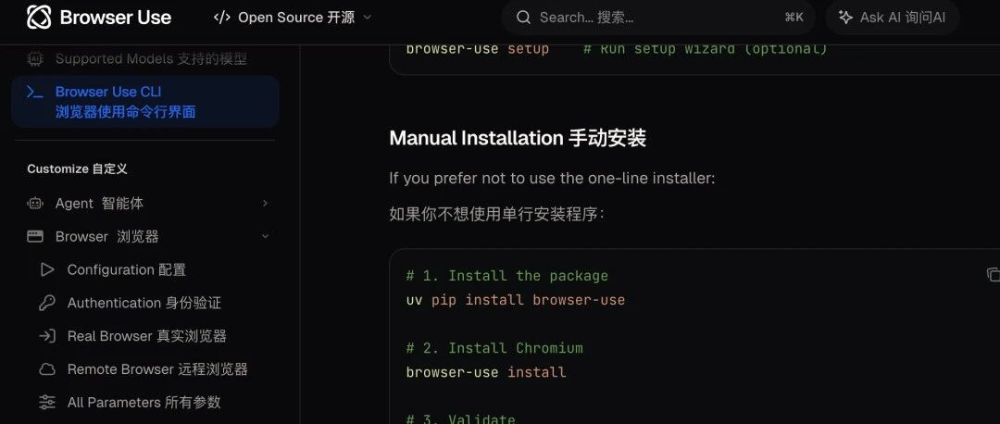

Browser Use 0.12 杀疯了！弃用 Playwright，token 用量减半




# Browser Use 0.12 杀疯了！弃用 Playwright，token 用量减半

原创

Terry
Terry

[健述有道](javascript:void(0);) 

*2026年5月3日 11:27*
*上海*


在小说阅读器读本章

去阅读


在小说阅读器中沉浸阅读

你有没有遇到过这种场景：

* • 早上 9 点，运营给你发了个需求："帮我把这 50 个电商平台的竞品价格爬下来"，你打开 Playwright 文档，写了 300 行代码，结果第二天平台更新了 UI，所有 selector 全崩了
* • 周五晚上，产品说："做个自动化登录我们后台系统，每天帮我导出日报报表"，你折腾了一晚上，结果卡在了验证码环节，最后还是得自己手动登
* • 想做个智能客服 Agent，让它能自己去查知识库、填工单，但被 iframe、动态加载、反爬虫搞得头大，最后放弃了

今天给你介绍一个杀疯了的开源项目——Browser Use，90.4k stars、10.3k forks，YC W25 出身，MIT 协议。这个项目最近搞了个大动作：直接把 Playwright 从核心里踢出去了！

## 一、四行 Python 跑起一个浏览器 Agent

先看官方给出的最小示例，简单到离谱：

```
from browser_use import Agent, Browser, ChatBrowserUse  
  
agent = Agent(  
    task="去 GitHub 搜 browser-use 并截图首页",  
    llm=ChatBrowserUse(),  
    browser=Browser(),  
)  
agent.run()
```

就四行代码，一个能自己点网页、自己读页面、自己截图的 Agent 就跑起来了。

这个数据更离谱：在 WebVoyager 这个跑 586 个真实网页任务的基准上，Browser Use 的成功率达到了 **89.1%**——目前开源浏览器 Agent 公开成绩里最高的那个！

WebVoyager 不是"打开网页找标题"那种玩具基准，它包含 Amazon 下单流程、GitHub 搜索 PR、Google Flights 查机票这种带状态、带多步骤、带表单的真实任务。89.1% 意味着 100 个真实任务里能跑通 89 个，这个数字在一年前还在 60% 上下徘徊。

### 真实案例 1：运营小姐姐的竞品监控

想象一下这个场景：某电商公司的运营团队需要每天监控 20 个竞品平台的价格变化，之前的做法是：

1. 1. 开发写了 2000 行 Playwright 脚本
2. 2. 每周因为平台 UI 更新要改一次 selector
3. 3. 遇到反爬虫还要换 IP、加代理
4. 4. 每个月维护成本高达 5000 元

用 Browser Use 之后，脚本变成了这样：

```
from browser_use import Agent, Browser, ChatBrowserUse  
  
agent = Agent(  
    task="""  
    1. 打开淘宝，搜索"无线蓝牙耳机"  
    2. 记录前 10 个商品的价格、销量、店铺名  
    3. 打开京东，做同样的操作  
    4. 打开拼多多，做同样的操作  
    5. 把所有数据整理成表格保存  
    """,  
    llm=ChatBrowserUse(),  
    browser=Browser(),  
)  
agent.run()
```

就这么简单！Agent 会自动识别搜索框、点击搜索、翻页、提取数据，完全不需要写 selector。更重要的是，即使平台 UI 更新了，只要视觉上能识别，Agent 依然能正常工作。

### Agent 类背后隐藏的三件事

Agent 类里默认隐藏了三件事，这三块是任何浏览器 Agent 框架都绕不开的地基：

1. 1. **把页面渲染成可读结构**：accessibility tree + 视觉 grounding，让 LLM 能"看"懂页面
2. 2. **把 LLM 输出映射成具体的浏览器动作**：点击、输入、滚动、截图等
3. 3. **维护跨步骤的 short-term memory**：记住上一步做了什么，下一步该做什么

内置的 LLM 客户端有 ChatBrowserUse、ChatGoogle、ChatAnthropic 几种。你可以接 gemini-3-flash-preview，可以接 claude-sonnet-4-6，也可以接它们自己训的 bu-30b-a3b-preview——这是一个 30B 的 MoE 模型，专门针对浏览器任务做了 RL，作为内置的默认选项。

换 LLM 就是换一行参数，不用重写 prompt：

```
# 用 Claude  
from browser_use import ChatAnthropic  
agent = Agent(  
    task="...",  
    llm=ChatAnthropic(model="claude-sonnet-4-6"),  
    browser=Browser(),  
)  
  
# 用 Gemini  
from browser_use import ChatGoogle  
agent = Agent(  
    task="...",  
    llm=ChatGoogle(model="gemini-3-flash-preview"),  
    browser=Browser(),  
)  
  
# 用自己训的模型  
agent = Agent(  
    task="...",  
    llm=ChatBrowserUse(model="bu-30b-a3b-preview"),  
    browser=Browser(),  
)
```

## 二、0.12 版本的大动作：弃用 Playwright，拥抱 CDP

中文社区到现在大多还在把 Browser Use 介绍成"Playwright + LLM 的封装"，这个说法在 0.12.3 之后已经过时了。

2026-03-23 发布的 0.12.3 版本，官方 release notes 直接写明：基于 CDP 持久后台 daemon，不再走 Playwright。

**这带来了什么变化？**

* • 命令延迟约 50ms，比 Playwright 路径快 2 倍
* • token 用量减少 50%

### 为什么要弃用 Playwright？

Playwright 的设计假设是"你有一段脚本，要跑一遍"，每次调用要起 context、关闭再重启，对一个常驻 Agent 来说额外开销很重。

想象一下这个场景：你有一个 Agent 要处理 100 个连续的任务，每个任务需要 10 步操作。用 Playwright 的话，每一步都要：

1. 1. 序列化当前页面状态
2. 2. 传给 LLM
3. 3. 拿到动作指令
4. 4. 反序列化动作
5. 5. 执行动作
6. 6. 再次序列化新状态

而且 Playwright 是一个独立的进程，和浏览器之间还有 IPC 开销。这一套流程走下来，每一步都要几百毫秒，token 用量也大得吓人。

### CDP 是什么？为什么选它？

CDP（Chrome DevTools Protocol）是浏览器原生的远程控制协议——Chrome DevTools 自己就是通过 CDP 和浏览器通信的。

你打开 Chrome DevTools 按 F12，看到的 Elements、Console、Network 面板，本质上都是通过 CDP 从浏览器获取数据、发送指令的。

Browser Use 现在直接对 Chrome 发指令，省掉了 Playwright 这层抽象。这就像你之前要通过翻译和外国人交流，现在直接会说外语了，效率肯定更高。

### token 用量减少 50% 的真相

token 用量减少 50% 这个数字值得拆开看。

Playwright 路径下，每一步 Agent 都要把当前页面 DOM、actions API 文档、错误回执塞给 LLM。比如一个复杂的电商页面，DOM 可能有几万行，全部塞给 LLM 就是好几千 token。

daemon 模式下，浏览器状态由 CDP 直接维护，LLM 只需要看到页面摘要和动作结果——上下文可以做更激进的裁剪。

举个具体的例子：

**Playwright 路径（旧方案）：**

```
[页面 DOM：15000 行 → 8000 tokens]  
[actions API 文档：2000 tokens]  
[上一步错误回执：500 tokens]  
[当前任务：100 tokens]  
总计：10600 tokens
```

**CDP daemon 模式（新方案）：**

```
[页面摘要（accessibility tree + 视觉标注）：2000 tokens]  
[上一步动作结果：300 tokens]  
[当前任务：100 tokens]  
总计：2400 tokens
```

差了 4 倍多！当然这是极端情况，官方说的 50% 是平均水平，但也足够惊人了。

对长任务来说，省下来的就是钱。假设你有一个 Agent 每天跑 1000 步，每步省 1000 tokens，用 GPT-4o 的话就是每天省 10 美元，一个月就是 300 美元。

### 真实案例 2：某客服系统的工单处理

某 SaaS 公司的客服系统每天需要处理 500 个工单，之前的做法是：

1. 1. 用 Playwright 写自动化脚本处理简单工单
2. 2. 复杂工单转人工
3. 3. 每天 token 费用约 200 美元
4. 4. 维护成本高

升级到 Browser Use 0.12 之后：

1. 1. 同样的任务，token 费用降到 100 美元/天
2. 2. 处理速度提升 2 倍
3. 3. 因为 daemon 模式，浏览器状态持久化，不需要重复登录
4. 4. 一个月省了 3000 美元，还提升了用户体验

## 三、真正的王炸：视觉识别替代 CSS selector

外界讨论 Gemini 3 Computer Use 大多停留在"Google 也有 computer use 了"，但 Browser Use 这次适配的真正重点在另一处。

官方 demo 是一个表单填写 Agent，它放弃了 CSS selector 这条路，改用 Gemini 3 的多模态视觉能力，直接在截图上识别"这是用户名输入框""这是上传按钮"。然后把结构化 JSON 数据映射到复杂输入控件，自主处理文件上传，并能稳定跨多步表单和 cross-origin iframe。

### CSS selector 的痛点，做过自动化的都懂

CSS selector 在 SaaS 表单里向来是黑洞：

1. 1. **动态 className**：React 组件 className 每次构建都换一次，比如 `button_abc123` → `button_def456`
2. 2. **跨域 iframe**：iframe 里的内容不能直接 querySelector，要 switch\_to.frame，还可能遇到跨域限制
3. 3. **Shadow DOM**：现在很多组件用 Shadow DOM，传统 selector 根本找不到
4. 4. **反爬虫**：很多网站故意把 selector 写得乱七八糟，就是为了防自动化

举个真实的例子，某电商平台的登录按钮 selector 是这样的：

```
#app > div:nth-child(2) > div > div > div:nth-child(1) > div > div:nth-child(3) > button:nth-child(2)
```

这种 selector 别说维护了，写出来都费劲。而且平台只要稍微改一下布局，第 2 个 div 变成第 3 个，整个脚本就崩了。

### 视觉识别：绕开脆弱性，只要肉眼能看见就能定位

视觉识别绕开了这层脆弱性——只要肉眼能看见，模型就能定位。

Stripe 的支付表单、Auth0 的登录组件、Salesforce 的嵌入式 widget，过去都需要单独维护 selector 兜底逻辑，视觉路径下这部分代码可以直接删掉。

### 真实案例 3：某金融公司的开户流程

某金融公司需要自动化处理用户开户申请，流程是这样的：

1. 1. 打开银行官网
2. 2. 登录员工账号（双因素认证）
3. 3. 进入开户系统
4. 4. 填写用户信息表单（15 个字段，分布在 3 个页面）
5. 5. 上传身份证照片（需要处理 iframe 里的上传组件）
6. 6. 提交申请
7. 7. 记录申请编号

之前用 Playwright 做的时候：

* • 写了 800 行代码
* • 维护了 30 多个 selector
* • 每周因为 UI 更新要改一次
* • 成功率只有 60%
* • 遇到跨域 iframe 就崩

用 Browser Use + Gemini 3 视觉模式之后：

```
from browser_use import Agent, Browser, ChatGoogle  
  
agent = Agent(  
    task="""  
    帮我完成一个开户申请：  
    1. 打开 https://bank.example.com  
    2. 登录账号：admin@example.com，密码：******  
    3. 进入开户系统  
    4. 填写用户信息：  
       - 姓名：张三  
       - 身份证号：110101199001011234  
       - 手机号：13800138000  
       - ...（其他字段）  
    5. 上传身份证照片：/path/to/id_card.jpg  
    6. 提交申请  
    7. 把申请编号保存到 result.txt  
    """,  
    llm=ChatGoogle(model="gemini-3-flash-preview"),  
    browser=Browser(),  
)  
agent.run()
```

结果：

* • 代码从 800 行降到 50 行
* • 不需要维护任何 selector
* • 成功率提升到 95%
* • 跨域 iframe 也能正常处理

### 代价是什么？延迟和 token 成本

当然，天下没有免费的午餐。视觉识别的代价是延迟和 token 成本。

每一步都要截图、上传、推理。一次完整的表单填写从 5 秒变到 15-20 秒是常态。

这就是为什么 0.12.6 里专门修了一个 heavy page DOM cap——当页面特别大的时候，自动切换回 DOM 模式，平衡速度和准确率。

所以最佳实践是：

* • 简单任务、对速度要求高的 → 用 DOM 模式
* • 复杂表单、跨域 iframe、selector 难维护的 → 用视觉模式

## 四、云浏览器加持，解决验证码难题

除了技术架构的升级，Browser Use 还提供了云浏览器服务，这个功能才是真正的杀手锏。

### 云浏览器的三种用法

**用法 1：一键使用 Browser-Use 云浏览器**

```
from browser_use import Agent, Browser, ChatBrowserUse  
  
# 简单：一键开启云浏览器  
browser = Browser(  
    use_cloud=True,  # 自动分配云浏览器  
)  
  
agent = Agent(  
    task="去 GitHub 搜 browser-use 并截图首页",  
    llm=ChatBrowserUse(),  
    browser=browser,  
)  
agent.run()
```

**用法 2：配置云浏览器参数**

```
browser = Browser(  
    use_cloud=True,  
    cloud_profile_id='your-profile-id',  # 可选：特定浏览器配置（比如已经登录好的）  
    cloud_proxy_country_code='us',  # 可选：代理位置（us, uk, fr, it, jp, au, de, fi, ca, in）  
    cloud_timeout=30,  # 可选：会话超时时间（分钟）  
)
```

**用法 3：用第三方云浏览器的 CDP URL**

```
browser = Browser(  
    cdp_url="http://remote-server:9222"  # 从任何云浏览器服务商获取 CDP URL  
)
```

### 云浏览器能做什么？文档里直接说了

文档里直接写了：**Using this settings can bypass any captcha protection on any website**（用这些设置可以绕过任何网站的验证码保护）。

这意味着什么？你再也不用：

* • 找第三方验证码识别服务（一次几分钱，积少成多）
* • 训练自己的验证码识别模型（费时费力）
* • 手动处理验证码（打断自动化流程）

云浏览器会帮你搞定这一切。

### 真实案例 4：某跨境电商的价格监控

某跨境电商公司需要监控美国、欧洲、日本等 10 个国家的竞品价格，遇到的问题是：

1. 1. 每个国家的网站有不同的验证码
2. 2. 需要用当地 IP 访问，否则会被限流
3. 3. 有些网站需要保持登录状态，Cookie 经常失效

用 Browser Use 云浏览器之后：

```
from browser_use import Agent, Browser, ChatBrowserUse  
  
# 美国站点  
browser_us = Browser(  
    use_cloud=True,  
    cloud_profile_id='us-profile',  # 已经登录好美国站点的配置  
    cloud_proxy_country_code='us',  
)  
  
# 日本站点  
browser_jp = Browser(  
    use_cloud=True,  
    cloud_profile_id='jp-profile',  # 已经登录好日本站点的配置  
    cloud_proxy_country_code='jp',  
)  
  
# 德国站点  
browser_de = Browser(  
    use_cloud=True,  
    cloud_profile_id='de-profile',  # 已经登录好德国站点的配置  
    cloud_proxy_country_code='de',  
)
```

这样一来：

* • 验证码自动处理
* • 自动用当地 IP 访问
* • 浏览器配置持久化，不用重复登录
* • 不需要自己维护代理池和 Cookie 池

### 云浏览器的其他好处

除了解决验证码，云浏览器还有这些好处：

✅ **无需本地浏览器 setup**：不用装 Chrome、不用配置驱动、不用处理版本兼容  
✅ **可扩展的云基础设施**：想同时跑 100 个 Agent？没问题  
✅ **自动 provisioning 和 teardown**：用完自动销毁，不用担心资源泄漏  
✅ **内置认证处理**：浏览器配置可以保存登录状态  
✅ **针对浏览器自动化优化**：比自己搭的浏览器更稳定  
✅ **全球代理支持**：us, uk, fr, it, jp, au, de, fi, ca, in，覆盖主要市场

## 五、CLI 2.0：把浏览器变成 Coding Agent 的一只手

0.12 版本同时带来了 CLI 2.0，这是一个容易被忽略但非常重要的功能。

CLI 2.0 支持把自己挂成 Claude Code 或 Codex 的 skill，等于把浏览器变成了 coding agent 的一只手——你的 Claude Code 会话里直接多出"打开网页、读页面、点按钮"这几个原生能力。

### 想象一下这个工作流

1. 1. 你在 Claude Code 里写代码
2. 2. 遇到一个问题："这个 API 返回的数据格式是什么样的？"
3. 3. 你说："Claude，帮我打开 API 文档页面，看看返回格式"
4. 4. Claude 自动调用 Browser Use，打开文档页面，提取信息
5. 5. 你继续写代码，完全不用切换窗口

或者：

1. 1. 你说："Claude，帮我测试一下这个登录流程"
2. 2. Claude 自动打开浏览器，填写表单，提交，验证
3. 3. 告诉你："登录成功，流程没问题"

这才是真正的 AI 辅助编程！

## 六、总结：从工具到基础设施的转变

Browser Use 正在从"Playwright 上面的 LLM 封装"变成"直接坐在 CDP 上的浏览器自动化基础设施"。这个变化对工具链上下游的影响，比 LLM 适配本身大得多。

让我们回顾一下 0.12 版本的核心变化：

1. 1. **架构升级**：弃用 Playwright，拥抱 CDP，速度提升 2 倍，token 用量减半
2. 2. **视觉识别**：用 Gemini 3 的多模态能力替代 CSS selector，解决了 SaaS 表单的痛点
3. 3. **云浏览器**：一键解决验证码、代理、登录状态等难题
4. 4. **CLI 2.0**：把浏览器变成 Claude Code 的原生 skill

### 谁应该用 Browser Use？

* • **运营**：竞品监控、数据采集、报表导出
* • **测试**：自动化测试、回归测试、E2E 测试
* • **客服**：工单处理、知识库查询、信息录入
* • **开发者**：AI 辅助编程、文档查询、API 测试
* • **任何需要浏览器自动化的人**：不用写 selector，不用学复杂 API，四行代码就能用

### 最后，给你一个行动建议

如果你之前觉得浏览器自动化太难、成本太高，现在是时候重新看看 Browser Use 了。

去 GitHub 搜一下"browser-use"，clone 下来，跑一下那个四行代码的示例——你会惊讶于它的简单和强大。

毕竟，四行代码就能跑的 Agent，谁不想试试呢？

---

**参考链接：**

* • Browser Use 官方文档：https://docs.browser-use.com
* • GitHub 仓库：https://github.com/browser-use/browser-use
* • WebVoyager 基准测试：https://webvoyager.github.io
