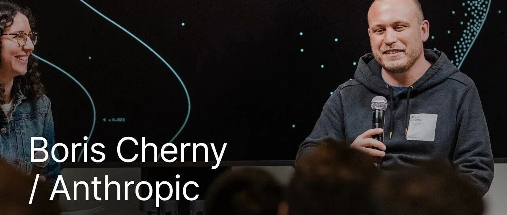
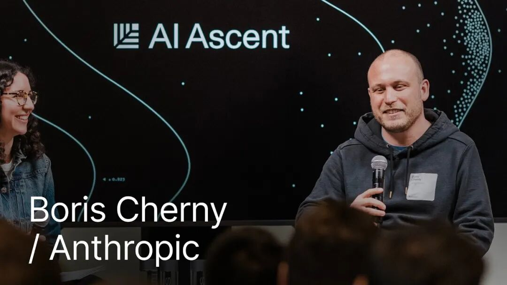
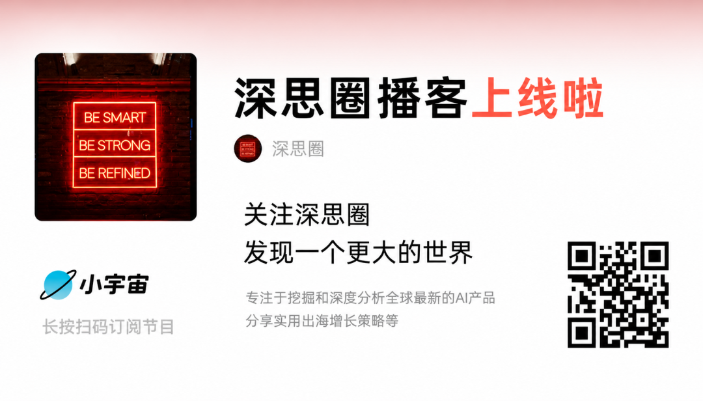

Claude Code之父最新预测：编程被解决后，下一个是什么？

# Claude Code之父最新预测：编程被解决后，下一个是什么？

[深思圈](javascript:void(0);) 

*2026年5月6日 09:50*
*浙江*

在小说阅读器读本章

去阅读

在小说阅读器中沉浸阅读

你有没有想过，"写代码"这件事，有一天会变得和"发短信"一样普通？不是比喻，是字面意思。最近我看了一个访谈，是 Anthropic 的 Boris Cherny 在 Sequoia Capital（红杉资本）的 AI Ascent 2026 大会上的分享。Boris 是 Claude Code 的创造者，也是整个 AI 编程领域最前沿的人之一。他在访谈里说了很多让我停下来反复思考的东西。

他说，编程已经被解决了。他说，他在 2026 年一行代码都没有手写过。他说，他现在每天从手机上发出几十个 PR（Pull Request，代码合并请求）。他还说，有一天他创了纪录，一天发了 150 个 PR。

我第一次听到这些话时，感觉有点像在看科幻小说。但越想越觉得，这不是未来，这是已经在发生的现实。只是大多数人还没意识到而已。

**Claude Code 是怎么来的**

Boris 说，Claude Code 其实是"意外"诞生的。2024 年底，他加入了 Anthropic 内部一个叫 Anthropic Labs 的孵化团队，整个团队就几个人，目标是把当时模型的潜力转化成真实可用的产品。他们做出来的东西，包括 Claude Code、MCP（Model Context Protocol，模型上下文协议），还有 Claude 的桌面端应用。任务完成之后，团队解散。现在他们又重新聚在一起，做第二轮。

他说，当时他们看到了一个"product overhang"（产品空缺）——模型的能力已经远超市面上任何产品所能发挥出来的水平。2024 年底，编程领域最先进的产品，是 type-ahead（逐行补全），就是你打开 IDE，按 Tab，每次补全一行代码。这是 Claude Sonnet 3.5 当时能做到的事情。

但 Boris 他们看到的是：模型已经可以做到更多。不需要逐行补全了，可以直接让 AI agent 写完所有代码。于是他就去做了。

但他也坦诚，Claude Code 一开始根本不好用。前六个月，他自己只用它写大概 10% 的代码。发布之后，也没有爆发式增长。真正的拐点是 Opus 4 发布的那一刻，之后每一个模型版本都带来一次跃升：4.5、4.6、4.7，一路往上。

我觉得这段历史特别值得深思。Boris 他们在产品还没有 PMF（Product-Market Fit，产品市场契合）的时候就开始做，而且明知道六个月内不会有 PMF，因为他们是在为下一代模型做准备。这是一种非常特殊的产品思维：你看到的不是现在的市场，而是模型进化之后会出现的市场。这需要极强的判断力，也需要极强的耐心。大多数创业公司在这个阶段就放弃了。

**"编程已经被解决了"，这句话什么意思**

这是整个访谈里最震撼我的一个论断。Boris 说，对他个人来说，编程已经被解决了。他的代码 100% 由模型来写，他不再手写任何一行代码。

他解释了为什么 Claude Code 用 TypeScript 和 React 来写自己的代码库。原因很简单：这两个是训练数据里分布最广的语言和框架，当时模型还没那么聪明，用"on distribution"（在分布范围内）的技术栈能让模型表现更稳定。到今天，模型已经可以学会它没见过的语言和框架，但那时候技术选型这件事，是影响 AI 输出质量的关键变量。

他也补充说，"编程被解决"这件事不是对所有人都成立的。非常复杂的大型代码库、冷门语言、特殊的历史系统，这些地方模型还没办法完全胜任。但他的判断是：通常等下一个模型就好了。

我自己理解这句话，是这样的：Boris 说的"编程被解决"，针对的是"写代码"这个动作本身。就好像"打字被解决了"——不是说文字创作没有价值了，而是说打字这个物理动作，不再是瓶颈了。写代码的技术门槛，正在以肉眼可见的速度崩塌。剩下的核心问题，变成了你想要构建什么、你理解不理解这个领域、你有没有判断力去知道 AI 做的对不对。

**Boris 的工作方式，让我重新定义了"工作"**

他分享了自己现在的工作方式。大部分时间，他在手机上工作。打开 Claude app，左侧有一个 code tab，里面通常有五到十个 session（会话）在同时跑，每个 session 里有多个 agent（智能体），加起来大概有几百个。每天晚上还有几千个 agent 在做更深入的工作。

他最近特别喜欢用的功能叫 `/loop`。原理很简单：让 Claude 用 cron（定时任务工具）创建一个定时循环任务，可以每分钟、每五分钟、每天运行一次。他现在有几十个这样的 loop 在持续运行。比如有一个在监控他的 PR，自动修复 CI（Continuous Integration，持续集成）、自动 rebase；有一个在保持 CI 健康，发现 flaky test（不稳定测试）就自动修复；还有一个每三十分钟从 Twitter 抓用户反馈，自动聚类整理。

他说，现在 Anthropic 内部，没有任何人工编写的代码了。所有 SQL 都是模型写的，所有东西都是模型构建的。更有意思的是，他的 Claude 和同事的 Claude，会通过 Slack 互相通信，在 loop 运行过程中协商解决未知问题。

我第一次听到这里，愣了一下。这不是"人用 AI 工具提效"，这是"人在管理一支 AI 团队"。工作的性质变了，不是提速，是质变。你的角色从执行者变成了指挥者，从写代码的人变成了定义问题、审核结果、协调 agent 的人。这种转变，比"提效十倍"这个描述要深刻得多。

**未来的团队长什么样**

Boris 对未来团队的判断，我觉得是这次访谈里最务实、也最有参考价值的部分。

他说，未来会有越来越多的 generalist（通才）。但他强调，这个"通才"的定义在扩展。以前说通才工程师，可能是说他既会写 iOS 也会写后端；而未来的通才，是真正跨学科的——工程很强，同时设计也很强，或者产品和数据科学也很强。

他举了 Claude Code 团队的例子：工程经理、产品经理、设计师、数据科学家、财务、用户研究员，每一个人都在写代码。每个人是某个领域的专家，但现在同时也都会编程。

这个判断让我深有共鸣。我一直在说，AI 时代最稀缺的不是"会用 AI 的程序员"，而是"懂业务的全栈执行者"。以前，技术是壁垒，让很多有想法的人被挡在门外。以后，技术壁垒会越来越低，真正的壁垒是：你有没有想清楚要做什么，你有没有足够深的行业认知，你有没有判断力去评估 AI 做出来的东西是否正确。

换句话说，AI 并不是让技术门槛消失，而是让门槛的位置移动了。从"会不会写代码"，移动到了"懂不懂这个领域"。

**SaaS 会死吗？不会，但很多护城河要消失了**

有人问 Boris，当写代码的成本降低 10 倍甚至 100 倍，SaaS（Software as a Service，软件即服务）会不会迎来大崩塌？

Boris 说，他最喜欢这个问题。他的回答引用了 Hamilton Helmer 的"七种商业护城河"理论（Seven Powers）。他认为，AI 的到来会让某些护城河变弱，让另一些护城河反而变得更重要。

会变弱的护城河，比如 switching cost（转换成本）——以前你用了一个工具三年，迁移数据、重新培训员工的成本太高；但现在模型可以帮你快速迁移，切换成本大幅下降。还有 process power（流程壁垒）——很多 SaaS 公司的护城河其实是复杂的业务流程设计，但 Boris 说，Opus 4.7 已经可以"hill climb anything"，给它一个目标，让它一直迭代，它就会一直优化，直到做到。这让纯靠流程设计建立壁垒的公司，变得非常脆弱。

而不会被削弱的护城河：network effects（网络效应）、scale economies（规模经济）、cornered resources（独特资源）。这些跟 AI 的关系不大，还是会继续有效。

他说的第二个判断，我觉得更重要：未来十年，会有 10 倍于现在数量的初创公司出现，去颠覆各个领域。原因很简单：一个小团队，现在可以用 AI 构建出跟大公司相当水平的产品，而大公司反而要面对内部阻力，需要改变流程、重新培训员工、克服组织惰性。初创公司没有这些包袱，可以从第一天起就 AI-native（AI 原生）地去构建。

我对这个判断非常认同。我们正处在一个"小公司窗口期"里。大公司的效率优势在缩水，初创公司的劣势也在缩水，两者之间的差距正在快速压缩。这个窗口不会永远开着，因为大公司迟早也会完成转型。但现在，是进攻的最好时机。

**编程，会像识字一样普及**

这是 Boris 说的最有历史感的一段话，我听完之后想了很久。

有人问他：编程会不会变成像 Microsoft Office 一样人人都会的技能？他说，不止如此，会更进一步——会像发短信一样普及。

然后他打了一个历史比方，我觉得非常贴切。1400 年代，欧洲印刷机发明之前，只有 10% 的欧洲人识字。这些人受雇于国王和贵族，专门负责读写，因为这是一门专业技能，普通人不会。印刷机发明之后，出版成本下降了一百倍，书开始大规模普及。接下来几百年，全球识字率从 10% 上升到 70%。现在，我们所有人都能读写，没有人需要专门的"阅读写作学位"才能识字，尽管仍然有职业作家这个行当。

Boris 说，软件正在经历同样的事情。写代码这件事，正在从一门需要专业训练才能掌握的技能，变成人人都能做的基础能力。而这一次，速度会比印刷机时代快得多。

他还说了一个让我觉得非常对的点：在这个新世界里，最适合写会计软件的人，不是工程师，而是一个非常厉害的会计。因为难的是懂会计，不是会写代码。

我深度认同这个判断。我在出海领域工作了很多年，经常遇到一种场景：某个行业里做得很好的从业者，心里有非常清晰的工具需求，但因为不懂技术，这个想法永远停留在脑子里。AI 的到来，其实是在解放这些人。真正的生产力，来自于深度的行业认知，而不是技术能力本身。

**Anthropic 内部和外部，差距在哪里**

有人问了一个很好的问题：Anthropic 内部工程师的工作方式，领先外部多少？是三个月？还是六个月？

Boris 的回答很诚实。他说，在模型层面，没什么差距，因为 Anthropic 本身就是在做平台，他们用的模型版本和外部用户差不多。真正的差距，在于组织流程和工作方式。

Anthropic 内部，Claude 被用在所有事情上。工程师的 Claude 在 loop 里运行代码，同时会通过 Slack 和其他工程师的 Claude 沟通，协商解决代码里的未知问题。整个公司没有手工写的代码，所有 SQL 都是模型写的。他说，这种组织级别的流程改造，才是真正领先的地方，而不是技术本身。

这一点让我想到一个更宏观的问题：AI 能力的释放，往往不是被技术限制的，而是被组织结构和工作流程限制的。工具在那里，但大多数公司还在用旧的工作方式去套新的工具。这就像印刷机发明了，但大家还在按照手抄书的方式来组织出版业一样。

对于初创公司来说，这其实是一个巨大的优势。没有历史包袱，可以从第一天就按照 AI 原生的方式来构建组织和流程。而大公司要完成同样的转型，需要说服每一个中间层、重新设计每一个流程，面对的阻力是指数级的。

**MCP 是连接 AI 和工具世界的基础设施**

Boris 在访谈中多次提到 MCP，我觉得有必要单独解释一下为什么这个东西很重要。

MCP（Model Context Protocol）是 Anthropic 提出的一个标准协议，让 AI 模型可以以统一的方式连接各种外部工具和数据源。就像 USB 让各种设备可以连接电脑一样，MCP 让 AI 可以统一接入 Salesforce、Google Docs、GitHub、Slack 等任何工具。

Boris 说，对于 knowledge work（知识工作）的 agent 化，MCP 就是答案。不管是 Claude Code、Claude CLI 还是 Co-work，连上各种 MCP connector 之后，AI 就能访问这些工具里的数据和能力。对于还没有 MCP 的工具，computer use（计算机视觉操控）可以作为兜底方案——虽然慢，但能用。

我的理解是：MCP 正在做的事情，是在 AI 和真实工作环境之间搭一座桥。以前的 AI 工具，往往是孤立的，需要手动复制粘贴信息进来，再把结果复制粘贴出去。MCP 让这个流程变成了自动的、流畅的。这不是一个小改进，这是 AI 从"辅助工具"进化成"工作主体"的关键一步。

而且他有一句话我觉得说到了本质：对模型来说，不管是 MCP、API 还是其他接口，都只是 tokens（词元）。模型不在乎连接方式，它只需要能访问到信息和执行能力。这意味着，只要信息能被结构化地传递给模型，模型就能用上它。这个视角，对于我们思考如何构建 AI 产品非常有用。

**我的深度思考：这一切对我们意味着什么**

听完这个访谈，我想到最多的一个问题是：在这个新世界里，什么才是真正有价值的？

Boris 说编程被解决了。我认同。但我想补充一点：编程被解决了，不代表软件产品变得不重要了，恰恰相反，软件会变得更多、更便宜、更专业化。因为以前很多有价值的软件，因为开发成本太高而从来没有被做出来。现在，这个成本在快速下降。会有大量"垂直场景的专用工具"被做出来，它们的受众可能只有几千人，但对这几千人来说无比重要。

我在出海领域工作，经常遇到一个痛点：跨境电商、SaaS 出海、内容出海，每个环节都有大量重复性的工作流，但专门针对这些场景的好工具，一直都很少。原因很简单，市场太小，开发成本太高，ROI 跑不通。但现在，当开发成本下降 100 倍，这个逻辑就变了。很多之前没有商业价值的工具，现在可以做了。

这让我想到另一个更深层的问题：未来的产品竞争，核心在哪里？

Boris 提到了网络效应、规模经济、独特资源这些不会被 AI 削弱的护城河。我觉得还有一个他没有明说，但整个访谈都在暗示的东西：领域知识的深度。

当代码可以自动生成，当流程可以自动优化，最难被替代的，是对某个具体领域的深刻理解。你知道用户真正的痛点在哪里，你知道这个行业的潜规则，你知道哪些功能表面上重要但其实没人用，你知道最后那 20% 的细节决定产品好不好用。这些，是模型短期内学不会的。

所以我得出了一个结论：AI 时代的产品竞争，表面上是谁用 AI 用得更好，底层是谁对自己的用户理解得更深。工具变了，这个底层逻辑没变。

另外一个我很认同 Boris 说的点，是关于初创公司的机会。他说，未来十年，初创公司的数量会增长 10 倍。大公司面临的转型阻力，是初创公司的天然优势。我在国内见过很多创业者，因为技术门槛而放弃了好想法。以后，这个理由会越来越站不住脚。想法本身的质量，会越来越决定一个公司能不能做起来。

最后，我想引用 Boris 说的那个印刷机的比方，再延伸一步。印刷机普及了文字，带来了文艺复兴、启蒙运动、工业革命。不是因为印刷机直接推动了这些，而是因为知识开始大范围流动，更多的人可以站在前人的肩膀上思考和创造。AI 普及编程，可能也会带来类似的效应：当更多有深刻行业认知的人可以直接构建工具和产品，整个社会的创新速度会加快。真正的突破，往往来自那些既深刻理解问题、又有能力去实现解决方案的人。AI，正在让这样的人从少数变成多数。

**结尾**

也欢迎大家留言讨论，分享你的观点！

觉得内容不错的朋友能够帮忙右下角点个赞，分享一下。您的每次分享，都是在激励我不断产出更好的内容。

**欢迎关注深思圈，一起探索更大的世界。**

**- END -**