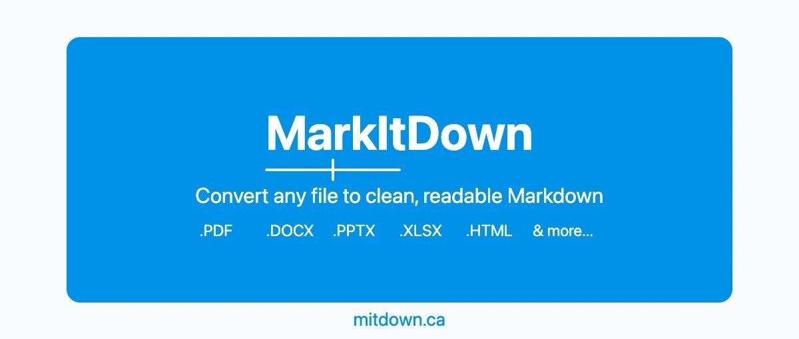
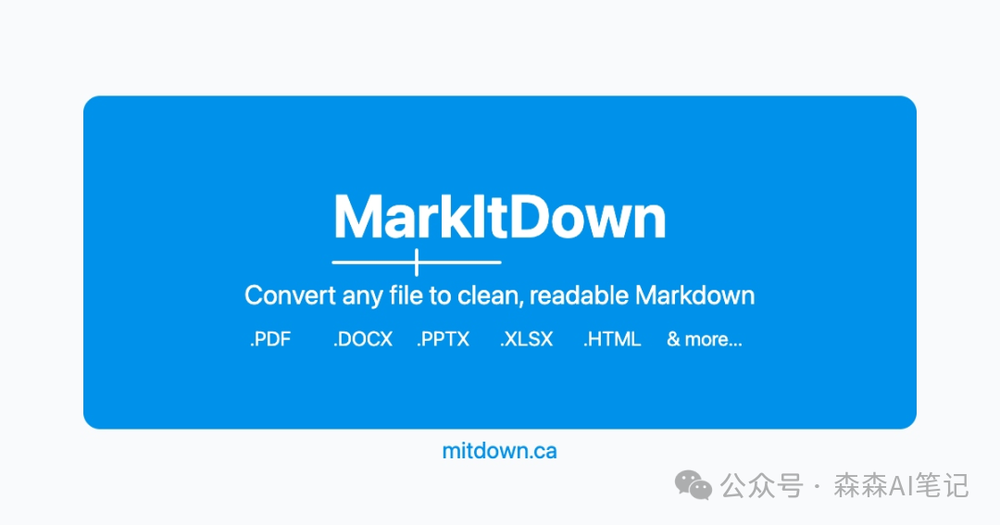

MarkItDown 转 PDF 表格总乱码？这 5 步让 OCR 精度从 60% 升到 95%




# MarkItDown 转 PDF 表格总乱码？这 5 步让 OCR 精度从 60% 升到 95%

原创

森森 AI
森森 AI

[森森AI笔记](javascript:void(0);) 

*2026年4月15日 07:03*
*上海*


在小说阅读器读本章

去阅读


在小说阅读器中沉浸阅读

转了 100 份扫描件,表格全乱了?

你的 MarkItDown 可能少装了一个插件。

MarkItDown 的 OCR 不是传统 Tesseract.

它是把图片提取出来，送给 GPT-4o、Claude、Gemini 这些 Vision LLM 做"看图识字"。

所以精度差距天差地别：GPT-4o 能到 95%+，小模型可能只有 60%。



---

## 01 · 先把 OCR 开启

这是最容易忽略的一步。

MarkItDown 默认不启用 OCR，需要手动开启：

```
  pip install 'markitdown[all]' markitdown-ocr  
pip install openai  # 或 anthropic / google-generativeai
```

```
  from markitdown import MarkItDown  
from openai import OpenAI  
  
md = MarkItDown(  
    enable_plugins=True,      # 关键：启用 OCR 插件  
    llm_client=OpenAI(),  
    llm_model="gpt-4o"        # 精度优先选 gpt-4o 或 claude-3-5-sonnet  
)  
  
result = md.convert("scan.pdf")  
print(result.text_content)
```

CLI 模式：

```
  markitdown document.pdf --use-plugins --llm-client openai --llm-model gpt-4o -o output.md
```

---

## 02 · 核心优化 5 步（按效果排序）

**第一步：选对模型（效果最明显）**

| 推荐模型 | 适用场景 |
| --- | --- |
| gpt-4o / claude-3-5-sonnet | 复杂表格、公式、高精度需求 |
| gemini-2.0-flash-exp | 速度快，精度尚可 |
| claude-opus-4 | 最高精度，响应较慢 |
| 4o-mini / LLaVA + Ollama | 简单文本，可本地运行 |

**第二步：自定义 OCR Prompt**

默认 Prompt 偏通用.

对于特定场景，明确要求效果更好:

```
  # 公式文档  
"Extract all text accurately, convert formulas to LaTeX, output clean Markdown"  
  
# 表格文档  
"Convert tables to proper Markdown grid tables, preserve all data"  
  
# 图文混排  
"Extract text in reading order, describe images briefly, output structured Markdown"
```

**第三步：图像预处理（低质量扫描件杀手）**

在送进 MarkItDown 之前，先用 OpenCV 预处理：

```
  import cv2  
import numpy as np  
  
def preprocess_for_ocr(img_path):  
    img = cv2.imread(img_path, cv2.IMREAD_GRAYSCALE)  
    img = cv2.resize(img, None, fx=2, fy=2, interpolation=cv2.INTER_CUBIC)  # 放大两倍  
    _, img = cv2.threshold(img, 0, 255, cv2.THRESH_BINARY + cv2.THRESH_OTSU)  # 二值化  
    img = cv2.medianBlur(img, 3)  # 去噪  
    cv2.imwrite("preprocessed.jpg", img)  
    return "preprocessed.jpg"
```

这招对扫描件、倾斜照片、低分辨率图片效果尤其明显。

**第四步：全页 OCR Fallback**

markitdown-ocr 内置了 scanned PDF 全页 fallback。

极复杂文档可结合 Azure Document Intelligence 或 Docling 混合使用。

**第五步：LLM 后处理**

MarkItDown 跑完后，再喂给 LLM 做一次 cleanup：

```
  "Fix any OCR errors in this text, standardize formatting, output clean Markdown only"
```

---

## 03 · 精度预期：心里有数

| 文档类型 | OCR 精度 |
| --- | --- |
| 清晰打印文本 + 强模型 | 95%+ |
| 复杂表格 / 轻微倾斜 | 80-90% |
| 公式 / 手写 / 低分辨率 | 60-75% |

比纯 Tesseract 好得多。

但公式和手写仍是难题，可搭配 MathPix 或 Nougat 后处理。

---

## 04 · 精度还是不够？替代方案

| 工具 | 优势 |
| --- | --- |
| Docling（IBM） | 结构化更好，表格和公式处理更强 |
| Marker / MinerU | GPU 加速，适合批量处理 |
| Azure Document Intelligence | 付费服务，精度高，可与 MarkItDown 组合 |
| LlamaParse | 付费但精度极佳 |

最佳实践:先用 MarkItDown + GPT-4o，不够再用 Docling 兜底。

---

GitHub：https://github.com/microsoft/markitdown

#### 引用链接

`[1]` [微软开源了一个文档转换神器，一键把 PDF、Word、Excel 全部转成 Markdown](https://mp.weixin.qq.com/s?__biz=MzI5ODkxODE5Ng==&mid=2247486066&idx=1&sn=45904e050c78969a41b49b265cf9b5f9&scene=21#wechat_redirect)

