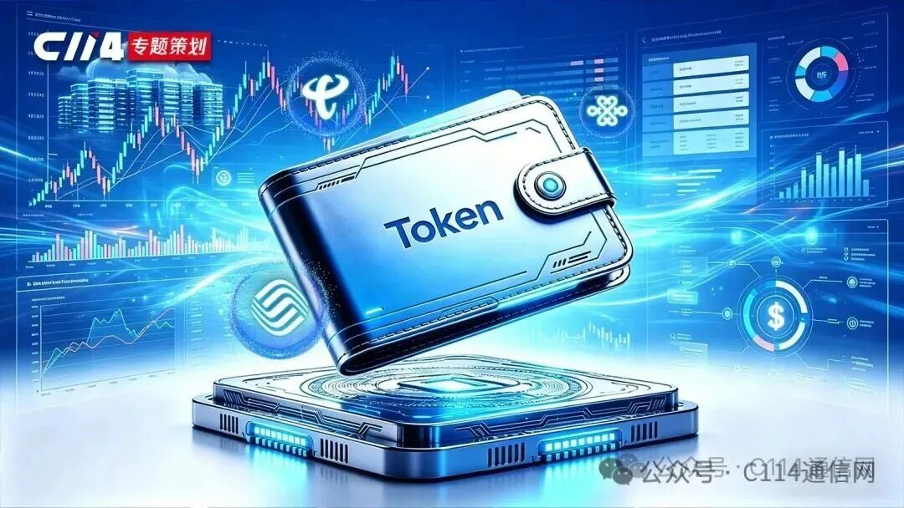
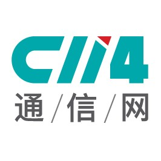

Token狂热之下，电信运营商如何突围？

# Token狂热之下，电信运营商如何突围？

原创

艾斯
艾斯

[C114通信网](javascript:void(0);) 

*2026年4月28日 18:22*
*上海*

在小说阅读器读本章

去阅读

在小说阅读器中沉浸阅读

眼下，Token已成为充斥媒体头条报道的热门词汇之一。一方面，极速狂飙的人工智能（AI）产业再次找到了新的宏大叙事方向，另一方面，Token代表着AI时代统一“度量衡”的确立，这更加有助于将AI价值货币化。

2026第一季财报业绩显示，国内三大电信运营商普遍利润大幅下滑。随着传统流量业务见顶，“Token经营”成为了见诸运营商财报的新解题思路。例如，中国电信明确提出“以Token经营重塑公司业务”，要“做强自有Token、做大生态Token、探索国际化Token”。截至目前，部分地方运营商已陆续推出不同形式的Token套餐，执行动作十分迅速。

因此，C114通信网特策专题“电信运营商发力Token运营”，本期邀约Omdia高级首席分析师杨光展开深入访谈，他不仅详细剖析了宏观层面的Token价值定位，同时亦对电信运营商投身Token经营存在的挑战与破局路径给出了思路与建议。

在杨光看来，Token经济是AI时代的必然趋势，但运营商目前的Token经营更多是计费模式的微创新。真正的机会在于，运营商需要向AI价值链上游探索，更好地掌握模型/入口与Token定价权，同时利用“算电协同”和边缘计算优势，从细分市场入手加固自身护城河。

关于Token：“广义”与“狭义”的概念冲突

随着英伟达首席执行官黄仁勋黄仁勋提出“Token工厂”概念，整个AI产业开始了一场新的竞争力排序。过去，互联网行业讲究流量称王，如今，Token正在取代流量的地位。

根据国家数据局统计，到2026年3月，中国日均Token调用量突破140万亿，相比2024年初的1000亿，两年增长超千倍。

“Token被视为AI时代的‘原子’或基础单元，类似于电力时代的“千瓦时”或互联网时代的“比特”。因此，从广义意义上来说，Token确实代表着一个划时代的标志。”杨光指出，Token标志着人类从数字经济迈向“AI经济”的分水岭。

具体到电信运营商的Token经营，在其看来，眼下更多是将传统的连接资源和算力资源等服务打包后换了一个计费单位。从Token代表智能能力本身这个角度来看，运营商并没有直接出售智能，而是在出售支撑智能运行的带宽和算力。这与过去语音时代按“分钟”收费到流量时代转为按“GB”收费，在逻辑上没有本质区别，只是计量单位变了。

这一点在地方运营商推出的一些Token套餐中得到了佐证。例如，北京移动推出面向个人用户的算力Token套餐，提供最低5.99元的算力次包以及低至24.99元的算力月包，每个月用户可使用1000万Token的算力；上海电信推出的199元/月的家庭套餐，其中包含万兆宽带+ 300万Token+ AI家智屏。

尽管如此，杨光对于运营商这种在计费方式上的微创新仍给予了肯定态度。“我认为这种尝试是可行的。坦率来讲，电信运营商——无论国内还是国际，与大型互联网厂商和头部模型厂商相比，在模型能力上的确存在着显著差距，而模型能力才是Token经济的核心。因此，通过对既有业务进行重新包装的资费模式创新，若能够吸引到一些用户，对电信运营商来说也是一条可选之路。”他谈到。

在与杨光的对谈中，C114梳理出了电信运营商目前难以真正实现“Token经济”的两个核心原因：计量权和控制权的缺失。

其中，在计量难题方面，底层Token消耗在模型侧，如果运营商不掌握模型，就无法精确计量用户的Token使用情况。当然，运营商可以通过封装API调用次数、输入输出长度来制定自己的计费规则。这在技术上是可行的，只是定价权不在运营商手里，他们只能跟随模型厂商的定价。

在控制权方面，由于当下Token经济的核心在于模型能力，模型能力的优劣，将决定Token的消耗量以及Token产出智能的质量与生产力转化效率，并且，行业对Token价值衡量正逐渐从“消耗量”转向“智能力”。因此，电信运营商若想要掌握Token定价权，就必须从卖资源转型为卖智能。

我们注意到，目前包括北京移动等地方运营商推出的Token套餐都并非端到端自研产品，其方案的核心都是“集成”——集成OpenClaw等智能体平台，接入DeepSeek、Qwen等第三方大模型，搭载自身的云电脑和算力网络资源。

如何破解？运营商需“内外兼修”抢占先机

万幸的是，Token所代表的新型经济形态现在仍处于非常早期的阶段，而且是一个足以容纳电信运营商在其中分一杯羹的“不可限量”市场。

分析师杨光将电信运营商能够真正参与“Token经济”实现业务转型的破局路径总结为几个方面：增强模型能力、聚焦细分市场、掌握Token入口、发挥信任优势。

**首先，向上游进发。**“运营商如果希望提升在AI产业链中位置，还是需要从基础能力入手，比如大模型的能力。”他认为，一方面，运营商可以通过一系列的研发、管理、组织架构变革，持续向AI价值链上游延伸，利用自身掌握的丰富且宝贵的数据资源，构建更强的模型能力；另一方面手握丰沛现金流的运营商，完全可以对AI初创企业或大模型公司进行战略性投资，通过达成紧密合作关系快速获取能力。

**同时，向下扎根。**电信运营商可利用在能源调度和网络调度上的优势，聚焦在一些能够发挥自身特色的细分市场。比如对时延敏感的推理任务，可以发挥边缘计算和网络融合的优势，或者对成本敏感的中小企业，可以利用网络能力，根据算力或能源的定价情况，进行实时调度。对于电信运营商正在大力推广的调度平台（如“息壤”等），杨光认为，这在一定程度上可能会与“模型市场”存在重叠，但本质上它更多的还是算力的路由器，更侧重在底层算力的调度上，应该有很大的机会与“模型市场”形成配合与协同。

**再者，抢占入口。**在2C市场的Token经营方面，重点则在于掌握一个“能让消费者接入Token生态的入口”。无论是AI手机还是AI眼镜，亦或是一款超级APP，都可以成为这样的入口。杨光强调，目前各种AI硬件仍处于发展的早期阶段，而越是在早期阶段，越是存在机会。无论是通过内部自研，还是利用投资收购进行早期介入，运营商都可通过其广泛影响力进行充分协调，从而汇聚产业资源并形成自身品牌，这样一来就有望抓住用户Token入口。据介绍，目前德国电信和日本软银已经在进行这方面的尝试。

**最后也是尤为关键的一点，是长期以来****电信运营商与用户之间****建立的信任关系。**目前Token经济仍处于尚未标准化的混沌时期，其交易缺乏独立的信用体系。电信运营商所拥有的品牌信任度，使其有望成为AI经济时代的“可信账单超级管家”。

总而言之，2026年的当下，Token经济仍处于早期，一切皆有可能。

预览时标签不可点

关闭

更多

名称已清空

**微信扫一扫赞赏作者**

喜欢作者[其它金额](javascript:;)

赞赏后展示我的头像

作品

暂无作品

喜欢作者

其它金额

¥

最低赞赏 ¥0

确定

返回

**其它金额**

更多

赞赏金额

¥

最低赞赏 ¥0

1

2

3

4

5

6

7

8

9

0

.

C114专题策划：运营商发力Token运营 · 目录

#C114专题策划：运营商发力Token运营

上一篇探析运营商Token运营 | IDC崔凯：流量衡量信息，Token衡量智能下一篇中国电信饶少阳：告别流量“内卷”， Token经营重塑业务增长极

修改于2026年4月28日

关闭

更多

#

搜索「」网络结果

关闭

**调整当前正文文字大小**

更多

100%

修改于

​

留言

暂无留言

1条留言

已无更多数据

[发消息](javascript:;)

写留言:

微信扫一扫  
关注该公众号

继续滑动看下一个

轻触阅读原文

C114通信网

向上滑动看下一个

当前内容可能存在未经审核的第三方商业营销信息，请确认是否继续访问。

[继续访问](javascript:)[取消](javascript:)

[微信公众平台广告规范指引](javacript:;)

[知道了](javascript:;)

微信扫一扫  
使用小程序

[取消](javascript:void(0);)
[允许](javascript:void(0);)

[取消](javascript:void(0);)
[允许](javascript:void(0);)

[取消](javascript:void(0);)
[允许](javascript:void(0);)

×
分析

微信扫一扫可打开此内容，  
使用完整服务

C114通信网

已关注

赞

分享

推荐

写留言

：
，
，
，
，
，
，
，
，
，
，
，
，
。
 
视频
小程序
赞
，轻点两下取消赞
在看
，轻点两下取消在看
分享
留言
收藏
听过

可在「公众号 > 右上角  > 划线」找到划线过的内容

我知道了

,

,

选择留言身份

**留言**

暂无留言

1条留言

已无更多数据

[发消息](javascript:;)

写留言:

关闭

更多

关闭

**C114专题策划：运营商发力Token运营**

详情

更多

正在加载

关闭

## 确认提交投诉

你可以补充投诉原因（选填）

确定