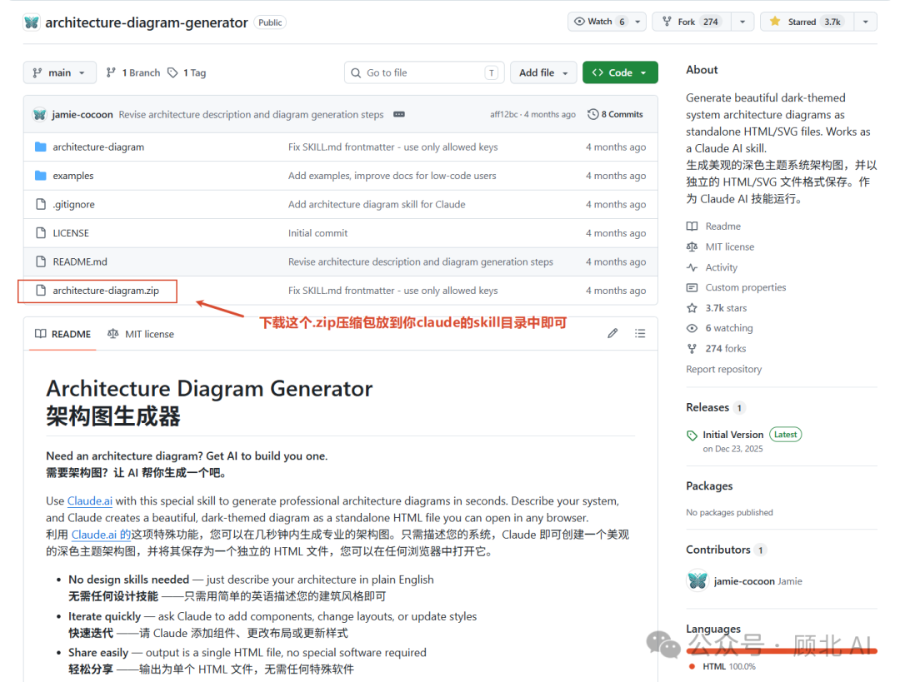
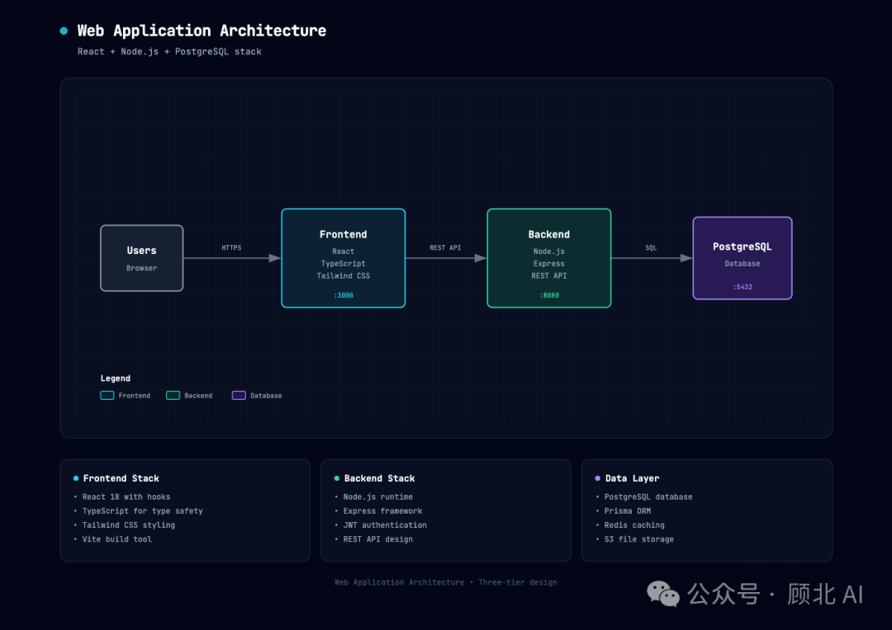
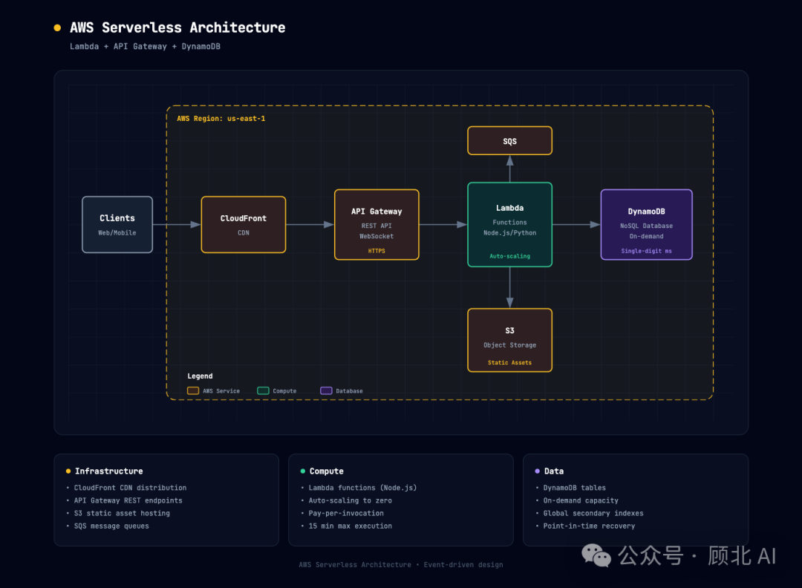
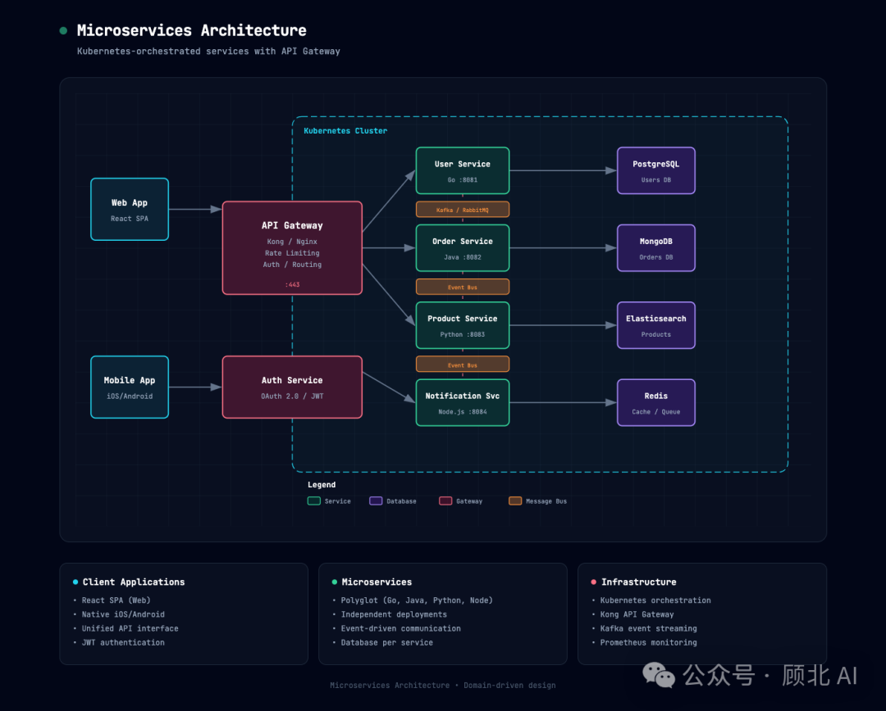
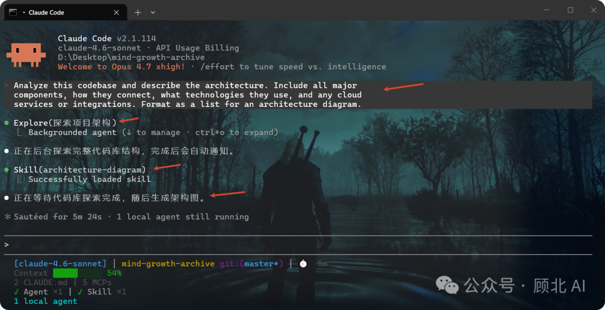
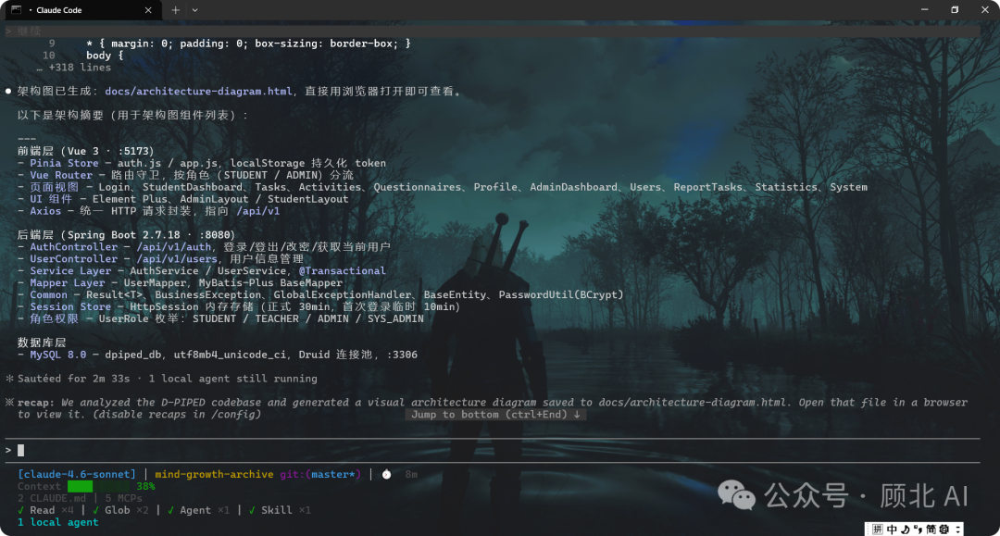
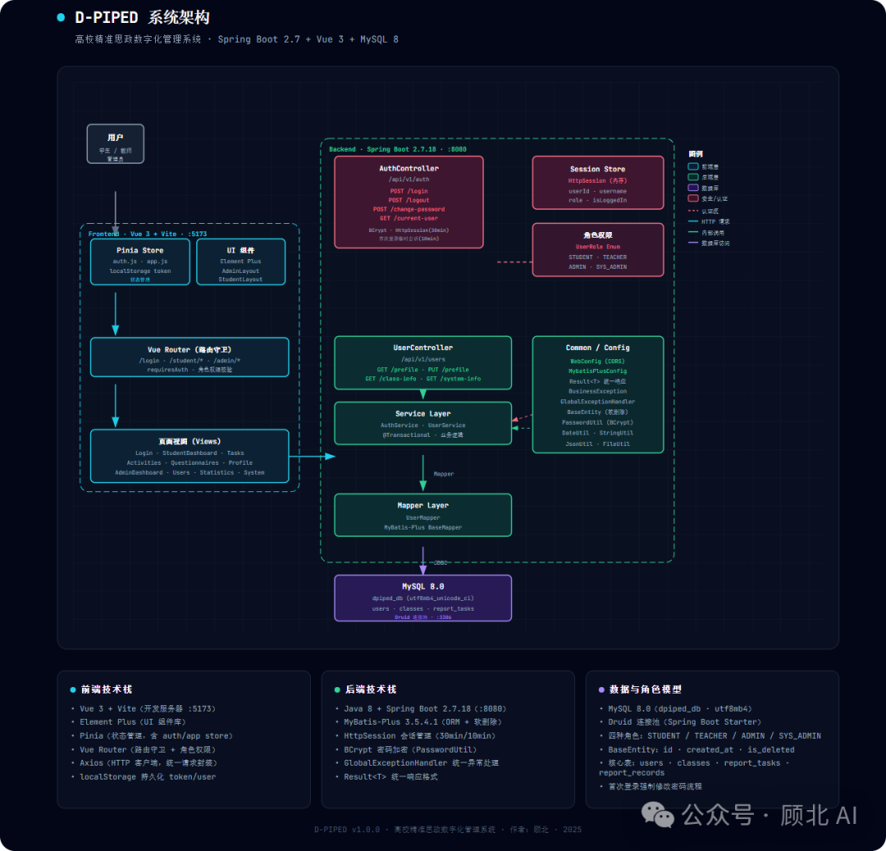
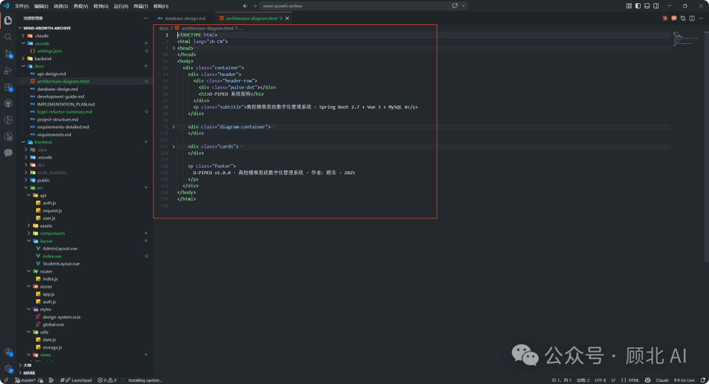

再见Visio、Draw.io，用Claude Code三句话生成专业架构图，这个免费 Skill 我用了就回不去了。


# 再见Visio、Draw.io，用Claude Code三句话生成专业架构图，这个免费 Skill 我用了就回不去了。

原创

顾北
顾北

[顾北 AI](javascript:void(0);) 

*2026年4月19日 14:02*
*广东*


在小说阅读器读本章

去阅读


在小说阅读器中沉浸阅读

上周我在给一个新项目写技术方案，需要配一张架构图。

打开 draw.io，摆了半小时方块，对齐线还歪了。换 Lucidchart，功能太多反而不会用。最后找了个 PPT 模板凑合了事，丑得自己都不好意思截图。

直到我发现了这个东西——**Architecture Diagram Generator**，一个 Claude Skill，描述几句话，架构图直接生成，还是带暗色主题的那种，看起来比你花一小时手画的专业多了。

今天把实操流程完整记录下来，你照着做就能用。

## 这玩意儿到底是什么？

简单说：**一个安装在 Claude 里的技能插件（Skill）**，让 Claude 能够根据你的文字描述，自动生成专业架构图，输出一个可以直接在浏览器打开的 HTML 文件。

不需要 Figma，不需要 draw.io，不需要任何设计工具。你只要能描述你的系统，它就能画出来。

输出效果是这样的：

* 暗色背景（`#020617`，就是那种很有程序员质感的深蓝黑）
* 带细网格纹路的底板
* 语义化配色：前端组件用青色、后端用翠绿色、数据库用紫色、云服务用琥珀色、安全相关用玫瑰红
* 字体是 JetBrains Mono，技术感拉满
* 组件之间有带箭头的连接线，数据流向一目了然
* 下方还有 3 张摘要卡片，总结关键信息

最重要的是——**纯 HTML 文件，无任何依赖，发给任何人用浏览器就能打开。**


## 安装步骤（5分钟搞定）

> ⚠️ 需要 Claude Pro / Max / Team / Enterprise 订阅，免费版暂不支持 Skills 功能。

### 方式一：Claude.ai 网页端安装（推荐）

**第一步：下载 Skill 文件**

去 GitHub 仓库下载 `architecture-diagram.zip`： 👉 https://github.com/Cocoon-AI/architecture-diagram-generator

找仓库根目录下专门的 `architecture-diagram.zip` 文件下载。



**第二步：上传到 Claude Skills**

打开 claude.ai → 右上角头像 → **Settings** → **Capabilities** → 往下滚找到 **Skills** 区域 → 点 **+ Add** → 上传刚才下的 zip 文件。

**第三步：开启 Skill**

上传后会出现一个卡片，把右边的开关拨到开启状态。完成！

### 方式二：Claude Code CLI 安装

如果你平时用 Claude Code，可以直接命令行装：

```
# 全局安装（所有项目都能用）  
unzip architecture-diagram.zip -d ~/.claude/skills/  
  
# 或者只在当前项目用  
unzip architecture-diagram.zip -d ./.claude/skills/
```

装完不用额外配置，Claude Code 会自动识别。

## 实操教程：三个场景全覆盖

安装完之后，核心使用方式就一句话：

> 打开 Claude 对话，告诉它用 architecture diagram skill 帮你画图，然后描述你的架构。

下面直接上三个实际场景。

### 场景一：标准 Web 应用

**适合谁：** 需要快速出一张 Web 项目架构图用于技术文档或 PPT 展示。

**提示词（直接复制用）：**

```
Use your architecture diagram skill to create an architecture diagram from this description:  
  
A web application with:  
- React frontend  
- Node.js/Express API  
- PostgreSQL database  
- Redis cache  
- JWT authentication
```

**中文解读：** 告诉 Claude 用架构图 Skill 画图，描述一个包含 React 前端、Node.js/Express API、PostgreSQL 数据库、Redis 缓存、JWT 认证的 Web 应用。

几秒钟后，Claude 会输出一整段 HTML 代码。把它复制到一个 `.html` 文件里，浏览器打开就完事。



### 场景二：AWS Serverless 架构

**适合谁：** 做云原生服务，需要向客户或老板展示 AWS 部署方案。

**提示词：**

```
Use your architecture diagram skill to create an architecture diagram from this description:  
  
An AWS serverless architecture:  
- CloudFront CDN  
- API Gateway  
- Lambda functions (Node.js)  
- DynamoDB  
- S3 for static assets  
- Cognito for auth
```

**中文解读：** 描述一个 AWS 无服务架构，包含 CloudFront、API Gateway、Lambda、DynamoDB、S3 静态资源和 Cognito 认证。

生成的图里，各 AWS 服务会用琥珀色标注，非常好区分。



### 场景三：微服务系统

**适合谁：** 系统设计比较复杂，需要展示多个微服务之间的关系和数据流向。

**提示词：**

```
Use your architecture diagram skill to create an architecture diagram from this description:  
  
A microservices system:  
- React web app and mobile clients  
- Kong API Gateway  
- User Service (Go), Order Service (Java), Product Service (Python)  
- PostgreSQL, MongoDB, and Elasticsearch databases  
- Kafka for event streaming  
- Kubernetes orchestration
```

**中文解读：** 一个包含 React + 移动端客户端、Kong 网关、三个语言各异的微服务（Go/Java/Python）、多种数据库（PostgreSQL/MongoDB/Elasticsearch）、Kafka 消息队列和 Kubernetes 编排的完整微服务架构。

组件多的时候，Skill 会自动分层排布，前端在上、网关居中、服务层在下、数据层最底，箭头清楚表明数据流向。



### 进阶玩法：让 AI 分析你的代码库

已经有一个项目，但不想手写描述？可以这样：

**第一步：** 打开你的代码（Cursor、Claude Code、VS Code 都行），粘贴这段提示词：

```
Analyze this codebase and describe the architecture. Include all major  
components, how they connect, what technologies they use, and any cloud  
services or integrations. Format as a list for an architecture diagram.
```

**中文意思：** 分析这个代码库，描述其架构，包括所有主要组件、它们之间的连接方式、使用的技术栈、云服务或外部集成，格式化成适合架构图的列表。



**第二步：** 把 AI 输出的描述，拿到装了 Skill 的 Claude 里，让它画图。（以Claude Code为例）

两步操作，你的项目就有一张真实反映代码结构的架构图了。对于给新同事讲解系统结构、写技术方案特别好用。



## 生成的图包含什么？

每次输出的 HTML 文件结构是固定的：

1. **Header（顶部标题区）** — 项目名称 + 一个有动态效果的状态指示器
2. **Main Diagram（主图区）** — SVG 格式的架构图，所有组件和连接线都在这里
3. **Summary Cards（摘要卡片）** — 3 张信息卡片，提炼关键技术信息
4. **Footer（页脚）** — 项目元数据

SVG 是响应式的，放大缩小都清晰，截图也好看。



## 什么时候用它最合适？

总结下来几个高频场景：

* **写技术方案/PRD 时** ——需要配架构图，但没时间用专业工具慢慢画，三句话就能出一张，质量比临时凑的 PPT 方块图高多了。
* **做演示/汇报时** ——暗色主题在投影仪上特别好看，比白底的图抗眩光，看起来也更专业。
* **给新人做 onboarding 时** ——新人入职要了解系统，描述一遍架构让 Claude 画出来，比画 PPT 方块快，比纯文字描述直观。
* **学习典型架构时** ——不知道某类系统该怎么设计？让 Claude 先给你一个典型架构，再在上面改，是个不错的入门方式。
* **向非技术人员讲解时** ——配色有语义（前端/后端/数据库颜色不同），就算不懂技术的人也能看懂大致结构。

## 一点实际体验

我自己用下来有几个感受：

**好的地方：** 速度真的快，描述清楚的话几乎一次出图就能用。暗色主题做得很有质感，配色逻辑也合理，不需要自己调颜色。HTML 单文件的方案非常实用，发给人直接打开，不依赖任何工具。

**需要注意的：** 组件位置和箭头方向是 Claude 自动排布的，不一定完全符合你心里的预期。如果有特定的布局要求，可以在提示词里补充，比如"前端在左，数据库在右"。另外如果描述太模糊，Claude 会发挥创造力补全，要仔细检查生成的内容是否符合你的实际架构。

**迭代很方便：** 生成之后不满意，直接在对话里说"把 Redis 改成 Memcached"、"加一个消息队列在 API 和数据库之间"，Claude 会直接更新 HTML。

架构图这种东西，做起来费时，但没有的时候真的挺头疼。有了这个 Skill，至少不用再为"花两小时画图还是将就用文字"纠结了。

仓库在这里，免费开源，去 Star 一下：

🔗 https://github.com/Cocoon-AI/architecture-diagram-generator

你有什么有意思的 Claude Skill 用法，或者用这个 Skill 画出了什么好看的图？欢迎评论区分享，我看到的都会回。

我是顾北，关注我，解锁更多好玩的SKill

谢谢你阅读我的文章，我们下期再见！

预览时标签不可点

**微信扫一扫赞赏作者**[喜欢作者](javascript:;)

关闭

**[0人付费](javascript:;)**

更多

正在加载...

正在加载...

关闭

更多

系统错误，请稍后重试

名称已清空

**微信扫一扫赞赏作者**

喜欢作者[其它金额](javascript:;)

赞赏后展示我的头像

作品

暂无作品

喜欢作者

其它金额

¥

最低赞赏 ¥0

确定

返回

**其它金额**

更多

赞赏金额

¥

最低赞赏 ¥0

1

2

3

4

5

6

7

8

9

0

.

AI编程 · 目录

#AI编程

上一篇刚刚，Claude Design 正式发布：Opus 4.7 加持，一句话让 AI 出设计稿，Adobe 和 Figma 股价当场跌了。下一篇Claude Code 用这个插件，Token 省了 40%，回答质量还更准了

作者提示: 个人观点，仅供参考

关闭

更多

#

搜索「」网络结果

关闭

**调整当前正文文字大小**

更多

100%

​

留言

暂无留言

1条留言

已无更多数据

[发消息](javascript:;)

写留言:


微信扫一扫  
关注该公众号

继续滑动看下一个

轻触阅读原文


顾北 AI

向上滑动看下一个

当前内容可能存在未经审核的第三方商业营销信息，请确认是否继续访问。

[继续访问](javascript:)[取消](javascript:)

[微信公众平台广告规范指引](javacript:;)

[知道了](javascript:;)


微信扫一扫  
使用小程序

[取消](javascript:void(0);)
[允许](javascript:void(0);)

[取消](javascript:void(0);)
[允许](javascript:void(0);)

[取消](javascript:void(0);)
[允许](javascript:void(0);)

×
分析


微信扫一扫可打开此内容，  
使用完整服务


顾北 AI

已关注

赞

分享

推荐

写留言

：
，
，
，
，
，
，
，
，
，
，
，
，
。
 
视频
小程序
赞
，轻点两下取消赞
在看
，轻点两下取消在看
分享
留言
收藏
听过


可在「公众号 > 右上角  > 划线」找到划线过的内容


我知道了

,

,

选择留言身份

该账号因违规无法跳转

**留言**

暂无留言

1条留言

已无更多数据

[发消息](javascript:;)

写留言:

关闭

更多

关闭

**AI编程**

详情

更多

正在加载

关闭

## 确认提交投诉

你可以补充投诉原因（选填）

确定