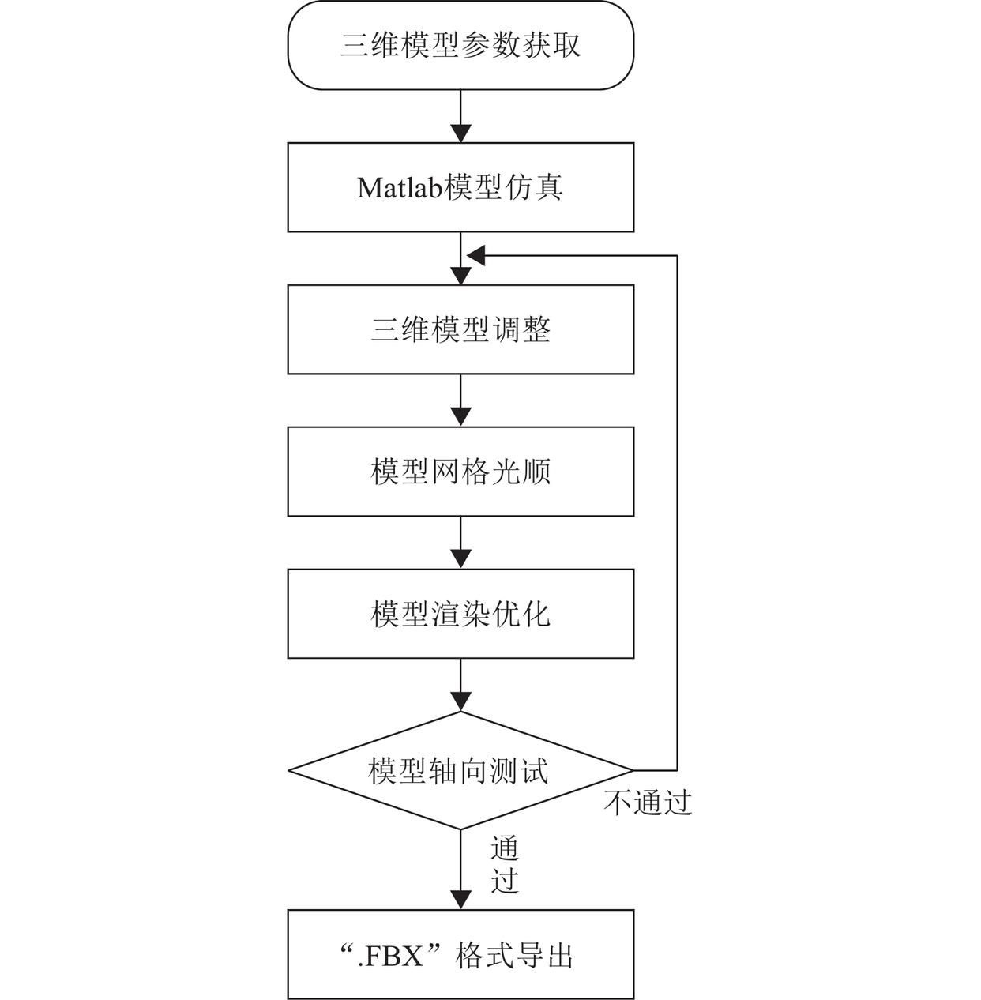
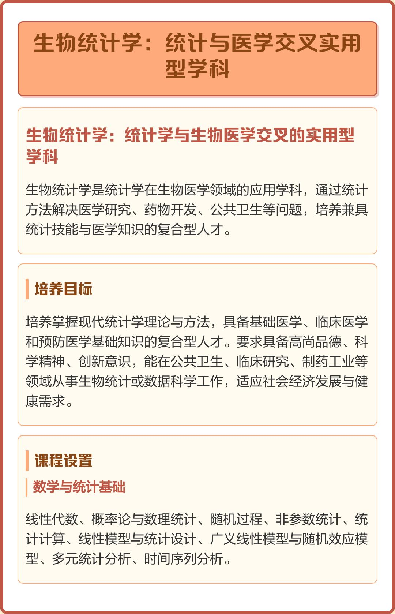
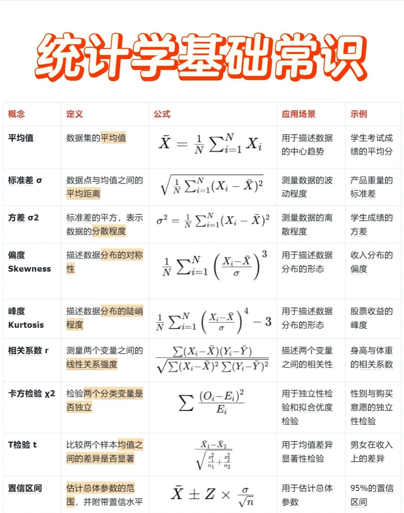

刘军院士敲响警钟：当ChatGPT包揽编程，你的统计学还剩下什么壁垒？ - 今日头条

* 关注
* 推荐
* 广州
* 视频
* 财经
* 科技
* 热点
* 国际
* 更多

  + 军事
  + 体育
  + 娱乐
  + 历史
  + 美食
  + [直播](https://live.ixigua.com)
  + 旅游
  + [懂车帝](https://www.dongchedi.com/?zt=tt_pc_home_channel)

搜索

消息

发布

[登录](https://sso.toutiao.com/login/?service=https%3A%2F%2Fwww.toutiao.com%2Farticle%2F7635417344839287348%2F%3Fwid%3D1778305496743)

38

8

收藏

分享

* 转发到头条
* 复制链接
* 微信

  微信扫码分享
* 新浪微博
* QQ空间

# 刘军院士敲响警钟：当ChatGPT包揽编程，你的统计学还剩下什么壁垒？

2026-05-03 05:59·[数字时代人文镜鉴](/c/user/token/MS4wLjABAAAAN-gwPkAlAN3wNAH25BFbmyFALAs8HJRmh8WE6dnjhpM/?source=tuwen_detail)

图片疑似AI生成，请注意甄别

最近群里都在转发那篇“ChatGPT能写Python，统计专业还学什么？”的讨论，评论区有人说统计是夕阳专业，有人说基础分析岗快被AI干掉了。我看着手机屏幕，突然想起我们学院最近一次校友会。

统计系毕业十年的老张，在广州一家金融科技公司做首席数据官，去年他们团队上线了一个AutoML平台，业务部门的分析师自己就能做预测模型。小赵毕业五年，在深圳做电商数据分析，每天有一半时间在和ChatGPT协作写代码。我问老张，统计专业的学生现在最该学什么。他沉默了一会儿，说：“别盯着怎么清洗数据了，想想数据为什么要这样清洗。”

**当工具民主化，专业的价值锚点在哪里？**

AutoML能让模型选择自动化，低代码平台让业务人员也能做可视化，ChatGPT能写出像样的数据分析代码。数据清洗、特征工程这些传统统计工作的基础环节，正被AI一步步攻破。看着工具门槛无限降低，很多统计专业的学生开始困惑——我的核心竞争力到底在哪里？

四年前，我们还在争论Python和R哪个更好用。现在，你告诉GPT想要什么分析，它都能给你生成代码和结果。统计学这个专业，难道真的要变成技术流水线上的一道可替代工序？

我翻看学院的就业报告，2024年应用统计学专业点新增数量猛增至27个，这几乎是前四年年均新增值的两倍。数据科学和应用统计学是绝对的增长主力，两者新增占比超过80%。市场在用脚投票，统计学相关人才需求在扩张，但需求的形态在发生深刻变化。

**冲击与挑战：AI对统计基础工作的效率革命**

数据清洗不再是繁琐的体力活。AI驱动的数据清洗通过自动化技术，利用机器学习算法和自然语言处理技术，能够快速识别和修复数据中的问题。去重、缺失值处理、异常值检测、标准化，这些曾经占据分析师大量时间的任务，现在系统自动完成。一个需要手动处理三天的数据集，如今可能只需要三个小时。

特征工程也在经历智能化变革。传统的特征工程需要人工设计和调整特征，耗时且容易受到主观因素的影响。AI驱动的特征工程自动化技术通过分析数据分布和模式，自动生成和优化特征，显著提高了特征工程的效率和效果。从文本中提取关键词、从图像中提取边缘特征、进行特征组合变换，这些工作正在被算法接管。

更冲击的是建模环节。AutoML通过自动化技术，可以在有限的计算资源下自动构建机器学习管道。从数据预处理、特征工程、模型选择到超参数调优，整个端到端流程都在向自动化演进。组合算法选择与超参数优化这个曾经需要专业经验的工作，现在被统一为一个结构化的优化问题。

这对就业市场的影响是直接的。初级数据分析岗、基础报表岗这类“操作执行型”工作的价值正在递减。企业不再需要大量人力去做重复的数据整理和基础分析，他们需要的是能够定义问题、设计分析框架、解释复杂结果的专业人士。

我们系去年毕业的硕士生小刘，面试时被问到一个问题：“如果公司上线了AutoML平台，你的价值在哪里？”他愣了几秒，说：“我能告诉平台该解决什么问题。”

**坚守与壁垒：统计学不可替代的核心能力**

刘军院士曾经用一个经典例子说明统计学的本质：“一个罐子里有一百个球，其中七十个白球、三十个黑球，你抓一把，抓到九个白球一个黑球的概率是多少？——这是数学，是前向推理。反过来，你不知道罐子里黑白球的比例，抓了一把发现有九个白球一个黑球，问里面黑白比例是多少？——这是统计，是反问题。”

这个“反问题”思维，是统计学最坚固的壁垒。

**从“工具应用”到“统计思维”的飞跃**

定义问题与实验设计的能力无法被自动化。如何将模糊的业务需求转化为可检验的统计问题？这需要深刻理解业务场景和统计原理。AB测试应该怎么设计分组？随机对照试验的伦理边界在哪里？样本量要多大才能保证结果的可靠性？这些决策背后是复杂的权衡。

因果推断是统计学的皇冠明珠。在相关性的海洋中洞察因果，这是AI黑箱模型难以企及的深度。当电商老板问“上个月发的优惠券带来了多少GMV增量”时，简单的预测模型可能会给出错误答案——因为发券对象本来就有选择偏差，高活用户就算没有券也大概率会买。

这时候需要反事实推断，需要构建潜在结果框架。倾向性得分匹配、工具变量法、双重差分法、匹配方法——这些因果推断技术在AI时代愈发重要。统计学者需要思考：如果同一个用户，在平行时空里没有拿到这张券，他会买吗？

不确定性的量化与沟通能力同样关键。理解并清晰传达估计中的误差、预测的置信区间、决策的风险概率，这是应对复杂世界的基础。AI模型可以给出预测结果，但往往说不清这个结果有多可靠。统计思维能够告诉你：这个判断，你有多大把握。

**业务理解与人文洞察：模型的“灵魂”所在**

统计模型需要扎根于具体的行业知识、商业逻辑与社会背景。缺乏业务理解的模型可能得出荒谬结论，而深刻的洞察能指导模型构建的方向与结果的解读。

金融领域的统计模型需要考虑市场微观结构，医疗统计需要理解疾病发展规律，社会科学统计要把握人类行为复杂性。这些领域知识无法从数据中自动习得，必须通过人的学习和经验积累。

我们系有个教授经常说：“给你一个完美的统计模型，没有业务理解，你就是在用显微镜看月亮——看得清楚，但不知道看的是什么。”

**进化与重构：未来统计人才的角色定位**

人工智能人才正走向复合化专业化。基于2024年度和2025年第一季度的市场招聘大数据对人工智能相关的核心岗位分析结果显示，人工智能核心岗位呈现技能深度融合趋势，理论研究与工程实践的复合型需求成为招聘主流。

**角色转变：从“技术操作者”到“分析架构师”**

上游的问题定义与框架设计变得至关重要。统计人才需要主导分析蓝图的规划，确定方法论路径。当业务部门提出“我们想提高用户留存率”的模糊需求时，分析架构师要将其转化为具体的研究问题：是要做用户细分？还是要做流失预测？或者设计干预实验？

中游的过程监督与模型审计成为新的职责。统计人才需要确保自动化流程的合理性与数据质量，评估模型的可解释性、公平性与稳健性。当AutoML平台输出了一个准确率90%的模型，分析架构师要问：这个模型在不同人群上表现一致吗？它是否存在偏见？决策逻辑可解释吗？

下游的结果解读与决策支持价值凸显。将复杂统计结果转化为商业语言，讲述数据背后的故事，支撑战略决策——这是统计人才从“数据处理者”转型为“智能决策合作者”的关键一步。

**能力矩阵的拓展**

深度交叉领域知识成为竞争优势。与特定领域深度融合，成为“统计学+”复合型专家。生物统计需要懂基因学，金融统计需要懂经济学，教育统计需要懂心理学。这种跨界能力让统计人才在特定领域建立难以替代的专业壁垒。

伦理、合规与社会责任意识不可或缺。在算法偏见、数据隐私、社会影响等方面，统计人才需要发挥关键监督与治理作用。当AI模型可能对某些群体产生不公平影响时，统计思维能够识别问题并提出解决方案。

沟通与领导力成为高阶能力。领导跨学科团队，向非技术背景的决策者有效传递洞见，推动分析结果落地——这决定了统计人才在组织中的影响力和天花板。

**在不确定的时代，锚定确定性的价值**

AI替代的是“如何做”的重复劳动，但无法替代“做什么”、“为何做”以及“结果意味着什么”的深层思考——而这正是统计学的精髓。统计学的终极价值，在于它提供了一套在充满噪声和不确定性的世界中，进行理性推断、科学决策与真理探索的框架性思维。

刘军院士将统计学的核心使命概括为：在不确定性环境下做最优决策，并量化这种不确定性。这种思维在AI时代愈发珍贵。当算法越来越智能、数据量越来越大，统计学的地位非但没有弱化，反而从“幕后配角”变成了“定海神针”。

那些只会调模型、不懂统计的算法从业者，最后大多只能当个“调包侠”；真正能把AI做稳、做落地、做出价值的，全是吃透统计学底层逻辑的人。统计思维不是工具箱里的一个锤子，而是建造房屋的蓝图设计能力。

你担心自己的工作会被AI取代吗？你认为统计专业学生最应该培养哪些AI无法轻易替代的能力？
