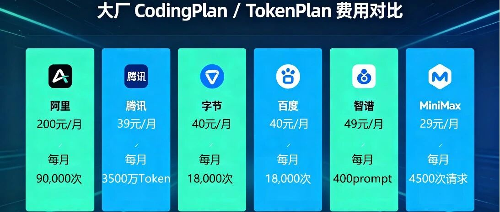
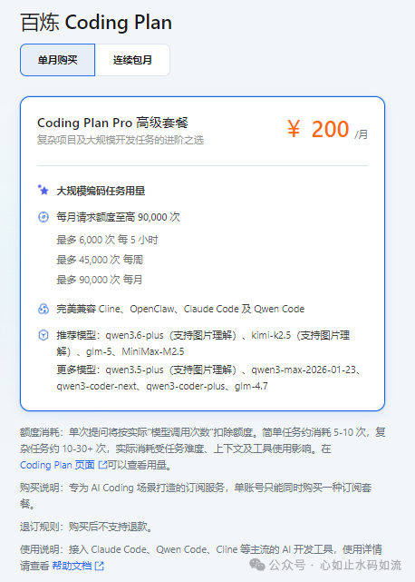
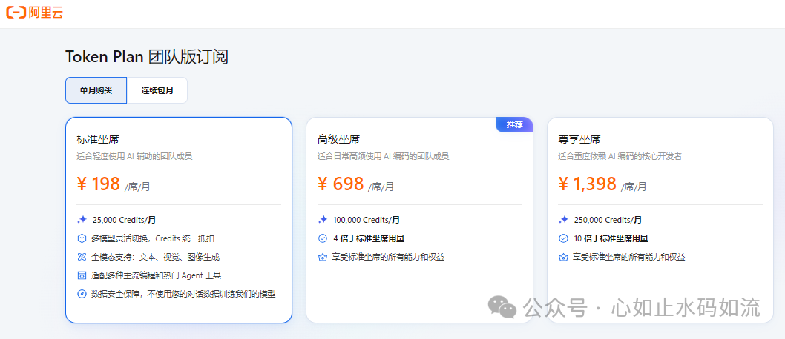
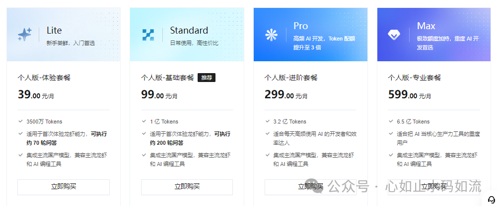
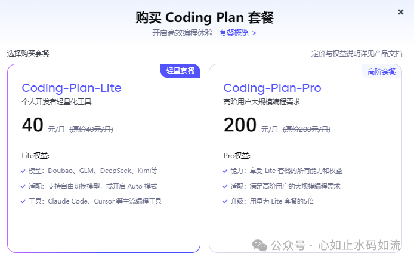
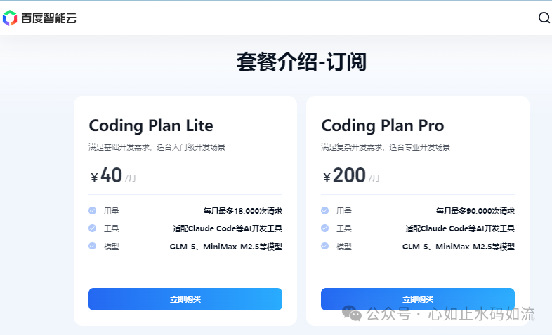
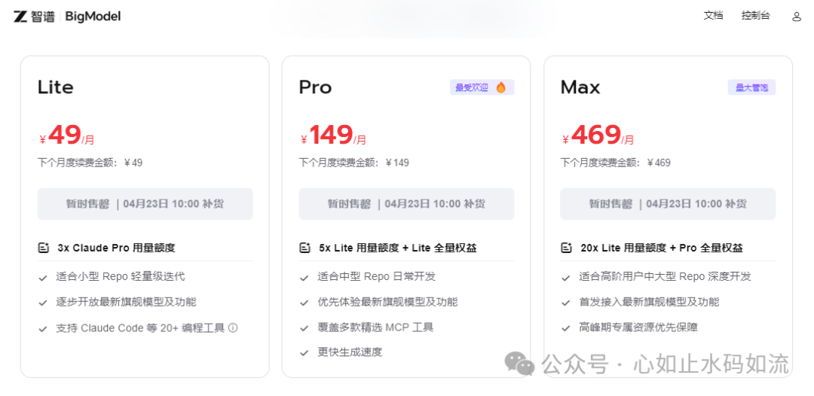
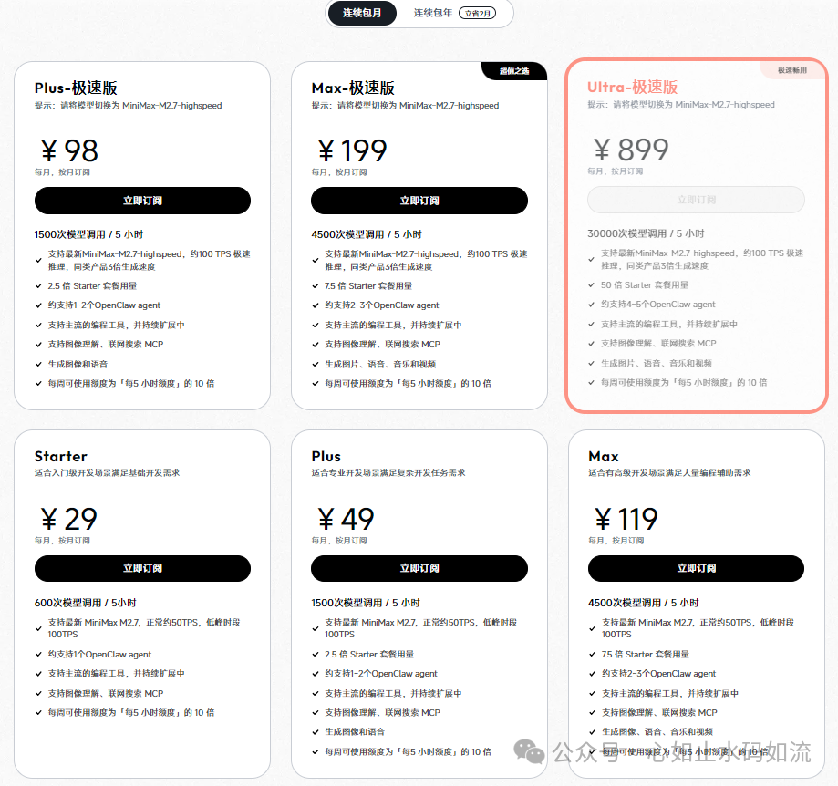

国内大厂CodinPlan/TokenPlan 4月底最新介绍

# 国内大厂CodinPlan/TokenPlan 4月底最新介绍

原创

心如止水码如流
心如止水码如流

[心如止水码如流](javascript:void(0);) 

*2026年4月23日 08:00*
*浙江*

在小说阅读器读本章

去阅读

在小说阅读器中沉浸阅读

> 字数 1450，阅读大约需 8 分钟

以前只有电费，现在还要加上算力成本，写公众号赚的费用都不够这算电成本了哈。这个Token翻译过来叫“词元”，但我觉得它叫算力币更贴切点。国内各大厂的按次的 CodinPlan 有点扛不住都改转成按量的 TokenPlan 了。下面介绍一下阿里、腾讯、字节、百度、智谱、MiniMax的 CodingPlan / TokenPlan费用及限制。

## 百炼 CodingPlan/TokenPlan（阿里云）

### CodinPlan

阿里云的CodinPlan计划，40元每月的Lite版已经不能购买和续费了，现在200元/月的Pro套餐每天放量也不多，每天9:30开抢，听说还有封号比较多，感觉过不了多久也要下架了。

### TokenPlan

TokenPlan是新推出来的，是按量来计算的套餐。

虽然使用的是Credits，但与Token量有直接挂钩，如：以 qwen3.6-plus 为例，预估单次请求消耗明细如下：

| **Token 类型** | **数量** | **消耗 Credits** |
| --- | --- | --- |
| 输入 tokens | 8,349 | 1.67 |
| 缓存 tokens | 40,794 | 1.63 |
| 输出 tokens | 573 | 0.69 |
| **合计** |  | **约 4 Credits** |

如果给OpenClaw或Hermes用，200元的CodingPlan优势大于198的TokenPlan，主要是AI智能体输入量太大，按次划算。

### 可用模型

* • 推荐：Qwen3.6-Plus（图文）、Kimi-K2.5（图文）、GLM-5、MiniMax-M2.5。
* • 其他：Qwen3.5-Plus、Qwen3-Max、Qwen3-Coder系列、GLM-4.7等。

### 使用体验

我现在用的是200元/月的CodinPlan，养虾养马，输出比较稳定，即使在高峰期，平均响应时间在10秒内，个别复杂一点的在30~60秒有响应。

## 腾讯云 TokenPlan

腾讯云的CodingPlan一直显示售罄，基本也转用TokenPlan了。

### TokenPlan

这个直接按Tokens计费。

### 可用模型

* • Auto 模型（系统智能路由）
* • 腾讯混元系：Tencent HY 2.0 Instruct、Tencent HY 2.0 Think、Hunyuan-T1等
* • 三方模型：MiniMax-M2.5、MiniMax-M2.7、GLM-5、GLM-5.1、Kimi-K2.5

## 方舟 CodingPlan(字节跳动 / 火山引擎)

火山引擎的CodinPlan可以直接购买，没用过，网上有评论说高峰期反应迟钝等。

### 可用模型

* • 豆包系：Doubao-Seed-2.0-Code、Doubao-Seed-2.0-pro、Doubao-Seed-2.0-lite、Doubao-Seed-Code
* • 三方模型： MiniMax-M2.7、MiniMax-M2.5、Kimi-K2.6、Kimi-K2.5、GLM-5.1、GLM-4.7、DeepSeek-V3.2、Doubao-Embedding-Vision 等。

### 使用限制

* • Lite：每5小时最多约1200次、每周最多约9000次、每月最多约18000次。
* • Pro：每5小时最多约6000次、每周最多约45000次、每月最多约90000次。（注意！注意！注意！以上次数基于 Doubao Seed 2.0 Lite 模型结合平均上下文长度预）

## 千帆 CodingPlan（百度）

百度千帆 CodingPlan现在也可以直接购买

### 可用模型

* • GLM-5、Kimi-K2.5、MiniMax-M2.5、DeepSeek-V3.2等4+款。

### 使用限制

* • Lite：每5小时1200次、周9000次、月18000次。
* • Pro：每5小时6000次、周45000次、月90000次。

## 智谱 CodinPlan

智谱的CodinPlan有三个档次，但基本比较热门，售罄没货，每天10点补货。好像网上有人说会有超时情况。

### 可用模型

* • 只支持自家模型： **GLM-5.1**、GLM-5-Turbo、GLM-4.7、GLM-4.5-Air等

### 使用限制

| 套餐类型 | 每 5 小时限额（动态刷新，额度在请求消耗 5 小时后刷新重置） | 每周限额（自下单时开启，以 7 天为一个周期额度刷新重置） |
| --- | --- | --- |
| Lite 套餐 | 最多约 80 次 prompts | 最多约 400 次 prompts |
| Pro 套餐 | 最多约 400 次 prompts | 最多约 2000 次 prompts |
| Max 套餐 | 最多约 1600 次 prompts | 最多约 8000 次 prompts |

* • 一次prompt指一次提问，每次 prompt 预计可调用模型 15-20 次。

## MiniMax TokenPlan

MiniMax 的TokenPlan计划是按次计算的，分为正常版和极速版本，唯一的区别是响应速度不一样。

### 可用模型

* • 只支持自家模型： **MiniMax-M2.7**、MiniMax-M2.5 等

**标准版**：

|  | **Starter** | **Plus** | **Max** |
| --- | --- | --- | --- |
| **M2.7** | 600 次请求/5小时 | 1,500 次请求/5小时 | 4,500 次请求/5小时 |
| **Speech 2.8** | — | 4,000 字符/日 | 11,000 字符/日 |
| **image-01** | — | 50 张/日 | 120 张/日 |
| **Hailuo-2.3-Fast 768P 6s** | — | — | 2 个/日 |
| **Hailuo-2.3 768P 6s** | — | — | 2 个/日 |
| **Music-2.6** | 100首/天（限免）（每首≤5分钟） | 100首/天（限免）（每首≤5分钟） | 100首/天（限免）（每首≤5分钟） |

**极速版**：

|  | **Plus-极速版** | **Max-极速版** | **Ultra-极速版** |
| --- | --- | --- | --- |
| **M2.7-highspeed** | 1,500 次请求/5小时 | 4,500 次请求/5小时 | 30,000 次请求/5小时 |
| **Speech 2.8** | 9,000 字符/日 | 19,000 字符/日 | 50,000 字符/日 |
| **image-01** | 100 张/日 | 200 张/日 | 800 张/日 |
| **Hailuo-2.3-Fast 768P 6s** | — | 3 个/日 | 5 个/日 |
| **Hailuo-2.3 768P 6s** | — | 3 个/日 | 5 个/日 |
| **Music-2.6** | 100首/天（限免）（每首≤5分钟） | 100首/天（限免）（每首≤5分钟） | 100首/天（限免）（每首≤5分钟） |

 

相关阅读：

* [OpenClaw与Hermes对比哪个更适合你呢？](https://mp.weixin.qq.com/s?__biz=MzYyNDU3OTMyNg==&mid=2247486128&idx=1&sn=11020f47e6cdee50ed2433dcbc019c4a&scene=21#wechat_redirect)
* [安装Hermes-Agent配置官方微信聊天并迁移OpenClaw配置和技能](https://mp.weixin.qq.com/s?__biz=MzYyNDU3OTMyNg==&mid=2247485879&idx=1&sn=bf0aa4bbec3c14eed87f959d2f2515d1&scene=21#wechat_redirect)

预览时标签不可点

**微信扫一扫赞赏作者**[喜欢作者](javascript:;)

关闭

**[0人付费](javascript:;)**

更多

正在加载...

正在加载...

关闭

更多

系统错误，请稍后重试

名称已清空

**微信扫一扫赞赏作者**

喜欢作者[其它金额](javascript:;)

赞赏后展示我的头像

作品

暂无作品

喜欢作者

其它金额

¥

最低赞赏 ¥0

确定

返回

**其它金额**

更多

赞赏金额

¥

最低赞赏 ¥0

1

2

3

4

5

6

7

8

9

0

.

AI智能体 · 目录

#AI智能体

上一篇OpenClaw和Hermes使用Himalaya连接163邮件下一篇Hindsight本地安装部署完整记录

作者提示: 个人观点，仅供参考

修改于2026年4月26日

关闭

更多

#

搜索「」网络结果

关闭

**调整当前正文文字大小**

更多

100%

修改于

​

留言

暂无留言

1条留言

已无更多数据

[发消息](javascript:;)

写留言:

微信扫一扫  
关注该公众号

继续滑动看下一个

轻触阅读原文

心如止水码如流

向上滑动看下一个

当前内容可能存在未经审核的第三方商业营销信息，请确认是否继续访问。

[继续访问](javascript:)[取消](javascript:)

[微信公众平台广告规范指引](javacript:;)

[知道了](javascript:;)

微信扫一扫  
使用小程序

[取消](javascript:void(0);)
[允许](javascript:void(0);)

[取消](javascript:void(0);)
[允许](javascript:void(0);)

[取消](javascript:void(0);)
[允许](javascript:void(0);)

×
分析

微信扫一扫可打开此内容，  
使用完整服务

心如止水码如流

已关注

赞

分享

推荐

写留言

：
，
，
，
，
，
，
，
，
，
，
，
，
。
 
视频
小程序
赞
，轻点两下取消赞
在看
，轻点两下取消在看
分享
留言
收藏
听过

可在「公众号 > 右上角  > 划线」找到划线过的内容

我知道了

,

,

选择留言身份

**留言**

暂无留言

1条留言

已无更多数据

[发消息](javascript:;)

写留言:

关闭

更多

关闭

**AI智能体**

详情

更多

正在加载

关闭

## 确认提交投诉

你可以补充投诉原因（选填）

确定