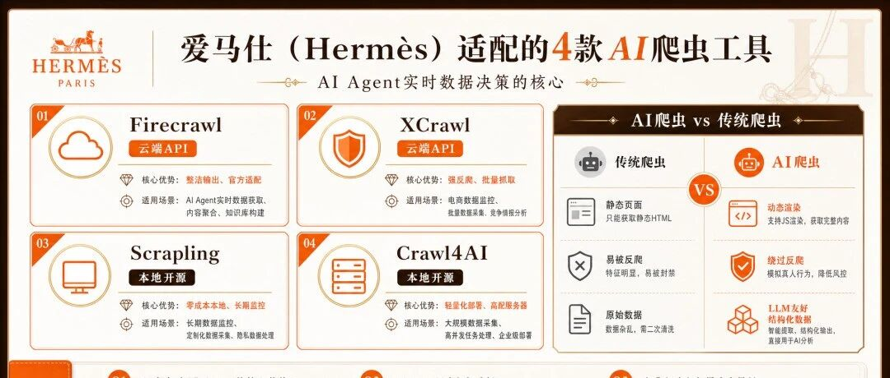
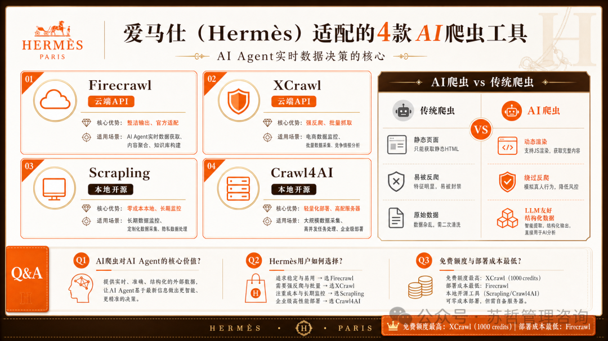
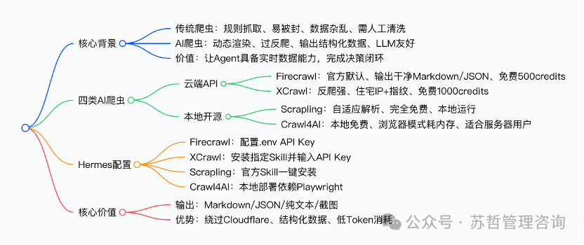
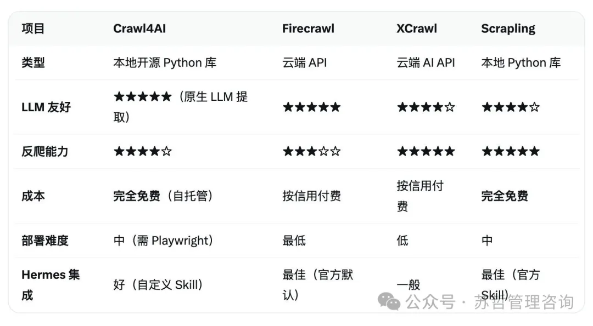

爱马仕可选AI爬虫：让智能体能够“看见”全世界

# 爱马仕可选AI爬虫：让智能体能够“看见”全世界

原创

CY编译
CY编译

[苏哲管理咨询](javascript:void(0);) 

*2026年5月4日 11:14*
*江苏*

在小说阅读器读本章

去阅读

在小说阅读器中沉浸阅读

**编者摘要**：本文介绍**爱马仕（****Hermes****）**适配的**4****款****AI****爬虫工具**，对比传统爬虫，**AI****爬虫**可渲染动态页面、绕过反爬、直接输出**LLM****友好**的结构化数据，是AI Agent 实现实时数据决策的核心；其中**Firecrawl****、****XCrawl**为云端API，**Scrapling****、****Crawl4AI**为本地开源工具，分别在**整洁输出、反爬能力、零成本本地、轻量化部署**上各有优势，并给出适配Hermes 的配置步骤与适用场景。

#### **爱马仕（****Hermes****）适配****4****款****AI****爬虫详情**

|  | **类型** | **LLM****友好** | **反爬能力** | **成本** | **部署难度** | **Hermes****集成** | **免费额度** |
| --- | --- | --- | --- | --- | --- | --- | --- |
| **Firecrawl** | 云端API | ★★★★ | ★★★ | 按信用付费 | 最低 | 官方默认 | 500credits |
| **XCrawl** | 云端AI API | ★★★★ | ★★★★ | 按信用付费 | 中 | 自定义Skill | 1000credits |
| **Scrapling** | 本地Python 库 | ★★★ | ★★★★ | 完全免费 | 低 | 官方Skill | 无限制 |
| **Crawl4AI** | 本地Python 库 | ★★★ | ★★★ | 完全免费 | 中(需Playwright) | 一般 | 无限制 |

**惯例的三个问题****Q&A**

**Q1:AI****爬虫相比传统爬虫，对****AI Agent****的核心价值是什么？**

答：AI 爬虫可绕过反爬、输出**LLM****友好的结构化数据**，为Agent 提供**实时干净数据**，让Agent 从聊天工具升级为能自主抓取、分析、决策的智能助手，形成完整业务闭环。

**Q2:Hermes****用户如何根据需求选择****4****款****AI****爬虫？**

答：追求**整洁输出与官方适配**选Firecrawl；需要**强反爬与批量抓取**选XCrawl；想要**零成本本地长期监控**选Scrapling；有**高配服务器**且追求本地开源选Crawl4AI。

**Q3:4****款工具中，免费额度与部署成本最低的分别是哪款？**

答：免费额度最高的是**XCrawl****（****1000credits****）**；部署成本最低、集成最便捷的是**Firecrawl**，仅需配置API Key 即可使用。

omegaAI  5月1日

传统爬虫（Web Crawler）就像一台“笨重”的搜索引擎机器人，它按照固定规则抓取网页HTML，返回原始代码，容易被反爬机制封杀，且输出杂乱，需要人工大量清洗才能使用，AI模型读起来费力且低效

而AI爬虫（AI-Powered Crawler）则是新一代智能工具它不仅能渲染JS 动态页面、绕过Cloudflare 等反爬，还能直接输出LLM 友好的结构化数据-- ✅Markdown（最优）：干净、结构清晰，Token占用少，模型理解最轻松✅结构化JSON按指令提取字段，直接可用✅纯文本/截图：辅助视觉或简单总结AI Agent 为什么需要AI爬虫？Agent的“大脑”需要实时、干净的数据来思考决策没有AI爬虫，Agent只能“纸上谈兵”；有了它，Agent才能自主抓新闻、看行情、做复盘，形成完整交易闭环一句话：传统爬虫给生肉，AI爬虫直接上熟食——这就是Agent从“聊天工具”进化成“智能助手”的关键🧠🌐

本文推荐3款实用AI 爬虫工具

# 1 Firecrawl（官方默认）

Step 1注册

firecrawl.dev

使用Google账号登录或者用邮箱注册

Step 2进入Dashboard，获取API Key

Step 3加到~/.hermes/.env FIRECRAWL\_API\_KEY = your\_api\_key

Step 4重启Hermes就可以使用Firecrawl了

优势: 输出超级干净的Markdown/JSON，LLM 友好，一键Crawl 全站劣势: 免费版只有500 credits，抓取500个网页，高频使用要付费实战: 每天抓取BTC 新闻+ 研报总结，Hermes 直接分析利好利空

# 2 XCrawl (反爬+ 批量首选)

Step 1注册

xcraw.com

同上用Google账号或者邮箱注册

Step 2进入Dashboard获取API Key

Step 3给Hermes说"

https://github.com/xcrawl-api/xcrawl-skills/blob/main/README.zh-CN.md

安装一下这个skills"

Step 4 Hermes在配置时候会让你输入API Key，复制刚才的API Key就可以了

优势: 住宅智能体+ 浏览器指纹，Cloudflare 轻松过；支持SERP、异步批量、智能规则劣势: 免费版送1000 credits，足够抓取1000多个网页实战：批量抓取多个交易所深度行情或Google 搜索结果，适合重度反爬场景

# 3  Scrapling (本地最强, 零成本)

Hermes有官方可选Skill，直接hermes skills install official/research/scrapling

优势: 自适应解析（网站改版也不怕）、Stealth 模式超强、Spider 框架并发爬取、完全免费本地运行劣势: 需要本地资源实战: 长期监控特定论坛/链上数据，Hermes 自动生成复盘Skill

# 4  Crawl4AI (备选)

这款爬虫和Scrapling雷士，都是完全本地运行，缺点是浏览器模式(Playwright)吃内存，资源消耗高，适合有好服务器的用户

本文总共分享了4款AI 爬虫工具，2款云端爬虫+2款本地爬虫

预览时标签不可点

关闭

更多

名称已清空

**微信扫一扫赞赏作者**

喜欢作者[其它金额](javascript:;)

赞赏后展示我的头像

作品

暂无作品

喜欢作者

其它金额

¥

最低赞赏 ¥0

确定

返回

**其它金额**

更多

赞赏金额

¥

最低赞赏 ¥0

1

2

3

4

5

6

7

8

9

0

.

爬虫工具 · 目录

#爬虫工具

上一篇OpenClaw创始人Peter开源的一款工具项目：discrawl v0.2.0

关闭

更多

#

搜索「」网络结果

关闭

**调整当前正文文字大小**

更多

100%

​

留言

暂无留言

1条留言

已无更多数据

[发消息](javascript:;)

写留言:

微信扫一扫  
关注该公众号

继续滑动看下一个

轻触阅读原文

苏哲管理咨询

向上滑动看下一个

当前内容可能存在未经审核的第三方商业营销信息，请确认是否继续访问。

[继续访问](javascript:)[取消](javascript:)

[微信公众平台广告规范指引](javacript:;)

[知道了](javascript:;)

微信扫一扫  
使用小程序

[取消](javascript:void(0);)
[允许](javascript:void(0);)

[取消](javascript:void(0);)
[允许](javascript:void(0);)

[取消](javascript:void(0);)
[允许](javascript:void(0);)

×
分析

微信扫一扫可打开此内容，  
使用完整服务

苏哲管理咨询

已关注

赞

分享

推荐

写留言

：
，
，
，
，
，
，
，
，
，
，
，
，
。
 
视频
小程序
赞
，轻点两下取消赞
在看
，轻点两下取消在看
分享
留言
收藏
听过

可在「公众号 > 右上角  > 划线」找到划线过的内容

我知道了

,

,

选择留言身份

**留言**

暂无留言

1条留言

已无更多数据

[发消息](javascript:;)

写留言:

关闭

更多

关闭

**爬虫工具**

详情

更多

正在加载

关闭

## 确认提交投诉

你可以补充投诉原因（选填）

确定