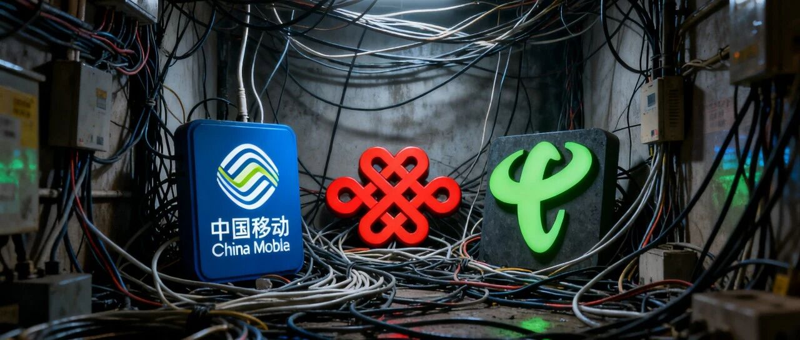
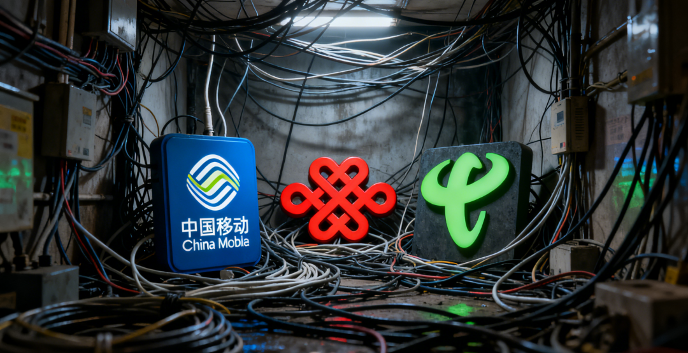

电信的 token 经营和移动的 token 经营是一回事吗？

# 电信的 token 经营和移动的 token 经营是一回事吗？

原创

杨敢
杨敢

[通信敢言](javascript:void(0);) 

*2026年5月7日 16:01*
*江苏*

在小说阅读器读本章

去阅读

在小说阅读器中沉浸阅读

🌟「通信敢言」🌟

与30万读者同行，客观、专业解读行业大事

运营商的经营主线正在发生关键切换。从早年的流量经营，到前几年的算力经营，再到如今的 token 经营，整个行业已经走到新的转型节点。中国电信已经在数字中国建设峰会上完整亮出 token 经营的整套思路，中国移动则将在苏州移动云大会上公布集团统一策略。不少行业人士都有疑问，两家头部运营商的 token 经营，到底是同一逻辑的不同表述，还是完全不同的两条路径。

中国电信的 token 经营，核心定位非常清晰。它直接把 token 定义为 AI 服务的计量单位，并且明确智能云体系就是 token 经营体系。电信走的是全链条闭环模式，底层依托升级后的天翼云操作系统和紫金架构硬件，大幅降低推理时延、提升处理效率。中间层以星辰 TokenHub 1.0 为运营中枢，实现多模型聚合与智能路由，能为智能体提供高性价比的 token 供给。再搭配安全防护升级与星海可信数据空间，电信构建起覆盖 token 生产、分发全流程的一站式服务平台。

电信还有一个关键动作，就是牵头成立 token 生态联盟。它没有选择单打独斗，而是希望联合上下游推动标准统一，把算力和 AI 服务打造成标准化公共产品。从业务基础来看，天翼云、AIDC、智能业务已经形成可观收入规模，电信的目标很明确，就是从传统云服务商向领先 AI 服务商升级。

中国移动的 token 经营目前还未正式官宣集团层面统一打法，但从前期试点和自身资源禀赋来看，路径和电信有明显区别。移动最核心的优势不是单纯的算力储备，而是覆盖最广、渗透最深的移动网络，以及成熟的算力网络调度能力。它的 token 经营，大概率会和网络切片、边缘算力节点深度绑定，把 token 服务下沉到离用户最近的位置，以此实现更低时延、更低成本的模型推理服务。

移动的另一大优势是近 10 亿用户带来的场景基础。依托梧桐大数据平台，移动可以快速验证不同场景的 token 消耗特点，反向优化模型选择与路由策略。2025 年中国移动算力服务收入保持稳健增长，智算服务更是实现高速增长，这些都为 token 经营提供了扎实的业务支撑。目前移动多地已经试点 token 套餐，走的是贴近用户、普惠落地的路线。

两家运营商的 token 经营，确实有共同的底层逻辑。两者都是以 token 作为 AI 服务的核心计量单元，本质都是释放数据加算力的价值，把模型能力、算力资源、数据要素转化为可计量、可交易的服务。同时，两家布局的方向一致，都是推动行业从流量经济向算力经济、智能经济跃迁，抓住 AI 时代的新增长空间。

但两者绝不是一回事，核心差异体现在三个关键层面。一是依托底座不同，电信以智能云为核心，做全链路平台化运营；移动以算力网络加移动通信网为核心，走算网一体的分发路径。二是生态思路不同，电信侧重搭建开放生态，牵头联盟统一行业标准，做标准化 AI 服务供给；移动侧重依托自身渠道与用户规模，做场景化落地，推进 token 套餐普惠化。三是场景侧重不同，电信偏向通用型、标准化的 AI 服务输出；移动更偏向低时延边缘场景，聚焦车联网、工业巡检等对实时性要求高的垂直领域。

电信和移动的 token 经营，是基于自身资源禀赋做出的差异化选择，没有优劣之分。电信已经率先完成体系化落地，移动即将在苏州大会揭晓完整策略。两种路径并行探索，不只是两家企业的竞争，更是整个运营商行业向 AI 时代转型的重要尝试。接下来的苏州移动云大会，不仅会揭开移动 token 经营的全貌，也会让行业更清晰看到 token 经营的多元可能。

预览时标签不可点

关闭

更多

名称已清空

**微信扫一扫赞赏作者**

喜欢作者[其它金额](javascript:;)

赞赏后展示我的头像

作品

暂无作品

喜欢作者

其它金额

¥

最低赞赏 ¥0

确定

返回

**其它金额**

更多

赞赏金额

¥

最低赞赏 ¥0

1

2

3

4

5

6

7

8

9

0

.

关闭

更多

#

搜索「」网络结果

关闭

**调整当前正文文字大小**

更多

100%

​

留言

暂无留言

1条留言

已无更多数据

[发消息](javascript:;)

写留言:

微信扫一扫  
关注该公众号

继续滑动看下一个

轻触阅读原文

通信敢言

向上滑动看下一个

当前内容可能存在未经审核的第三方商业营销信息，请确认是否继续访问。

[继续访问](javascript:)[取消](javascript:)

[微信公众平台广告规范指引](javacript:;)

[知道了](javascript:;)

微信扫一扫  
使用小程序

[取消](javascript:void(0);)
[允许](javascript:void(0);)

[取消](javascript:void(0);)
[允许](javascript:void(0);)

[取消](javascript:void(0);)
[允许](javascript:void(0);)

×
分析

微信扫一扫可打开此内容，  
使用完整服务

通信敢言

已关注

赞

分享

推荐

写留言

：
，
，
，
，
，
，
，
，
，
，
，
，
。
 
视频
小程序
赞
，轻点两下取消赞
在看
，轻点两下取消在看
分享
留言
收藏
听过

可在「公众号 > 右上角  > 划线」找到划线过的内容

我知道了

,

,

选择留言身份

**留言**

暂无留言

1条留言

已无更多数据

[发消息](javascript:;)

写留言:

关闭

更多

关闭

## 确认提交投诉

你可以补充投诉原因（选填）

确定