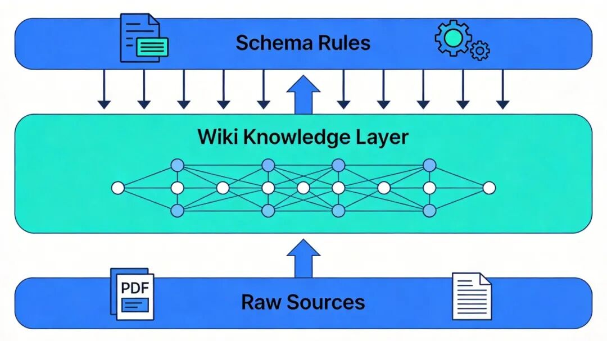
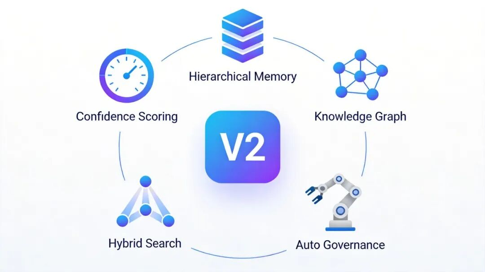
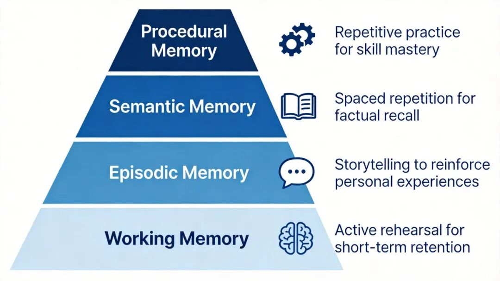

聊聊 Karpathy 的 LLM Wiki，以及 V2 为什么值得认真看一眼!

# 聊聊 Karpathy 的 LLM Wiki，以及 V2 为什么值得认真看一眼!

原创

江坤波
江坤波

[观澜逸趣](javascript:void(0);) 

*2026年5月1日 00:06*
*广东*

在小说阅读器读本章

去阅读

在小说阅读器中沉浸阅读

# 你用AI处理过的知识，为什么全都"留不下"？

先说个场景，你肯定不陌生。

拿到一篇几十页的行业报告，丢给 ChatGPT，让它帮你提炼要点。聊了二十分钟，观点梳理得清清楚楚，甚至还有自己的分析。你满意地关掉对话框。

第二天，想引用其中一个数据点。打开新的对话窗口，重新上传报告，重新提问——一切从头来过。

上周聊过的那个精彩洞察？没了。上个月让 AI 帮你对比过的那三篇论文？也得重新来。

这不是 AI 变笨了，而是我们一直在用一种"阅后即焚"的方式跟 AI 打交道。

你让它搜，它就搜；你让它总结，它就总结。但总结完之后呢？什么都没留下。下次再来，它又是一张白纸。

这个问题困扰我很久了。直到上个月，Karpathy 发了一条长推，把这件事讲透了。

从"临时搜一搜"到"持续积累"的转变

---

## 一、问题的根源：你让AI当搜索引擎用了

目前绝大多数人用AI处理文档的方式，本质上都是RAG——不管你知不知道这个词。

RAG（Retrieval-Augmented Generation）翻译成人话就是：

*你扔一堆文件进去，AI 每次提问时从文件里翻找相关片段，然后拼个答案给你。*

ChatGPT 的文件上传是 RAG，Google 的 NotebookLM 是 RAG，企业里搭的大部分知识库方案也是 RAG。

能用吗？能用。但有个要命的问题——知识没积累。

打个比方。你去图书馆借了五本书，每本都做了详细的读书笔记。但你把笔记全写在便利贴上，贴完就扔了。下次想查某个观点，你得重新翻那五本书。

这就是 RAG 的现状。AI 每次都在"重新发现"你已经让它发现过的东西。

更糟的是，如果你在三月份让它读了一篇论文说方法 A 有效，六月份又来一篇说方法 A 有严重问题——它不会主动告诉你这两篇矛盾了。因为在上一个会话里做的分析，到下一个会话已经不存在了。

> 说白了，RAG 是"无状态"的。你每次消费的都是原始文档，知识本身从未被加工、被提炼、被沉淀。

RAG（临时检索）和 LLM Wiki（持续编译）的核心区别

---

## 二、Karpathy 的思路：别搜了，让AI帮你"编"一套百科全书

Andrej Karpathy——OpenAI 联合创始成员、前特斯拉 AI 总监——给了一个完全不同的思路。

他说的其实很简单：与其让 AI 每次临时翻书找答案，不如让它像一位全职的百科全书编辑，持续地阅读你喂给它的资料，提炼、整合、交叉引用，维护一部专属于你的知识库。

这个方案叫 LLM Wiki。消息出来 48 小时，GitHub 星标破了 5000。

### 三层结构

整个系统分成三层，说白了就是三个文件夹：

底层：原始资料库——你收集的论文、报告、文章、笔记，原封不动放在那里。AI 只读不改，这些文件是你的"原件"。

中层：Wiki 知识库——AI 帮你生成的结构化笔记。摘要、概念解释、人物档案、对比分析、时间线，全部用 Markdown 写好，互相链接。这一层 AI 全权负责写和维护，你只管看。

顶层：规则配置——一份"操作手册"，告诉 AI 你的 Wiki 该怎么组织、用什么格式、更新时该遵守什么流程。可以把它理解成你和 AI 之间的一份"劳动合同"。

LLM Wiki 的三层架构

### 日常就三件事

搭好这三层之后，你日常只需要做三个动作：

1. **喂资料**：扔一篇新论文给 AI，它会读完，跟你讨论要点，然后自动在 Wiki 里新建摘要页、更新相关概念页、补充交叉引用。一篇资料进来，可能触发十几个页面的更新。
2. **提问**：直接对着 Wiki 问。AI 不用再去翻原始文档了，因为关键信息已经被编译好了。更重要的是，好的答案本身也会被存进 Wiki。你让它做的一次对比分析、你发现的一个关联，全都会沉淀下来。这就是"复利效应"——你的每次提问都在让知识库变得更丰富。
3. **体检**：定期让 AI 给 Wiki 做一次"健康检查"：有没有自相矛盾的页面？有没有过时的结论？有没有创建了但没人链接的"孤岛"页面？有没有重要概念还没建专页？

听起来不就是 Obsidian + AI 吗？

形式上有点像，但本质区别在于\*\*“谁来维护”\*\*。你自己用 Obsidian 建知识库，维护负担会随着页面数量指数增长——更新链接、保持摘要最新、标注矛盾——这些都是让人崩溃的苦力活。

Karpathy 方案的核心是：**这些活全部交给 AI。你只管选材料、问问题、做判断。**

> Karpathy 原话的意思是：**人类放弃维护 Wiki，从来不是因为懒得思考，而是因为"记账"太累了。LLM 第一次让这些维护成本接近于零。**

---

## 三、V2 来了：不只是"记住更多"，而是学会"遗忘"

V1 火了之后，大量开发者开始实战。很快，一个真实的问题浮出水面——知识库越大，噪音越多。

开发者 Rohit Ghumare 跑了一段时间 V1 之后，发现了一个挺尴尬的事：

**当 Wiki 超过 200 页，全靠一个索引文件导航就开始力不从心了。更头疼的是，所有知识都被等权对待——三个月前的一条临时笔记和一篇核心论文的摘要在系统眼里"地位"一样。**

他推出的 LLM Wiki V2，就是来解决这些"规模化之后的问题"。

V2 的五个核心升级方向

### 升级一：每条知识都有了"保质期"

V2 给每条知识打了一个"置信度分数"，根据三个因素动态调整：

* 这信息从哪儿来的？同行评审论文 > 行业报告 > 博客文章；
* 有多少独立来源佐证了这个结论？证据越多，分数越高；
* 这信息多久了？越新的信息初始分数越高，但经典理论衰减极慢。

说白了，就是让知识会"自然过期"。一条三个月前录入的临时 bug 记录，如果没人再提起它，就会慢慢淡出。而一条被十篇论文反复验证的核心结论，权重会越来越高。

### 升级二：模仿人脑的四层记忆

这个设计我觉得特别巧妙。V2 把知识分成了四层，完全对标人类大脑的记忆机制：

| 层级 | 人脑类比 | 系统里是什么 | 留存策略 |
| --- | --- | --- | --- |
| 工作记忆 | 你正在读的这句话 | 当前对话的即时上下文 | 会话结束即释放 |
| 情节记忆 | 昨天午饭吃了什么 | 压缩后的对话摘要 | 定期压缩归档 |
| 语义记忆 | 你知道水在100度沸腾 | 核心事实和知识节点 | 长期保留 |
| 程序记忆 | 你会骑自行车 | 沉淀的分析模板和工作流 | 几乎永久 |

V2 的四层记忆架构

层级越高，知识越精炼，存得越久。这样就不会出现"鸡毛蒜皮和核心知识混在一起"的情况了。

### 升级三：知识之间有了"关系标签"

V1 时代，Wiki 页面之间只是简单的超链接——你知道 A 页面连着 B 页面，但不知道它们之间是"支持"还是"反驳"还是"补充"。

V2 引入了带类型的关系。系统能记录"A 导致了 B"、“C 与 D 存在方法论冲突”、"E 是 F 的改进版本"这种语义关系。通过关系链路去探索，AI 能发现关键词搜索根本碰不到的隐藏关联。

> 举个例子：你的 Wiki 里有一篇关于"Transformer架构"的页面和一篇关于"注意力机制计算瓶颈"的页面。V1 里它们可能只是各自独立存在。但 V2 的图谱推理会自动在 Transformer 那页加上一条标注：“其核心组件在高维场景下可能存在性能瓶颈”。这种"跨越页面的智能推理"，是纯链接做不到的。

### 升级四：三种搜索一起上

Wiki 大了之后怎么找东西？V2 把三套搜索方案揉在一起：

* BM25 关键词搜索——找专业术语、专有名词，精确匹配；
* 向量语义搜索——理解你问题的意思，匹配语义相近的内容；
* 图谱遍历——沿着关系链路，发现间接但重要的关联。

三路结果综合排序。实测下来，比任何单一搜索方式都靠谱。

### 升级五：AI 自己管理知识库

这个可能是最"省心"的改进。

* **自动遗忘**：长期没人提、没被引用的知识条目会慢慢降权。但不同类型衰减速度不一样——架构决策衰减很慢（影响深远），临时 bug 记录衰减很快（很快就修好了或被替代了）。
* **自动维护**：设好规则之后，系统会自动从指定信息源抓取新内容、自动压缩过长的对话记录、定时清理冗余页面。那些没人愿意干的活，AI 全包了。
* **智能调解**：当新信息和旧知识打起来的时候，AI 不再只是冷冰冰地标注"此处存在冲突"，而是主动分析两边的权威度和时效性，给你一个倾向性建议：应该更新旧结论？还是两边都保留让读者自己判断？

---

## 四、实践者都在怎么用？

理念再好，得有人落地才行。好消息是，开源社区跑得很快。

LLM Wiki 发布不到一个月，已经有不少值得一试的实现方案：

* OpenKB——能处理长文档和图片，适合做研究型知识库；
* Sage-Wiki——Go 语言写的，一个二进制文件就能跑，提供搜索、问答和 MCP 服务器；
* Obsidian 插件版——直接在 Obsidian 里用，不用换工具；
* Axiom Wiki——命令行爱好者的选择。

国内这边，网易有道云笔记也紧跟着推出了面向普通用户的 LLM-Wiki 技能套件，主打零基础上手。不用懂什么 Markdown、不用搭环境，跟着指引点几下就能用。

一个有意思的现象是，很多实践者不约而同地提到了同一个感受：“查询输出归档回 Wiki 的那一刻，知识库才真正开始复利增长。” 也就是说，不只是摄入的资料在丰富知识库，你问过的每一个问题、做过的每一次分析，都在让下一次提问的答案更好。

---

## 五、说点更本质的东西

跳出技术细节，这件事背后其实藏着一个更有意思的问题。

我们总以为"记住更多"就是更聪明。但人脑不是这么工作的。

人脑的聪明之处，恰恰在于它知道该忘记什么。你不会记住上周三午饭的每一道菜，但你会记住那个改变了你认知的一次对话。大脑通过遗忘来降噪，通过强化来固化，通过关联来创造新的理解。

V2 的置信度评分和分层记忆，本质上就是在用工程手段复刻这个过程。一个什么都往里塞的知识库，和一个什么都记不住的大脑一样，没什么用。

Karpathy 在原文里还提到了一个细节我觉得很值得玩味。他说这个想法的精神源头，是 1945 年万尼瓦尔·布什的一篇论文

在那篇文章里，布什构想了 Memex，一个能自动关联所有知识条目的私人知识机器。布什想了这个东西 80 年，一直没实现。

不是技术做不到，而是没人愿意当那个"维护员"。

现在 AI 愿意了。它不会烦，不会忘，不会因为维护了 200 个页面的交叉引用就辞职。这可能是 LLM 在"生产力工具"这个赛道上，最朴素但最真实的贡献——不是帮你写代码、写邮件，而是帮你做那些你明知道很重要但就是懒得做、做了也坚持不下去的事。

人类负责判断和方向，AI 负责苦力活

最后说一句可能有点鸡汤的话：真正的智慧，从来不是知道得多，而是知道什么值得记住。

只不过现在，你终于不用一个人扛了。

---

预览时标签不可点

关闭

更多

名称已清空

**微信扫一扫赞赏作者**

喜欢作者[其它金额](javascript:;)

赞赏后展示我的头像

作品

暂无作品

喜欢作者

其它金额

¥

最低赞赏 ¥0

确定

返回

**其它金额**

更多

赞赏金额

¥

最低赞赏 ¥0

1

2

3

4

5

6

7

8

9

0

.

收录于AI

#AI

关闭

更多

#

搜索「」网络结果

关闭

**调整当前正文文字大小**

更多

100%

​

留言

暂无留言

1条留言

已无更多数据

[发消息](javascript:;)

写留言:

微信扫一扫  
关注该公众号

继续滑动看下一个

轻触阅读原文

观澜逸趣

向上滑动看下一个

当前内容可能存在未经审核的第三方商业营销信息，请确认是否继续访问。

[继续访问](javascript:)[取消](javascript:)

[微信公众平台广告规范指引](javacript:;)

[知道了](javascript:;)

微信扫一扫  
使用小程序

[取消](javascript:void(0);)
[允许](javascript:void(0);)

[取消](javascript:void(0);)
[允许](javascript:void(0);)

[取消](javascript:void(0);)
[允许](javascript:void(0);)

×
分析

微信扫一扫可打开此内容，  
使用完整服务

观澜逸趣

已关注

赞

分享

推荐

写留言

：
，
，
，
，
，
，
，
，
，
，
，
，
。
 
视频
小程序
赞
，轻点两下取消赞
在看
，轻点两下取消在看
分享
留言
收藏
听过

可在「公众号 > 右上角  > 划线」找到划线过的内容

我知道了

,

,

选择留言身份

**留言**

暂无留言

1条留言

已无更多数据

[发消息](javascript:;)

写留言:

关闭

更多

关闭

**AI**

详情

更多

正在加载

关闭

## 确认提交投诉

你可以补充投诉原因（选填）

确定