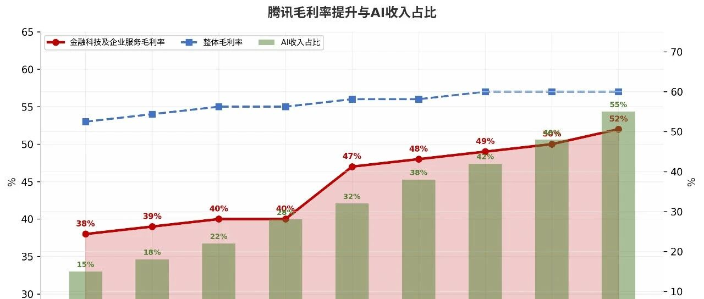
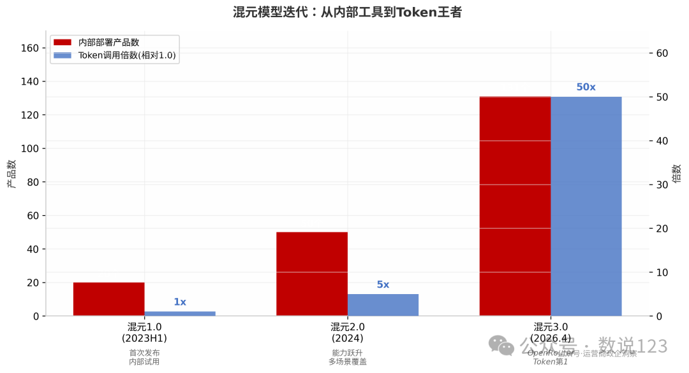
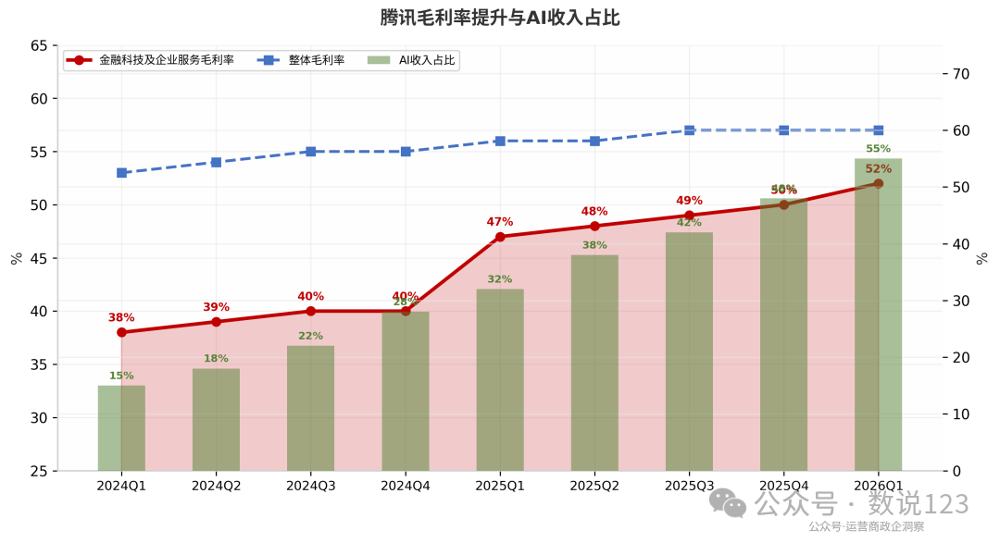
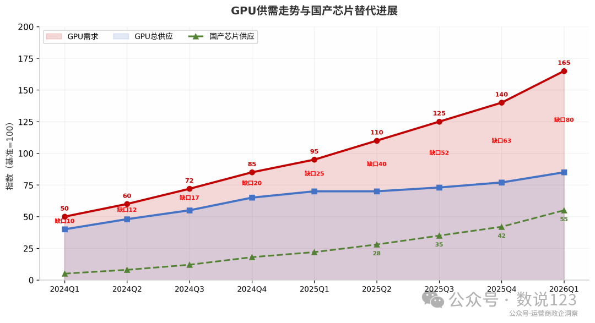
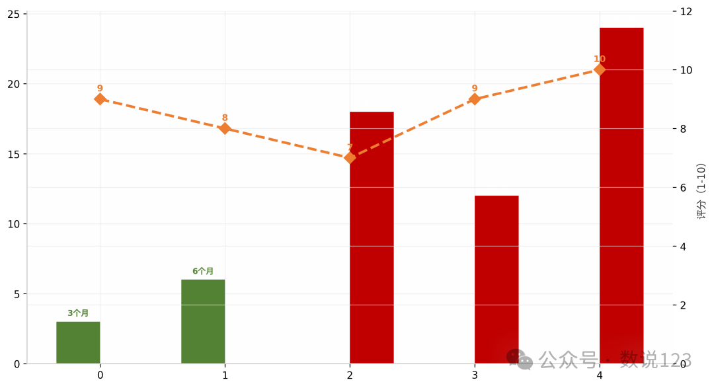
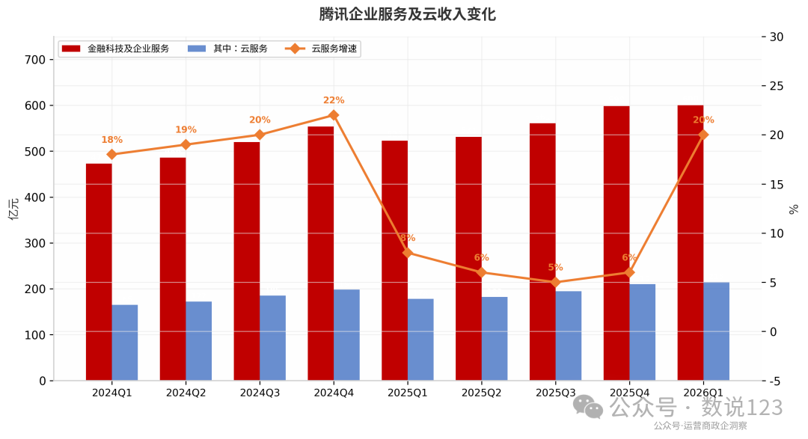
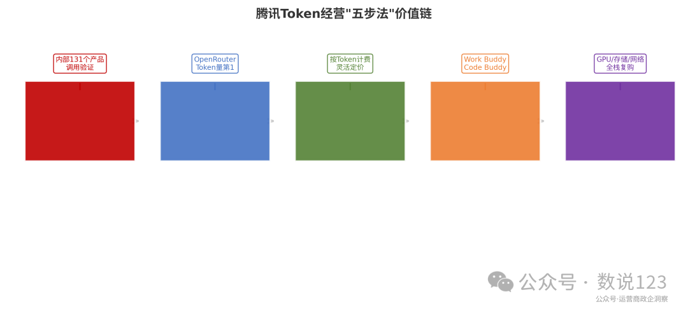
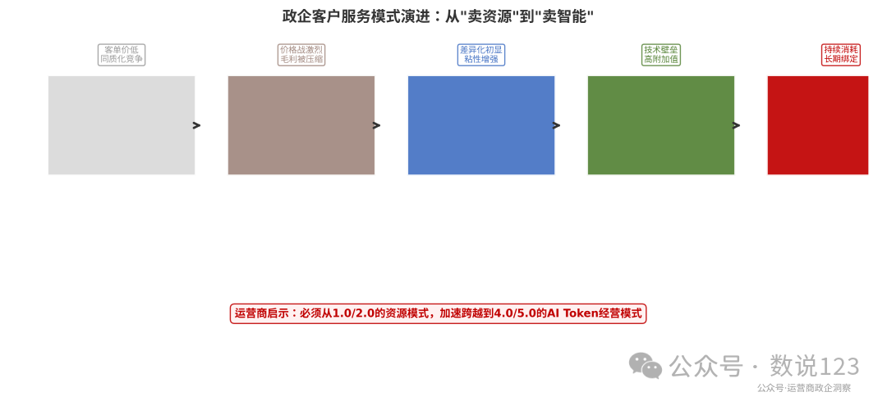
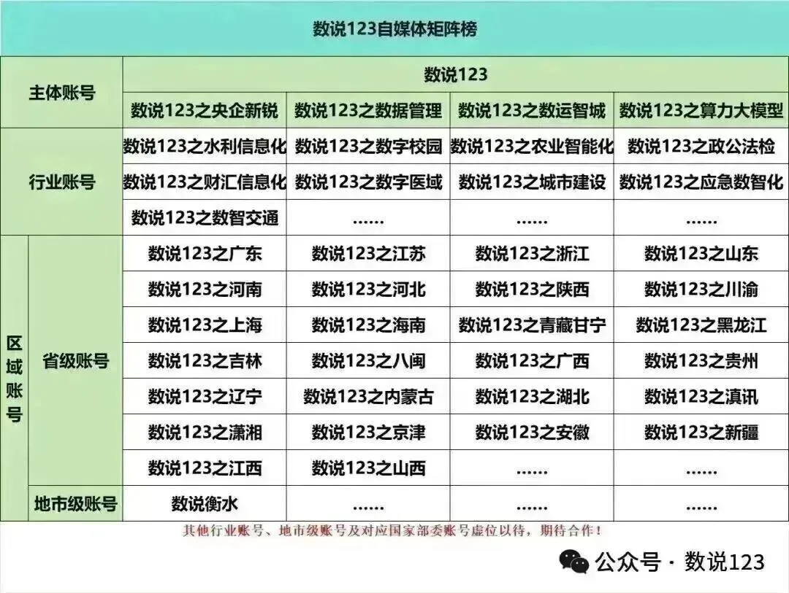

腾讯Token经营启示\_运营商政企必读

# 腾讯Token经营启示\_运营商政企必读

原创

数说123行研组
数说123行研组

[数说123](javascript:void(0);) 

*2026年5月17日 05:05*
*河北*

在小说阅读器读本章

去阅读

在小说阅读器中沉浸阅读

# 5月13日腾讯发布2026年Q1财报，一组数据让运营商政企线的从业者不得不重新审视自己的云业务逻辑：企业服务收入同比增长20%，云服务毛利率提升到52%，混元3.0的Token调用量较上一代暴增10倍，资本开支环比暴增84%至312亿元——其中AI相关占比飙升到55%。

这不是一家互联网公司的常规财报，这是一份云厂商向”AI原生服务商”转型的教科书。对于手握天翼云、移动云、联通云三大品牌的运营商来说，腾讯的做法里藏着七条可以直接抄作业的启示。

• 表面上看，腾讯靠GPU和算力需求拉动了云增长——AI相关需求推动GPU、CPU和存储收入全部同比增长； 

• 深层次看，腾讯正在跑通一套”Token经营”的新商业模式——不是按月卖云资源，而是按Token卖智能能力，用户用得越多、绑得越紧； 

• 更关键的是，这套模式的毛利率比传统IaaS高出十几个点——Q1金融科技及企业服务毛利率同比提升2个百分点至52%，定价环境的改善已经开始兑现。

运营商政企线当前最大的困惑，不是缺客户，而是缺高价值的计费单元。卖带宽按端口、卖云按核时、卖IDC按机柜——都是一次性买卖。Token经营的本质，是把”卖资源”变成”卖持续消耗的智能服务”。这正是腾讯给运营商上的最重要一课

腾讯企业服务及云收入变化

一、Token经营”五步法”：从模型到持续收入

腾讯首席战略官James米歇尔在财报电话会上的一句话，值得每个运营商政企产品经理背下来：“我们升级了腾讯云的AI智能体解决方案，配备了专有安全基础设施、技能中心和云接口，促进了使用量的快速增长和初步的Token变现。”

拆解腾讯的Token经营逻辑，是一套环环相扣的五步价值链：

第一步，模型训练。混元3.0不是为刷榜而生的”秀肌肉”模型，而是为实际部署优化的”干活”模型。刘炽平说得直白：“我们优先采用可以被实际验证的评测方式，而不是那些可以刷分的基准测试。” 131个内部产品先吃狗粮，验证模型在实际场景中的可用性。

第二步，API化输出。通过腾讯云将模型能力封装为标准API，政企客户不需要自建GPU集群，只需要调用接口、按Token付费。这是运营商最应该学习的环节——把自有能力和合作能力都MaaS（模型即服务）化。

第三步，Token计量。摒弃按月按核的包租模式，转向按实际调用量计费。这种模式下，客户初期成本低、上手快，随着使用量增长，客单价自然提升。

第四步，场景嵌入。通过Work Buddy（办公智能体）、Code Buddy（编程助手）等产品，将AI能力深度嵌入客户的工作流。刘炽平透露，“未来AI智能体将能够使用小程序代码作为AI技能来访问小程序”——这意味着微信生态本身就是最大的AI应用场景库。

第五步，持续消耗。Token用得越多，对底层云资源（GPU、存储、网络）的消耗就越大，客户粘性就越强。米歇尔确认，“随着用户使用更多AI智能体处理更复杂的任务，付费用户转化率提高，导致腾讯云上的Token使用量近期快速增长。”

腾讯Token经营”五步法”价值链

运营商启示一：别再只卖”水”，要卖”活水系统”。传统云业务的困境在于，客户租了虚拟机就完事了，用得多少跟云厂商无关。Token经营模式把计费单元从”资源”变成了”智能调用量”——客户业务越好、AI用得越多、云厂商收入越高。运营商政企线当务之急，是设计一套类似Token计费的”智能计量单元”，无论是按API调用、按文档处理量还是按智能体会话次数，核心是把收入跟客户的业务活跃度绑定。

二、为什么混元3.0选择了”小而美”路线？

运营商做云有个惯性思维：堆规模、拼参数、比排名。但混元3.0给出了完全相反的解题思路——它不是在参数量上追求最大，而是在”推理效率×实际效果×成本控制”的三角中找到最优解。

刘炽平解释得很清楚：“我们超越狭隘的专业领域，转向更全面的智能，例如整合了推理、长上下文理解、指令遵循、对话、编程和工具使用等能力。同时，通过将推理过程与模型进行协同设计，我们能够显著降低成本。”

翻译成人话：混元3.0的核心竞争力不是”最大”，而是”最省”——推理成本足够低，才能让131个内部产品敢用、多用、长期用。

效果怎么样？内部数据惊人——“相比混元2.0，混元3.0模型的Token调用总量至少提升了十倍”。外部验证更直接——自4月28日上线以来，在Open Router平台按Token使用量排名第一，免费期结束后依然保持领先

混元模型迭代：从内部工具到Token王者

运营商启示二：模型不是越大越好，而是越便宜越好用。运营商做大模型，不需要跟OpenAI拼万亿参数，而是应该学腾讯的务实路线——做一个在政企场景（公文处理、智能客服、文档分析、代码辅助）上足够好用、推理成本足够低的模型。关键指标不是参数量，而是”每百万Token推理成本”和”政企场景准确率”。

三、毛利率52%的秘密：从价格战到价值战

中国云厂商市场份额对比（2024 vs 2025）

 

中国云市场过去几年深陷价格战的泥潭，运营商云尤其如此——动辄”三折上云”、“零门槛迁移”，换增长不换来的利润。但腾讯Q1的数据证明，风向正在转变。

金融科技及企业服务毛利率同比提升2个百分点至52%。米歇尔点明了原因：“得益于我们云服务需求的增加和更好的定价环境。” 当AI算力供不应求时，有GPU就是硬道理，价格话语权开始向供给方倾斜。

更重要的是结构性的变化——腾讯云的AI相关收入正在从IaaS层向上迁移。米歇尔透露AI相关需求推动了GPU、CPU和存储收入同比增长，而刘炽平补充腾讯云国际业务收入同比增长超过40%，靠的是媒体处理服务和TDSQL云数据库这样的PaaS产品。

腾讯毛利率提升与AI收入占比

运营商启示三：AI是云业务毛利率的”救星”。传统IaaS的毛利率天花板很低（一般在20-35%），但AI服务的毛利率可以高得多（模型API的毛利率通常在50-70%）。运营商政企线应该从”卖资源”加速转向”卖AI能力”——智能客服、公文助手、代码审查、文档分析等高附加值服务，是突破毛利率天花板的关键。

四、AI投资的”双周期”回报框架

运营商做AI最大的顾虑是什么？是投入大、回报慢、看不清ROI。腾讯在财报电话会上给出了一套非常成熟的投资评估框架，值得运营商管理层认真参考。

米歇尔把AI投资分成两类：

短周期投资——“如果我们购买GPU并将其部署到广告技术中，那是一个相对短周期的投资，GPU会带来更好的定向、更高的点击率和加速的收入和利润增长。” 这类投资3-6个月就能见到回报。

长周期投资——“当我们将GPU部署到基础模型时，我们认为这对我们的长期竞争优势很重要，我们采取了更长远的视角。” 模型训练本身不会立即产生回报，但能力会积累并解锁许多不同的商业机会。

CFO罗硕瀚则从商业变现的角度补充：“算力租赁有明确的投资回报率。你有折旧成本，通常会加上一些利润率，然后运营下去，这样回报就更清晰。”

腾讯AI投资”双周期”回报框架

运营商启示四：建立”短周期造血+长周期布局”的双轨AI投资策略。运营商完全可以在两个赛道同时布局：用GPU做云资源租赁（短周期、明确ROI），同时投入一部分算力训练/微调自有行业大模型（长周期、战略卡位）。关键是不要把所有鸡蛋放在一个篮子里，也不要因为长周期项目的不确定性就放弃所有AI投入。

五、国产GPU替代：供应链安全就是竞争力

腾讯在财报会上坦诚讨论了GPU供应瓶颈，这也是运营商最关心的话题之一。米歇尔的分析一针见血：

“中国GPU瓶颈比其他国家更明显的原因，是政策限制某些国外设计GPU进入中国，以及中国设计GPU在国内面临有限的晶圆厂产能。结果导致国家确实缺乏GPU或IC产能。现在这个问题正在得到解决，因为国产AI芯片从国内晶圆厂以及邻国晶圆厂获得了更多供应。”

好消息是，国产AI芯片供应正在逐月增加。米歇尔预计：“你们应该预期资本支出会有显著增加，尤其是在今年下半年，因为更多国产AI芯片将逐月供应给我们。

 

GPU供需走势与国产芯片替代进展

运营商启示五：提前卡位国产GPU供应链，就是提前锁定AI时代的门票。运营商有天然的IDC和带宽优势，如果能在国产GPU（华为昇腾、寒武纪、海光等）的采购和部署上提前布局，不仅能降低供应链风险，还能形成差异化竞争力——“国产算力+运营商网络”的组合，在政企市场有很强的合规吸引力。

六、PaaS出海：运营商国际化的差异化路径

腾讯云Q1国际业务收入同比增长超过40%，这是一个容易被忽视但极其重要的信号。不同于阿里云在东南亚深耕IaaS基础设施、华为云主打政企出海，腾讯云选择了PaaS产品的差异化路径。

米歇尔点明了两个核心产品：“媒体处理服务和TDSQL云数据库”。前者是音视频时代的标配能力，后者是金融级分布式数据库——都是高附加值、高技术门槛的PaaS产品，客户一旦采用就很难迁移。

 

腾讯资本开支及AI投资占比

运营商启示六：运营商出海不要只会卖”管道”，要学腾讯卖”能力”。运营商在”一带一路”沿线有大量的通信基础设施投资，但国际化收入主要停留在带宽租赁和IDC托管。如果能像腾讯一样，把智能客服、云视讯、安全审计等PaaS/SaaS能力打包出海，毛利空间和客户粘性都会大幅提升。

七、生态思维：微信是腾讯最大的护城河，运营商的”微信”在哪里？

讨论腾讯的AI战略，离不开一个核心问题：为什么腾讯敢在GPU供应紧张的时候，优先满足内部需求而不是外部云客户？

米歇尔的回答揭示了腾讯的底层逻辑：“我们之所以能够同时支持所有这些项目，是因为我们一直没有在腾讯云上积极出租GPU容量。我们有多个旗舰项目：混元基础模型、微信内的智能体开发、元宝支持、广告和游戏的AI部署，以及现在的Work Buddy和Code Buddy用例。”

腾讯AI智能体商业化演进

换句话说，腾讯的AI战略不是单纯的云业务拓展，而是整个生态的智能化升级——微信、QQ、企业微信、小程序、腾讯会议，每一个都是AI落地的场景。AI能力一旦嵌入这些平台，用户无需学习新工具，就能自然使用AI。

腾讯云 vs 运营商云能力对比

运营商启示七：找到你的”微信”——那个能让AI自然流淌的平台。运营商手里其实有很多”类微信”的平台资产：企业微信/钉钉/飞书上的行业解决方案、自有的办公OA系统、政府服务热线平台、智慧城市运营平台。关键不是再造一个ChatGPT，而是把AI能力嵌入这些已有的、用户每天都在用的平台——让AI像水一样自然流淌，而不是像油一样需要专门去获取。

 

运营商可借鉴的腾讯Token经营”六大经验”

结语：Token经营的本质是经营”关系”

看完腾讯Q1财报和业绩会全程，最深的感触不是哪一项技术有多厉害，而是腾讯正在重新定义云厂商和客户之间的关系。

传统模式下，云厂商和客户是”房东和租客”的关系——签了合同、交了租金，双方的联系就弱了。Token经营模式下，云厂商和客户是”搭档”的关系——客户的业务越好，AI用得越多，云厂商的收入越高。这是一种共生共荣的利益绑定。

刘炽平在业绩会上说了一句非常深刻的话：“找到高价值用例的能力，与单纯盲目获取大量DAU相比，同样重要，甚至更重要。在互联网世界，交付的变动成本非常小；但AI每一次服务交付都会产生相当的成本。因此，不能简单地将互联网的逻辑套用在AI上。”

这句话，值得每个运营商政企线的同仁贴在办公桌上。

政企客户服务模式演进：从”卖资源”到”卖智能”

至此，腾讯云AI的七条运营商启示已经全部摊开。当混元3.0的Token在131个产品中流转，当AI智能体从”好用”走向”离不开”，当国产GPU的供应量逐月攀升——这不是一个季度的数字游戏，而是一场关于云产业未来十年游戏规则的深层变革。

运营商政企线的同仁们，游戏才刚刚开始。

****数说123** 全面监测三大运营商（31省公司+24家专业公司）、国内五大云厂（阿里云、腾讯云、华为云、百度智能云、火山引擎）及国外五大云厂（AWS、Microsoft Azure、Google Cloud、Meta、OpenAI）的官网、官微、峰会、招投标文件、财报和研报、高端访谈，从海量情报中提炼 token 经营可落地的案例、方案与洞察分析报告，帮运营商看得懂、用得上。欢迎添加文末微信加入“运营商token经营付费学习群”，非诚勿扰。**

合作请联系：

18603187258

预览时标签不可点

关闭

更多

名称已清空

**微信扫一扫赞赏作者**

喜欢作者[其它金额](javascript:;)

赞赏后展示我的头像

作品

暂无作品

喜欢作者

其它金额

¥

最低赞赏 ¥0

确定

返回

**其它金额**

更多

赞赏金额

¥

最低赞赏 ¥0

1

2

3

4

5

6

7

8

9

0

.

关闭

更多

#

搜索「」网络结果

关闭

**调整当前正文文字大小**

更多

100%

​

留言

暂无留言

1条留言

已无更多数据

[发消息](javascript:;)

写留言:

微信扫一扫  
关注该公众号

继续滑动看下一个

轻触阅读原文

数说123

向上滑动看下一个

当前内容可能存在未经审核的第三方商业营销信息，请确认是否继续访问。

[继续访问](javascript:)[取消](javascript:)

[微信公众平台广告规范指引](javacript:;)

[知道了](javascript:;)

微信扫一扫  
使用小程序

[取消](javascript:void(0);)
[允许](javascript:void(0);)

[取消](javascript:void(0);)
[允许](javascript:void(0);)

[取消](javascript:void(0);)
[允许](javascript:void(0);)

×
分析

微信扫一扫可打开此内容，  
使用完整服务

数说123

已关注

赞

分享

推荐

写留言

：
，
，
，
，
，
，
，
，
，
，
，
，
。
 
视频
小程序
赞
，轻点两下取消赞
在看
，轻点两下取消在看
分享
留言
收藏
听过

可在「公众号 > 右上角  > 划线」找到划线过的内容

我知道了

,

,

选择留言身份

**留言**

暂无留言

1条留言

已无更多数据

[发消息](javascript:;)

写留言:

关闭

更多

关闭

## 确认提交投诉

你可以补充投诉原因（选填）

确定