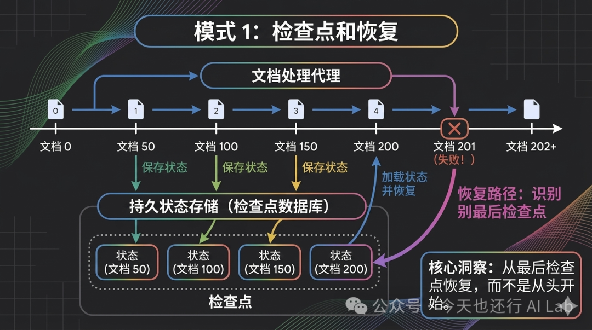
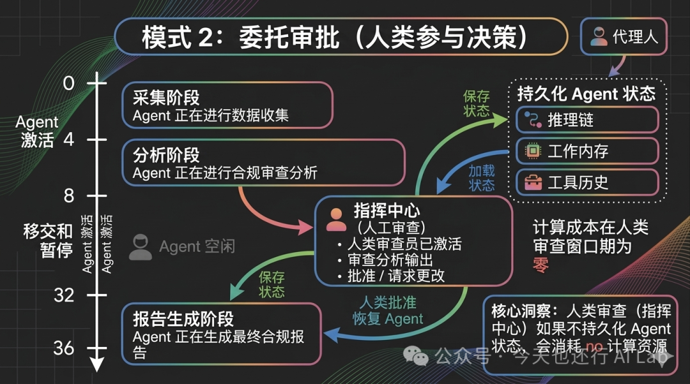
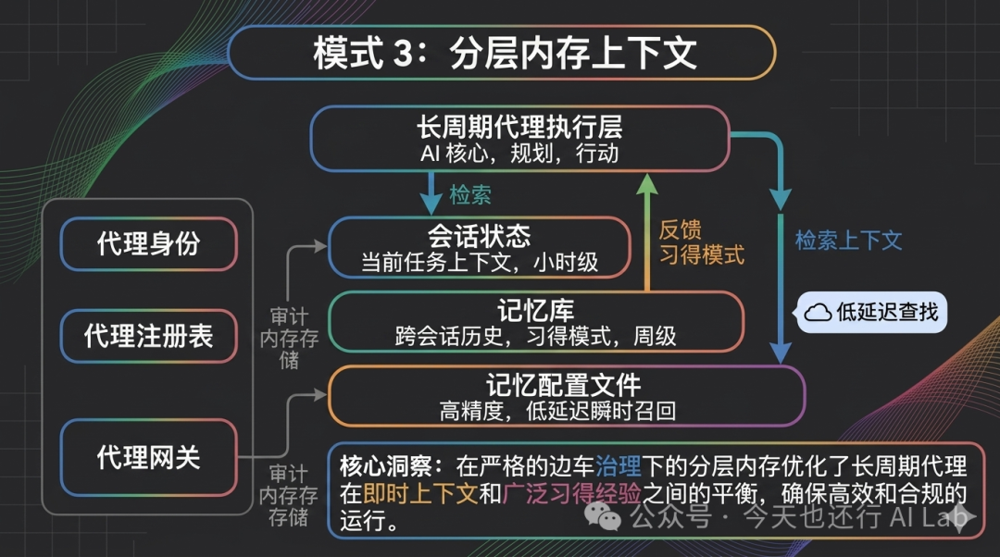
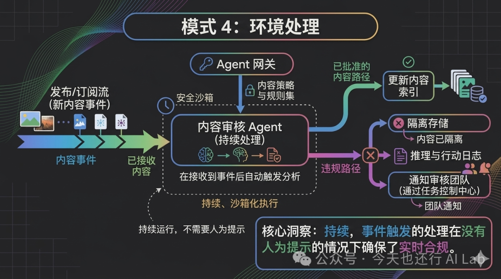
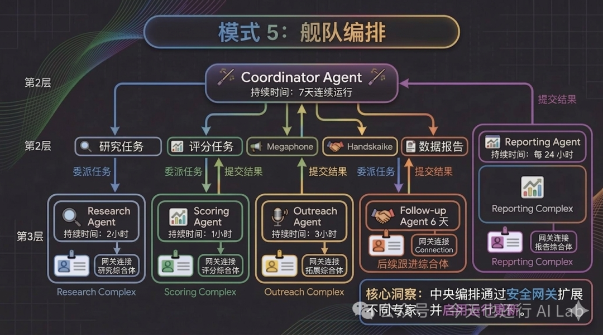

长运行 AI Agent 怎么设计？Google 给出了 5 个生产级模式


# 长运行 AI Agent 怎么设计？Google 给出了 5 个生产级模式

[今天也还行 AI Lab](javascript:void(0);) 

*2026年4月25日 15:54*
*北京*


在小说阅读器读本章

去阅读


在小说阅读器中沉浸阅读

很多团队在做 AI Agent 的时候，都会把精力集中在这些“短期指标”上：

* • 提示词怎么写更稳？
* • 工具调用怎么更准？
* • 响应延迟能不能再低一点？

这些当然重要。

但问题是——当你的 Agent 需要连续运行几天，去处理真实业务（比如批量理赔、销售自动跟进、跨系统对账）时，这些优化几乎不再是决定性因素。

最近，Google Cloud 发布了一篇非常硬核的文章，总结了「长时间运行 AI Agent」的 5 个关键设计模式。

读完之后有一个很强的感受：

**大多数团队，还停留在“对话式 Agent”的阶段，而真正的生产级系统，本质上更接近“持续运行的服务”**

这篇文章，不只是讲怎么做 Agent，更是在讲——

**当 AI 从“对话工具”变成“长期工作的系统”，架构应该如何升级。**


## 先把概念说清：什么是“长运行 Agent”

你可以用一句话理解它：

**长运行 Agent = 任务可能持续数小时/数天 + 执行状态可以被保存/恢复 + 过程中可以暂停等待人类输入**。

它和“聊天机器人式 Agent”的差别大概是：

| 维度 | 常见对话式 Agent | 长运行 Agent |
| --- | --- | --- |
| 时间尺度 | 秒到分钟 | 小时到天 |
| 状态 | 经常“重建” | 需要“持久” |
| 失败处理 | 重来 | 断点续跑 |
| 人在回路 | 事后审批/回调 | 原地暂停/恢复 |
| 运维视角 | 像一次请求 | 更像一个长期进程 |

接下来是原文给出的 5 个模式，我会用“问题 → 做法 → 你可以抄什么”来讲。

## 模式 1：检查点与恢复（Checkpoint-and-Resume）

**典型翻车场景**：Agent 处理了 200 份文档，卡在第 201 份报错。没有检查点，你只能从头再来。

原文的建议很直白：

* • 把 Agent 当作“长跑服务”，而不是“请求处理器”
* • 像做数据管道一样做它：**检查点进度、允许部分失败、保证幂等**

****


原文给了一个用 Google ADK 写的例子（保留代码结构，中文解释）：

```
from google.adk import Agent, ToolContext  
  
class DocumentProcessor(Agent):  
    """处理大批量文档，支持检查点与恢复。"""  
  
    async def process_batch(self, docs: list, ctx: ToolContext):  
        checkpoint = self.load_checkpoint()  # 从上次位置恢复  
        start_idx = checkpoint.get("last_processed", 0)  
  
        for i, doc in enumerate(docs[start_idx:], start=start_idx):  
            result = await self.classify_and_extract(doc)  
            self.results.append(result)  
  
            # 每 50 份做一次检查点  
            if (i + 1) % 50 == 0:  
                self.save_checkpoint({  
                    "last_processed": i + 1,  
                    "partial_results": self.results,  
                    "timestamp": datetime.now().isoformat()  
                })  
  
        return self.compile_final_report()
```

**你可以直接抄的要点**：

* • 检查点粒度不是越细越好：每条都 checkpoint 太浪费，只在最后 checkpoint 风险太高
* • 关键是“可恢复 + 幂等”：允许重试，不把系统状态写坏

## 模式 2：委托审批（人类参与决策）

先把话说得更直白一点：

**所谓“人参与审批”，就是 Agent 遇到关键一步先停下来，等你确认后再继续。**

### 为什么要“停下来”？

因为很多真实业务里，Agent 总会遇到这种“不能拍脑袋”的动作：

* • 要不要真的把邮件发出去？
* • 要不要真的把数据写进生产库？
* • 要不要把某个用户拉黑/退款/关单？

这些动作一旦做错，成本很高，所以必须让人来点头。

### 常见做法为什么容易翻车？

很多系统的做法是：Agent 把当前进度“打包”→ 发消息给人 → 人过一会儿回复 → Agent 再继续。

问题在于：**等人回复的这段时间里，Agent 很容易“断片”**。

* • 它忘了自己当时为什么这么判断（前后的推理过程丢了）
* • 外部条件可能已经变了（数据变了、依赖变了、上下游状态变了）

结果就是：要么继续跑得很别扭，要么干脆走错路。

### 原文强调的关键点：像工作流一样“按暂停键”

更稳的做法是把审批做成流程里的一个状态：

1. 1. Agent 跑到“需要人确认”的节点
2. 2. **按下暂停键**：现场不散（它的上下文、进度、下一步要做什么都保留）
3. 3. 你来审核/补充一句话/改几个参数
4. 4. 你点确认后，Agent **从刚才的位置接着跑**

### 举个你一眼能懂的例子

比如你让 Agent 做一轮销售外联：

* • Agent 先生成一封外联邮件草稿
* • 到“发送”之前暂停，让你看一眼、改两句
* • 你确认后，Agent 才真正发送，并继续跟进下一位

你可以把它理解成：**不是把 Agent 赶出去等消息，而是让它停在门口等你签字。**

****

**你可以直接抄的要点**：

* • 把“等待人类决策”当作系统的第一等状态，而不是异常
* • 暂停期间不消耗算力，恢复要快（原文强调“亚秒级冷启动”）

## 模式 3：分层记忆（Memory-Layered Context）

如果 Agent 能跑 7 天，它需要的不只是“把对话记录存下来”。更现实的问题是：

**你要让它在“信息越来越多”的情况下，依然记得对的事、忘掉该忘的事、而且不会越用越跑偏。**

为了让这件事可控，原文把“记忆”拆成了两层（你可以理解成：一个负责沉淀，一个负责取用）：

### 第一层：Memory Bank（长期记忆库）

把它想成“自动整理的笔记本”。它会从对话里提炼出可复用的信息，并按主题归档，比如：

* • 这个用户长期偏好什么表达方式
* • 这个项目有哪些固定约束（不能动生产库、只能读权限、必须走审批）
* • 这个团队的术语、命名习惯、交付格式

它解决的是：**跨天、跨周的持续协作**。

### 第二层：Memory Profiles（工作记忆/快取）

把它想成“随手可拿的便签”。它追求的是：

* • 取用速度快（低延迟）
* • 命中更准（高准确度）

适合放“当前任务强相关、但不能每次都从长文里翻”的信息，比如：

* • 本次任务的目标与边界
* • 当前阶段的关键参数（地区、客户、时间范围、阈值）
* • 正在使用的工具/接口版本

一句话：Memory Bank 负责“沉淀”，Memory Profiles 负责“高精准度提速”。



但原文也提醒一个非常“生产级”的坑：**记忆漂移（memory drift）**。

说人话就是：Agent 用得越久，越容易“学坏”。

* • 它可能从几次特殊情况里学到一个捷径，然后在不该用的时候也照搬
* • 如果多个 Agent 共享记忆池，还可能把 A 任务的经验串到 B 任务里，造成信息污染

所以，记忆系统不能只考虑“能存”，还要考虑“能管”。

因此原文强调“治理”三件套（类比微服务基础设施）：

* • **Agent Identity**：像 IAM，明确它能访问哪些记忆与工具
* • **Agent Registry**：像服务注册中心，知道谁在跑、跑哪个版本、状态是什么
* • **Agent Gateway**：像 API 网关，做策略校验（例如拦截写入 PII）

**你可以直接抄的要点**：

* • 记忆不是越多越好，**能解释、能隔离、能回滚**更重要
* • 把“写入记忆”当成一次写操作：默认受控，必要时要审批/策略校验
* • 长期记忆和工作记忆分开：别把“当天临时参数”写进“长期偏好”里

## 模式 4：环境处理（Ambient Processing）

不是所有长运行 Agent 都要和人聊天。

有一类 Agent 更像“环境里一直开着的自动化系统”：

* • 不等你发指令
* • 看到事件就自动处理
* • 需要时才把关键信息抛给人

你可以把它理解成：从“你问我答”变成“系统持续运转”。

### 它通常解决哪类问题？

原文提到的典型场景是：批处理和事件驱动的 Agent 直接连 BigQuery 表、Pub/Sub 流。

换成更通用的说法，就是两类：

* • **批处理**：定时跑（每天/每小时）去清洗数据、对账、汇总、生成报告
* • **事件驱动**：实时跑（来一条处理一条）去审核内容、风控拦截、工单分流

### 原文例子：内容审核 Agent

这类 Agent 会持续运行很多天：

* • 内容一来就处理
* • 自己维护趋势/模式的状态（比如同一类违规是否正在升温）
* • 只有“需要升级”的时候才找人



这里有一个非常工程化的建议：

**不要把策略硬编码进 Agent。把策略定义在网关层（Agent Gateway），Agent 运行时执行。**

这句话很关键：

* • Agent 只负责执行，不负责“定义规则”
* • 规则放在统一的策略层（网关）里，集中管理

好处是策略变化时，你更新一次网关，全体 Agent 立刻生效；否则每次变更都要重部署所有 Agent。

**你可以直接抄的要点**：

* • 环境处理的 Agent 要“少打扰人”：默认自动跑，只在异常/高风险时升级
* • 策略要外置：把规则集中在网关层，避免每个 Agent 都有一份自己的“规则副本”

## 模式 5：舰队编排（Fleet Orchestration）

生产环境里，往往不是一个 Agent 单打独斗，而是一个“队长 Agent”带着一组“专业 Agent”一起干活。

你可以把它类比成一个小团队：

* • 队长负责拆任务、分派、汇总、做最终决策
* • 专业成员各自负责一块（研究/评分/外联/合规/对账……）

原文举例是销售线索跟进：研究、评分、外联……每个环节都可能是独立 Agent。



原文强调的“舰队”价值有两点：

### 价值 1：隔离（权限隔离 + 风险隔离）

每个专业 Agent 都有自己的身份与权限边界：

* • 研究 Agent 只读公开信息
* • 评分 Agent 可以读 CRM/历史成交，但不能对外发消息
* • 外联 Agent 能发邮件/消息，但不能碰财务数据

用原文的话说：Identity / Gateway / Registry 三件套，让每个 Agent 都“只拿自己该拿的权限”。

### 价值 2：可演进（能灰度、能回滚、不连坐）

舰队化还有一个很现实的收益：你可以单独升级某个专业 Agent，而不是“全仓重发”。

* • 想改评分逻辑？只升级评分 Agent
* • 先观察指标（成功率、误判率、成本），稳定了再扩大
* • 就算这个版本翻车，也只影响这一名“成员”，不会把整条链路拖垮

**你可以直接抄的要点**：

* • 用“队长/工人”模式做编排：队长负责状态与协作，工人专注单一职责
* • 让每个 Agent 都可独立发布/回滚：把“升级风险”控制在局部

## 怎么判断你需不需要这些模式？

原文给了一个很好的问题：

**你最长的不间断工作单元到底有多长？**

* • 如果只是分钟级，可能用不着“长运行 Agent”这套复杂度
* • 如果是小时/天级，这 5 个模式基本就是起点

你也可以用这个简单清单自测：

* • 任务是否可能跨多个系统/多天执行？
* • 失败后能否从中间恢复，而不是重来？
* • 是否有明确的“暂停等待人类决策”的节点？
* • 记忆写入是否可控、可审计、可隔离？
* • 多 Agent 协作是否需要版本治理与权限隔离？

## 结尾：长运行 Agent 的本质，是把“不确定”做成“可控”

把 Agent 做成能跑几天的系统，难点不在模型多聪明，而在于你能不能把这些东西工程化：

* • 失败是常态（检查点 + 幂等）
* • 人类是流程的一部分（原地暂停 + 恢复）
* • 记忆要治理（身份/注册/网关）
* • 策略要外置（一次更新，全局生效）
* • 协作要编排（舰队化、可演进）

如果你正在把 Agent 从 Demo 推向生产，这篇文章的 5 个模式，至少能帮你少踩一半坑。

## 参考链接

* • 原文：https://x.com/googlecloudtech/article/2046989964077146490
* • Gemini Enterprise Agents：https://cloud.google.com/gemini-enterprise/agents

